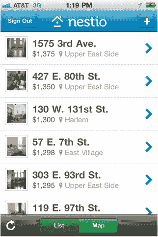

# 内斯特筹集 750，000 美元让公寓搜查变得不那么糟糕 

> 原文：<https://web.archive.org/web/http://techcrunch.com/2011/07/05/nestio-raises-750000-to-make-apartment-searches-suck-less/>

# 内斯特筹集了 750，000 美元来减少公寓搜查

 [Nestio](https://web.archive.org/web/20230204195534/http://nestio.com/) ，一家旨在平静和组织寻找公寓的疯狂过程的初创公司，今天宣布完成了一轮 75 万美元的种子资金。这轮融资由 [Quotidian Ventures](https://web.archive.org/web/20230204195534/http://www.crunchbase.com/financial-organization/quotidian-ventures) 牵头，许多天使投资人也参与其中，包括[乔安妮·威尔逊](https://web.archive.org/web/20230204195534/http://www.crunchbase.com/person/joanne-wilson)、[里克·韦伯](https://web.archive.org/web/20230204195534/http://www.crunchbase.com/person/rick-webb)、[乔希·奥尔巴赫](https://web.archive.org/web/20230204195534/http://www.crunchbase.com/person/josh-auerbach)和[大卫·蒂施](https://web.archive.org/web/20230204195534/http://www.crunchbase.com/person/david-tisch)。

这家初创公司计划利用最近的资金建立开发团队，目前正在努力增加一些功能，为公寓房源提供更深入的背景和透明度。虽然该服务目前仅向纽约市提供网络和移动支持，但这家初创公司还计划在未来几个月内利用其新资本开始向更多城市提供支持。

总部位于纽约的 tech stars grad 正在开发一项服务，允许用户使用 Nestio 的平台在一个地方保存来自各种网站的公寓列表。这家初创公司希望结束漫长的电子邮件链、混乱的电子表格和浏览器中的多个标签。

Nestio 使用户能够编辑房源信息，添加评论，并通过共享房源、照片和笔记，在公寓搜索过程中与室友实时协作。Nestio 最近还发布了其 iPhone 应用程序的第一个版本，让用户可以随时跟踪他们在旅途中查看的地方，例如，公寓搜索者可以在参观完新公寓后立即上传照片和笔记。

举几个例子，像 Apartments.com、Padmapper.com 和 Hotpads.com 这样的类似服务已经出现在这个领域，Nestio 当然有它的工作要做。然而，优化的移动功能对 Nestio 来说是一个巨大的优势，因为大多数移动公寓搜索服务在移动功能方面还有很多不足之处。

此外，随着 Nestio 打算为 Zillow 和 Trulia 等列表服务的价值提供补充，对于一家旨在驯服公寓搜索过程、不与这些成熟、高度库存化的服务竞争、而是充当逻辑延伸的初创公司来说，有一些东西可以说。

对于那些想了解更多的人，请点击这里查看我们关于内斯特的原始报道。