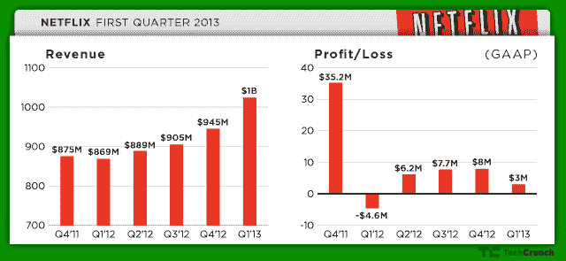

# 网飞超过分析师预期，拥有 2920 万美国用户和 10 亿美元 Q1 收入 

> 原文：<https://web.archive.org/web/https://techcrunch.com/2013/04/22/netflix-beats-analyst-estimates-with-29-2-million-us-subscribers-and-1-billion-in-q1-revenue/>

网飞报告了积极的第一季度数字，包括今年前三个月的 10.2 亿美元的收入。该公司还宣布，该季度增加了 200 万国内用户，使用户总数达到 2920 万。

这一结果代表了对凯文·史派西主导的政治惊悚片《纸牌屋》的积极回应，该片恰好是网飞今年原创节目中的第一部重要影片。他们正推动投资者在盘后交易中买入该股，推动股价上涨近 20%。

网飞宣布，美国用户净增 203 万，而第四季度为 205 万，这是历史上用户增长最强劲的时期，去年第一季度为 174 万。因此，该公司表示，其用户群和收入的增长速度快于流媒体业务的内容支出。该公司报告称，本季度其国内流媒体贡献率增至 20.6%，比上一季度增长 140 个基点。

分析师估计，该公司将报告约 10 亿美元的收入，以及每股收益 18 美分。但所有人都在关注的是网飞的用户数量，华尔街预测美国的流媒体用户数量约为 2900 万

网飞在《T2》和《纸牌屋》等独家节目的发行上下了很大的赌注，以此将自己的服务与现有电视网络授权的联合内容区分开来。它在这些剧集上投入了数亿美元，并希望这些投资能够得到回报，带来更大的用户兴趣。

虽然网飞去年发布了它的第一部原创剧，史蒂夫·范·赞特(Steve Van Zandt)主演的挪威黑帮喜剧《莉莉·哈默》( Lilly hammer )( T5 ),但本季度标志着《纸牌屋》的推出。该系列首次亮相就获得了强烈的评论和网飞的巨大营销推广，该公司希望利用凯文·史派西、制片人大卫·芬奇的演技和同名英国原创迷你剧的人气。

到目前为止，这个策略似乎奏效了，因为《纸牌屋》很快成为网飞最受关注的节目。更重要的是，自从新系列推出以来，注册这项服务的用户比预期的多。网飞在其分析师评论中指出:

> “一些投资者担心《纸牌屋》的粉丝会利用我们的免费试用，观看节目，然后取消。然而，在本季度数百万次免费试用中，免费试用游戏很少，只有不到 8000 人这样做。”

这是对《纸牌屋》的一个很好的回应——但是网飞在它的管道中有更多的独家内容。网飞刚刚推出了《铁杉林》( Hemlock Grove )( T6 ),这是一部由招待所所长伊莱·罗斯执导的 13 集恐怖片。下个月，另类喜剧《发展受阻》将回归，该剧将只在网飞播出。稍后,《野草》的创作者杰姬·科恩的新系列《橙色是新的黑色》也将上映。

除了国内流媒体用户数量，网飞称其国际业务新增用户 100 万，用户总数达到 710 万。相比之下，假期季度增加了 180 万国际用户，去年同期增加了 120 万。虽然与前几个季度相比，这些数字似乎较低，但网飞表示，它受益于前几个季度在新市场的推出。该公司计划继续向海外扩张，今年下半年将增加一个新的国际市场。

不足为奇的是，网飞的 DVD 会员人数持续下降，但幅度不大。DVD 用户总数减少了约 25 万，降至 800 万。但是贡献利润继续保持强劲，达到 1.13 亿美元，尽管本季度使用量增加，USPS 价格小幅上涨。

网飞报告称，其第一季度净收入为 300 万美元，或每股 5 美分，但这包括与 2 月份贷款再融资相关的债务清偿损失 1600 万美元。如果没有这一点，该公司将报告 1900 万美元的净收入，或每股 31 美分，远高于指导值。

进入第二季度，网飞预测流媒体用户的增长将放缓，最有可能是由于 Q2 的季节性，到本季度结束时，用户数量将在 2940 万到 3005 万之间。这相当于美国用户收入约为 6.65 亿至 6.73 亿美元，贡献利润约为 1.39 亿至 1.49 亿美元。总而言之，它预计第二季度的收益在 1，400 万美元至 2，900 万美元之间，或每股 23 至 48 美分。