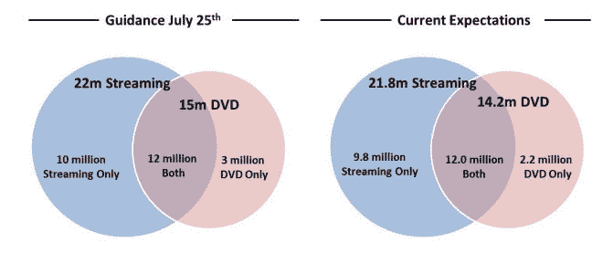

# 网飞发布修改后的订户估计，股价暴跌 

> 原文：<https://web.archive.org/web/http://techcrunch.com/2011/09/15/netflix-releases-revised-subscriber-estimate-stock-takes-a-nosedive/>

# 网飞发布修改后的订户估计，股价暴跌

网飞在交易前崩溃了，因为该公司刚刚向股东发布了一份声明，将预测用户减少了 100 万。这发生在网飞开始推出新计划之后，该计划有效地将最受欢迎的计划的价格提高了 60%。截至本文撰写之时，[网飞下跌了 15%](https://web.archive.org/web/20230204200526/http://www.google.com/finance?client=ob&q=NASDAQ:NFLX) 【更新如下】并且还在下跌，几乎抹去了该公司去年 19%的增长。

新的估计认为该公司的 DVD 用户数量为 220 万，低于[之前预测的 300 万。对网飞流媒体用户基础的估计也被下调了:用户数量被固定在 980 万，而不是原来估计的 1000 万。即使订户数量减少，网飞也不会修改其第三季度的财务前景，尽管损失了 100 万订户，但预计仍将达到目标。](https://web.archive.org/web/20230204200526/https://techcrunch.com/2011/07/25/netflix-75-percent-new-customers-streaming/)

 
网飞表示，他们预计推出新计划后会出现亏损，但他们显然没有料到会出现这种反弹。然而，正如这封信[ [PDF](https://web.archive.org/web/20230204200526/http://files.shareholder.com/downloads/NFLX/1403199447x0x500395/7c72e777-75c5-4f7f-9640-5b06f8cc54e4/Guidance_Update_Sept_2011_final.pdf) ]中所述，虽然他们高度重视客户的意见，但该公司仍然认为他们做出了正确的决定，将流媒体和 DVD 业务分开。这使得现在已经分离的部门可以专注于自己的业务，而不必处理其他业务:例如，全球流媒体服务不再与国内 DVD 业务等联系在一起。

改变是艰难的，网飞从初创企业到超级巨星的辉煌成就值得称赞。但是现在他们在顶端，如果你愿意，操场上的大孩子，它的历史将被写下它如何从这里前进。毫无疑问，短期目标是在增加 DVD 和流媒体服务的同时，挽回最近流失的用户。作为一个无聊的网飞用户，内容才是王道，而且流媒体库也不会变得更大。

**更新**:本帖写于开市前。网飞今天以 177 美元收盘，比昨天 208 美元的收盘价下跌了 14.9%。