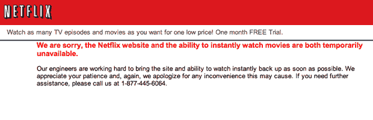
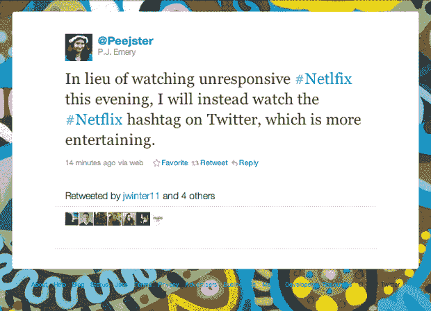

# Netflix.com 网站和流媒体服务关闭 TechCrunch

> 原文：<https://web.archive.org/web/https://techcrunch.com/2011/06/19/netflix-website-and-streaming-services-go-down/>

# Netflix.com 网站和流媒体服务关闭

想在父亲节和你爱的人一起去看电影，或者仅仅因为是星期天？它不会出现在网飞 T2，因为它的在线服务包括每月 7.99 美元的流媒体功能和订购 DVD 的功能对一些用户来说已经关闭。

现在，用户已经有大约三个小时无法访问网站或流媒体功能，并且[在(当然)推特上抱怨](https://web.archive.org/web/20221209183809/http://search.twitter.com/search?q=netflix)。网飞在美国和加拿大有 2330 万会员。

据一名用户称，从太平洋时间下午 5:23 开始，无法访问该网站的报告就不断出现，该网站目前显示上述“服务中断”消息(网飞开[Wii](https://web.archive.org/web/20221209183809/http://twitter.com/#!/RozitaSwinton/status/82655798655860736)和[iPad](https://web.archive.org/web/20221209183809/http://twitter.com/#!/BoJacobson/status/82658037378191360)显然仍在工作)。目前还没有消息表明这是否是最近索尼和世嘉等服务遭受黑客攻击的一部分。

我目前正在听网飞的音乐，如果我听到更多的信息，我会更新这个帖子。在那之前，也许你应该看看 Hulu？或者和你的家人交谈？

太平洋标准时间晚上 9:00 更新:一些用户报告说，它已经恢复在线，似乎 http://movies.netflix.com 仍然可以访问。

