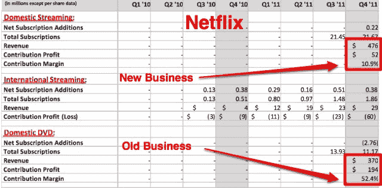

# 网飞流媒体利润率为 11%，DVD 利润率为 52% TechCrunch

> 原文：<https://web.archive.org/web/https://techcrunch.com/2012/01/25/netflixs-streaming-dvd-margins/>

# 网飞流媒体的利润率为 11%，DVD 的利润率为 52%

如果你仔细看看网飞第四季度的收益，就会明白为什么该公司想要拆分其 DVD 和流媒体业务。这是该公司将每项业务分开并分别报告收入、利润和利润率的第一个季度。

虽然流媒体业务正在增长(本季度国内增加了 220 名用户)，DVD 业务正在萎缩(国内失去了 276 万用户)，但其利润率远低于传统 DVD 业务。流媒体业务的利润率为 11%，而 DVD 业务的利润率高达 52%。

在网飞上个季度 8.47 亿美元的总收入中，4.76 亿美元来自流媒体，3.7 亿美元来自 DVD 租赁(其余来自国际)。流媒体业务的用户数量也翻了一番:2170 万对 1120 万。但 DVD 业务贡献了网飞绝大部分的利润:1.94 亿美元对 5200 万美元。

如果你细分一下，每个流媒体用户对网飞来说每个季度的利润只有 2.40 美元，而每个 DVD 用户的利润是 17.32 美元。旧生意利润丰厚。新生意有点糟糕。经济学是非常不同的。DVD 业务有固定成本，而网飞被迫与每家媒体公司逐个协商流媒体许可。

投资者必须弄清楚，在新的流媒体业务起飞之前，旧的 DVD 业务可以持续产生现金多长时间，但股票将根据流媒体的未来现金流进行估值。这些未来现金流的价值远远低于 DVD 业务的现金流。至少现在看起来是这样。

网飞在给股东的信中表示，它希望能够将每季度的流动利润率提高 1%。但是在达到自然上限之前，它还能坚持多久呢？百分之十五？百分之二十？更多？这是网飞最大的未知数。流媒体业务不可能有 50%的利润。但它最终将落户何处，将是决定网飞最终价值的主要因素之一。

在电话会议中，首席执行官雷德·哈斯汀斯表示，随着网飞通过许可协议和原创节目获得更好的内容，其利润率应该会上升。但是它还没有完全实现。“我们对现有的内容感觉很好，”他说。“我们对利润流感觉不太好。”

