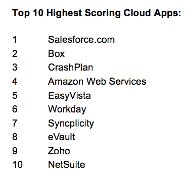

# Netskope 带着来自 Social+Capital 和 Lightspeed 的 2100 万美元以及一个管理企业应用的云平台悄然而至 TechCrunch

> 原文：<https://web.archive.org/web/https://techcrunch.com/2013/10/03/netskope-comes-out-of-stealth-with-21m-from-socialcapital-and-lightspeed-and-a-dream-team-of-enterprise-vets/>

基于云的服务和消费化的双重崛起是企业 IT 领域最大的两项发展，但它们也导致了一个最大的难题:IT 经理和首席信息官乐于看到员工开机工作，但也面临着管理和监控员工正在使用的潜在成千上万个应用程序的大难题。

如今，一家名为 [Netskope](https://web.archive.org/web/20230126030505/http://www.netskope.com/) 的新创公司正在秘密启动，试图正面应对这一挑战，该公司推出了一个新平台，允许公司监控员工使用的所有基于云的应用，然后制定安全政策，以防止数据泄露等。“我们的解决方案允许你去流氓，但在一个安全和合规的方式，”首席执行官桑杰贝里告诉我。

Netskope 不是你普通的创业公司。“走出大门”,它由 Social+Capital Partnership 和 Lightspeed Venture Partners 提供 2140 万美元的资金。这还不是全部。它还有 Beri 向我描述的“梦之队”,由工程师和硅谷产生的一些最令人印象深刻的企业 It 初创公司的其他人组成——其中包括 Palo Alto Networks、McAfee 和 PayPal 总共约有 55 名员工，其中许多人在该行业有 15-20 年的经验。

“我们反对创业，”贝利说。"这些人受够了过去雇主的自满和顽固态度。"对于一家试图在企业层面应对类似挑战的公司来说，这是一个合适的开端。

这 2100 万美元分两批筹集，都是在 Netskope 还处于秘密模式时筹集的。第一轮是来自 Social + Capital 的 550 万美元种子轮；第二个是光速公司今年早些时候完成的 1590 万美元的融资。

这并不是该公司拥有的唯一弹药:尽管仍未受到关注，但它正在与多家公司进行私人测试，规模从 5000 到 25000 名员工不等。这产生了几个付费客户。今天被提名的两个国家是 Vegas.com 和环球音乐集团，尽管 Beri 指出还有更多在财富 500 强中，其中一些将在未来几周内揭晓。

Netskope 背后的想法是，它假设消费化和云服务都是不可避免的趋势，消费化是指员工将自己在工作中使用的设备和服务的想法带到桌面上，其中许多都是他们在家里使用的设备和服务的翻版。这导致了服务的混乱局面，通常是为了共享敏感信息。“如果你是首席信息官或首席安全官，坦率地说，你甚至不知道云上发生了什么。你被蒙住了眼睛，”贝利说。“但是你做什么呢？告诉他们停止使用这些应用程序？如果你做那件事，你将成为一个恶棍。引入这些应用是有原因的:为了提高工作效率。”

因此，Netskope 的前提是，最好的做法是顺应员工的意愿，用 Beri 的话说就是“消除第 22 条军规”，而不是试图修改 IT 政策来模仿这些政策。Netskope 的平台目前能够在其服务中支持大约 3，000 种不同的应用程序，从最受欢迎的到不太知名的。Beri 告诉我，它的作用是，当它被 it 部门打开后，它会扫描网络和设备，以检测不同的应用程序。它从那里开始实时监控。IT 经理可以反过来使用 Netskope 仪表板来跟踪信息如何移动，并设置策略来限制使用，警告用户不良做法等等。

“我们正在关注用户和应用程序之间发生任何交易，”Beri 说。对于在您和服务器之间传输数据的任何活动，Netskope 都可以对其进行数据分析

Netskope 目前在它组织的 50 个不同类别的应用上工作——围绕劳动力协作、CRM、会计、销售等领域。事实上，它们之间有如此多的碎片——即使是来自微软、甲骨文或 Salesforce 等单一供应商的服务——对 Netskope 来说几乎是一件幸事。

和 SaaS 的其他产品一样，Netskope 的平台也是按年订购的。随着许多其他 SaaS 应用转向按月甚至按需付费服务，看看这些层级是否也会被添加到 Netskope 的计划中会很有趣，特别是当它发展壮大，也许会更多地扩展到小企业细分市场。

尽管亚马逊网络服务(Amazon Web Services)等公司对云服务的发展产生了影响，但 Beri 表示，Netskope“绝对不会”依赖 it 或其他第三方提供商作为自己的基础设施提供商。“我们非常关注安全性，”他说。相反，该公司已经与运营商中立的数据中心提供商 Equinix 建立了合作伙伴关系，并选择与后者一起构建自己的高性能、高安全性云。“大企业真的需要投资认证基础设施，”他说。(不过，这只是这项投资的一部分:剩下的是销售和一般员工保留，当你有这样一个高级员工时，这不是一件小事。)

这种“反创业”的定位也在另一个方面有所帮助:知识产权。Beri 说 Netskope 已经申请了大约 36 项专利，这得益于它的创始员工是“当今一些大型企业的主要设计师”

为了启动这一项目，Netskope 还制作了一份报告，报告了它迄今为止收集的关于企业应用程序使用情况的一些统计数据——这证明了这家初创公司的一些大数据资质，甚至可能是它未来可能如何利用这种数据的一个迹象。以下是该公司发现的十大最受欢迎的企业云应用。其中没有太多惊喜。

