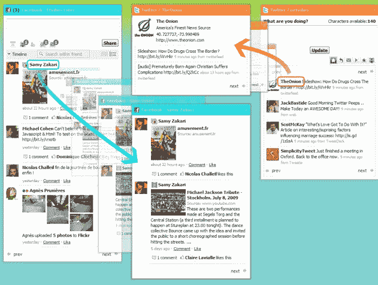

# NetVibes 为 Twitter、脸书和 MySpace 增加了拖拽和跟随搜索工具 

> 原文：<https://web.archive.org/web/https://techcrunch.com/2009/07/15/netvibes-adds-drag-and-follow-search-widgets-for-twitter-facebook-and-myspace/>

# NetVibes 为 Twitter、脸书和 MySpace 添加了拖拽和跟随搜索工具

[NetVibes，](https://web.archive.org/web/20221007150042/http://www.netvibes.com/)这家初创公司让你可以将所有你喜欢的小工具、订阅源、社交网络、电子邮件、视频和博客整合到一个可定制的主页上，明天它将为脸书、MySpace 和 Twitter 推出有用的“拖动并跟随”小工具。

NetVibes 已经为 T4 提供了脸书、MySpace 和 Twitter 插件。一旦你把相应的部件插入到你的 NetVibes 主页，现在你就可以点击部件中的任何朋友、用户名或标签，然后把它拖到外面，放到你的页面上，创建一个新的定制部件。新的小部件将跟随一个人或主题。例如，您可以从 Twitter 获取新闻源或朋友的流，并创建一个单独的小部件，只跟踪他们的流。

一次浏览许多不同的流或线程当然很有用。尤其是如果你是一个活跃的 MySpace、脸书或 Twitter 用户，你可以将所有的 feed 聚合到一个页面上，并拆分出对你最有吸引力的 feed 和搜索，就像你可以使用许多桌面 Twitter 客户端一样..

举例来说，像 Tweetdeck 和 Seesmic 这样的桌面客户端可以让你创建分类专栏，根据用户和 Twitter 搜索来过滤信息。因此，如果你经常使用 Twitter 客户端，NetVibes 的页面可能是多余的。但是小部件的好处是它们很小，你可以将其他信息，如天气、新闻、RSS 订阅等聚合到一个集中的页面上。NetVibes 表示，他们将在不久的将来开始在其他小工具中使用拖放技术进行搜索。NetVibes 的竞争对手包括 [Pageflakes](https://web.archive.org/web/20221007150042/http://www.pageflakes.com/) 和 [iGoogle。](https://web.archive.org/web/20221007150042/http://www.google.com/ig)上周在 [TechCrunch 的实时流处理会上，](https://web.archive.org/web/20221007150042/http://www.beta.techcrunch.com/2009/06/02/the-real-time-stream-and-4th-annual-summer-crunchup-at-august-capital/) Netvibes 还展示了一个新的直播阅读器和即时更新架构，以[使 RSS 实时，](https://web.archive.org/web/20221007150042/http://www.beta.techcrunch.com/2009/07/09/speeding-up-rss/)将在不久的将来正式推出。

