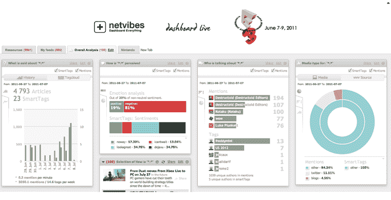

# Netvibes 推出面向品牌和代理商的强大社交分析平台 

> 原文：<https://web.archive.org/web/http://techcrunch.com/2011/07/08/netvibes-debuts-powerful-social-analytics-platform-for-brands-and-agencies/>

# Netvibes 为品牌和代理商推出强大的社交分析平台

Netvibes 是一家为品牌和机构提供社交媒体仪表板和新闻聚合器的公司，今晚将推出一个强大的新分析平台。Netvibes 的新社交分析和监测平台正在进行私人测试，但要到本月晚些时候才会向公众开放。

正如我们[去年所写的，](https://web.archive.org/web/20230203092906/https://techcrunch.com/2010/04/13/netvibes-launches-a-realtime-tracking-platform-with-instant-dashboards/) Netvibes 推出了即时仪表盘，允许用户在 Netvibes 的网站上输入一个关键词，就会弹出一个即时仪表盘，自动实时收集所有关于该主题的最新照片、视频、新闻、提要、搜索结果、Twitter 对话等等。该公司的新产品 Social Pack 是对 Instant Dashboard 产品的补充，使品牌经理能够同时进行监控和分析。

该平台的社交语料库让你可以自由添加和控制从哪些来源(博客、有影响力的人、新闻源)获取数据。此外，Netvibes 提供了一个内置的库，包含 20 多万个原创内容源和应用程序可供选择。

与 Radian6 等分析平台类似，Netvibes 跟踪提及和主题，并为品牌洞察这些数据的意义。该平台将识别趋势、情绪、影响者和想法。你也可以用数据挖掘得很深。例如，Netvibes 不仅会告诉你谁是你的头号影响者，而且这项技术还会告诉你这个影响者为哪个博客写文章，以及关于一个品牌或产品的评论是什么。Netvibes 将立即创建一个新的应用程序，只分析由一个影响者透露的特定关键词，并随着时间的推移跟踪它们。

Netvibes 还允许您设置特定的标签来跟踪特定来源的特定提及。Netvibes 允许管理人员创建无限数量的高级警报，以自动监控活动的有效性、品牌声誉、竞争对手，甚至触发行动，如调整活动预算、简讯回复或调用 URL。警报可以实时发送到任何移动设备。

虽然社交包平台结合新闻聚合平台肯定是一个信息过载，但它可以成为品牌经理的一个综合工具。许多知名机构和品牌已经在使用 Netvibes 的企业产品，包括 Digitas、可口可乐和欧莱雅。当然，企业仪表板并不便宜。整个社交包和仪表板的安装费用为 15，000 美元，然后每月 2，000 美元。

但显然大品牌正在为 Netvibes 的产品支付现金。该公司在净收入的基础上是盈利的。