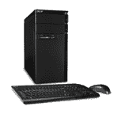

# 新款宏碁 Aspire 台式机起价 449.99 美元 

> 原文：<https://web.archive.org/web/https://techcrunch.com/2010/06/21/new-acer-aspire-desktop-pcs-start-at-449-99/>

 我能做些什么来让你换一台新的宏碁 Aspire X3 或 M3 系列电脑？我不能再降价了——我的经理已经在催我把价格降到 449.99 美元——但我附赠一个“节省空间的机箱”并提到它们是“对宿舍、卧室或家庭办公室的一个有吸引力的补充”如何没有吗？还是什么都没有？

听着，X3 系列是高端产品，是一款优秀、强劲的机器。不过，这辆 M3 只被我认识的某个人开过 11 万英里，这个人定期更换显卡。你可以为你的 X 系列配备英特尔或 AMD 处理器，或者为 M3 配备一个不错的 AMD 处理器。你听说过外国处理器的坏话吗？在哪里？消费者报告？他们撒谎。他们一直在撒谎。

我们能去我的办公室，坐下来，喝点咖啡吗？好好谈谈吗？我想我们可以做笔交易。

> Aspire X3 系列台式机是享受流媒体视频、数字音乐和摄影以及利用主流生产力应用程序的理想机型。这些台式机是技术和功能的强大组合，配备 4GB 内存和 AMD Athlon II、AMD Phenom II、英特尔酷睿 i3 或英特尔奔腾 E6600 处理器，可满足当今市场上各种数字媒体和生产力应用的需求。小巧而强大的系统还提供高达 1TB(2)的硬盘，用于存储和归档大量的音乐、电影和视频。无论是 NVIDIA GeForce 9200 还是英特尔图形媒体加速器高清显卡，都能为游戏、数码照片和视频注入鲜明的色彩和清晰的细节。
> 
> M3 系列台式机提供高达 640GB(2)的硬盘，提供足够的空间来存储大量的 MP3 音乐、数字图像和视频。两个可用的 PCI Express x1 插槽、一个开放的 PCI Express 插槽和用于额外光驱和硬盘的托架也有扩展空间。此外，10 个 USB 2.0 端口可连接大量外围设备和数字媒体设备。

> 新的 Aspire X3 和 M3 系列台式机标榜新的设计，高效的形式和功能
> 
> 加利福尼亚州圣何塞——(美国商业资讯)——全球第二大个人电脑市场供应商宏碁(1)今天宣布，其新的宏碁 Aspire X3 和 Aspire M3 系列消费者台式机型号已在美国上市。这些系统融合了新的造型、节省空间的机箱和一流的技术，为高级多任务处理和数字娱乐提供强大的功能和性能。
> 
> “这些系统旨在高效地进行多任务处理和处理数字媒体，配备了行业领先的组件，是宿舍、卧室或家庭办公室的理想之选。”新款台式机采用时尚的黑色设计，带有带照明的蓝色电源按钮，这种迷人的触感确保即使在黑暗的橱柜中也能找到它。时尚的 Aspire X3 系列在小巧的外形中拥有最佳的主流技术。Aspire M3 系列是一款高效的多任务处理器，具有充足的扩展空间。这两款产品都可以在领先的科技和电子零售商处买到，起价低至 449.99 美元。
> 
> 宏基美洲消费台式机高级业务经理史蒂夫·史密斯表示:“我们新推出的 Aspire X3 和 M3 系列台式机是出色的全能产品，以直观的设计提供实用的技术。“这些系统旨在高效地进行多任务处理和处理数字媒体，配备了行业领先的组件，是宿舍、卧室或家庭办公室的理想之选。”
> 
> 宏碁 Aspire X3 系列小型机:节省空间的机箱+实惠的价格
> 
> 紧凑的宏碁 Aspire X3 系列台式机证明了小包装带来的好处。这些系统外形小巧，外形美观，充分利用了狭小的空间，保持低调。它们非常适合放在桌子上，系统正面的 USB 端口、读卡器和音频端口都很容易够到。
> 
> Aspire X3 系列台式机是享受流媒体视频、数字音乐和摄影以及利用主流生产力应用程序的理想机型。这些台式机是技术和功能的强大组合，配备 4GB 内存和 AMD Athlon II、AMD Phenom II、英特尔酷睿 i3 或英特尔奔腾 E6600 处理器，可满足当今市场上各种数字媒体和生产力应用的需求。小巧而强大的系统还提供高达 1TB(2)的硬盘，用于存储和归档大量的音乐、电影和视频。无论是 NVIDIA GeForce 9200 还是英特尔图形媒体加速器高清显卡，都能为游戏、数码照片和视频注入鲜明的色彩和清晰的细节。
> 
> 紧凑型台式机还提供了 HDMI 端口的便利，通过一根电缆连接即可为家庭影院或外部 LCD 提供出色的视觉效果和高保真音频。为了提供扩展空间，部分型号有一个可用的 PCI Express x1 插槽，所有型号都有一个开放的 PCI Express x16 插槽。此外，多达 11 个 USB 2.0 端口可连接数码相机、数字音乐播放器、智能手机和许多其他数字设备。
> 
> 宏碁 Aspire M3 系列微塔式机:多任务怪兽+扩展
> 
> 宏碁 Aspire M3 系列台式机结合了独特的设计、实用的功能和技术，轻松快速地进行多任务处理。这些系统配备 AMD Athlon II 或 AMD Phenom II 以及 ATI HD 5450 或 NVIDIA GeForce 9200 显卡，可以支持各种数字媒体应用，包括休闲游戏。
> 
> 为了方便使用，读卡器、音频插孔和几个 USB 2.0 端口位于机箱顶部。具有 5.1 声道环绕声支持的高清音频通过动态声学效果为音乐、电影和游戏注入活力。
> 
> M3 系列台式机提供高达 640GB(2)的硬盘，提供足够的空间来存储大量的 MP3 音乐、数字图像和视频。两个可用的 PCI Express x1 插槽、一个开放的 PCI Express 插槽和用于额外光驱和硬盘的托架也有扩展空间。此外，10 个 USB 2.0 端口可连接大量外围设备和数字媒体设备。
> 
> 实用软件套件
> 
> 这些系统预装了 Acer Arcade Deluxe 2010，这是一款用于管理数字媒体的一体化媒体门户。宏碁街机存档歌曲、照片、电影和视频；Arcade Photo 优化图形加速，实现快速照片排序和令人难忘的幻灯片制作；Arcade Video 可以快速转换视频，以便在喜爱的媒体播放器上播放，并将视频上传到 YouTube 和脸书；和街机音乐浏览和组织音乐收藏。
> 
> 定价和可用性
> 
> 宏碁最新的 Aspire 台式电脑现已在科技和电子产品零售商处上市，起价为 449.99 美元。