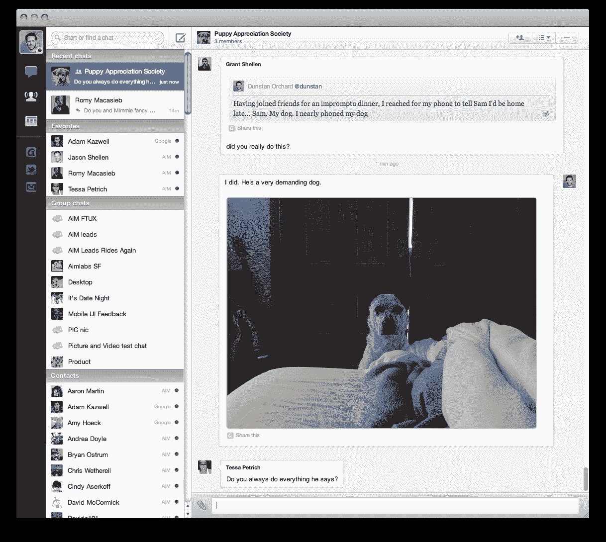

# 全新 AIM 预览版，可在桌面和移动设备上进行群组和视频聊天 TechCrunch

> 原文：<https://web.archive.org/web/http://techcrunch.com/2011/11/16/new-aim-preview/>

# 新的 AIM 预览版，可以在桌面和手机上进行群组和视频聊天

美国在线(拥有 TechCrunch)今天发布了新 AIM 的预览图。Jason Shellen 的团队对其进行了彻底的重新设计，该团队通过[收购 Thing Labs](https://web.archive.org/web/20230205044536/https://techcrunch.com/2010/09/28/aol-thing-labs/)(Twitter 客户端 Brizzly 的制造商)加入了 AOL。新的 AIM 去掉了许多以前内置在 AIM 中的 [Lifestream 功能](https://web.archive.org/web/20230205044536/https://techcrunch.com/2009/09/15/aim-is-now-faster-better-more-streamy/)，主要专注于通信。

AIM 预览版同时在桌面、网络、iPhone 和 Android 上推出。(手机版将于今天晚些时候上市)。好友列表不见了，取而代之的是最近的聊天记录(有点像 Skype)。除了 AIM 好友，您还可以在 AIM 中与脸书和 GTalk 联系人聊天。它还会显示您的 Twitter @提及次数和新关注者。但是不支持雅虎即时通讯或者微软信使(有意思)。添加谷歌联系人时要小心，在预览版中，他们都会收到垃圾邮件，询问他们是否希望聊天信息记录在案。

照片和视频可以内嵌，聊天记录可以在手机和桌面版本之间同步(同样，很像 Skype)。它还包括一个带有新闻标题的提要阅读器

我一直提到 Skype，因为许多人主要将 Skype 用作即时消息客户端。我当然知道。AIM 不做电话。但它确实可以进行一对一的视频聊天。它还可以进行群聊(Skype 不太擅长这一点)。但在这里，AIM 是在回应 GroupMe、Beluga 之类的。

一个似乎是旧 Lifestream 战略遗留下来的功能是新闻提要，这是足够有用的，只是它只包括 AOL 拥有的资产的提要(主要是赫芬顿邮报频道，TechCrunch 也在其中)。没有明显的方法来添加更多的提要，这是相当蹩脚的。要么让它成为一个完整的阅读器，要么摆脱它是我的两分钱。

查看预览，并在评论中与其他读者分享您的反馈。

