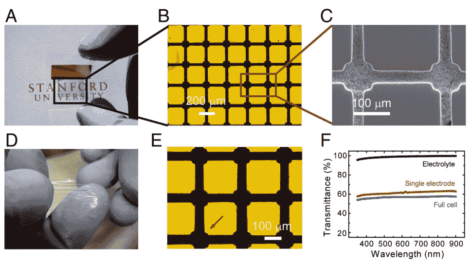

# 新电池技术部分透明、灵活 

> 原文：<https://web.archive.org/web/http://techcrunch.com/2011/07/27/new-battery-tech-is-partially-transparent-flexible/>

# 新的电池技术是部分透明的，灵活的

斯坦福大学的研究人员整合了[一种有趣的新电池技术](https://web.archive.org/web/20230203081315/http://news.stanford.edu/news/2011/july/transparent-litiumion-battery-072511.html)，它结合了两种理论上令人垂涎的属性:透明性和灵活性。使电池透明的方法相当聪明，虽然最终产品的能量密度远低于其不透明的亲戚，但这仍然是一个有趣的发展。

秘密在于在微观尺度上以某种方式组织这些成分。电极材料不是透明的，但没有理由它必须是一个固体块，而不是一些不太结实的东西。材料科学教授崔屹将这种电池的电极层做成一个线网格，只有 35 纳米厚，肉眼是看不见的。通过将它们排列成稀疏的网格，他产生了一个能量密度尚可的阵列，但光线可以轻松通过。

【YouTube = http://www . YouTube . com/watch？v=5boywxr8ot4&w=640&h=390]

该栅格被嵌入到不导电的柔性衬底中，然后在它和另一个栅格之间插入凝胶电解质层，该凝胶电解质层被精确地放置在第一个栅格之上。通过以这种方式堆叠电极网格，并对其他组件仅使用透明材料，他们已经能够实现约 60%的透明度。瓦数没什么可夸耀的，但这是下一个需要改进的。

应用程序？我不是工程师，但我相信柔性和/或透明电池在很多地方都很有用。将它包裹在其他组件周围，将其嵌入已经透明的物品(屏幕、窗口等)中，以及其他想法很快浮现在脑海中，但谁知道这项研究将实现什么？崔和他的学生团队正在努力扩大技术规模，解决这些问题。

全文可在 PNAS 阅读。