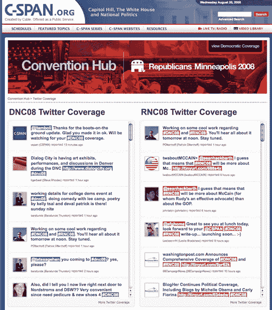
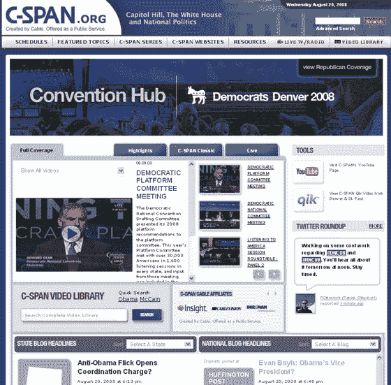

# 新的 C-SPAN 网站与 YouTube、Twitter、Qik、Flash 的联系越来越紧密...TechCrunch

> 原文：<https://web.archive.org/web/https://techcrunch.com/2008/08/21/new-c-span-sites-get-way-unboring-with-youtube-twitter-qik-flash/>

# 新的 C-SPAN 网站与 YouTube、Twitter、Qik、Flash 等网站分离开来

我愿意站出来说出来。C-SPAN 致力于不间断地播放政府程序和公共事务节目，是我们在极少数情况下快速跳过的一个频道，我们实际上在未录制的电视上切换频道。如果不是洋葱[一直取笑它](https://web.archive.org/web/20221209115317/http://www.theonion.com/content/video/rep_gary_nelson_r_ct_introduces)，我会忘记它的存在。如果 CSPAN 有人口统计的话，我认识的人中没有一个是它的一部分。我敢打赌，即使是在 C-SPAN 工作的人，也绝不会自愿看 C-SPAN。

但是今天，随着两个新网站的推出，C-SPAN 变得相当酷，这两个网站致力于即将在丹佛举行的民主党大会和在明尼阿波利斯举行的共和党大会。C-Span 仍在解决一些技术问题，但 TechCrunch 的读者可以通过点击 [DNC08](https://web.archive.org/web/20221209115317/http://38.105.88.215/) 和 [RNC08](https://web.archive.org/web/20221209115317/http://38.105.88.241/) 的链接获得早期预览。这两个网站都是类似的格式，通过博客、Twitter、YouTube 和 Qik 将公民新闻整合到门户网站，以报道大会和相关新闻。他们将补充现有的 C-SPAN Politics 网站。

这些网站还包括正常的 C-SPAN 视频内容。但是不同于 C-SPAN 主网站上笨重的内容，新网站将以 Flash 格式显示视频，并允许嵌入其他网站。来自赫芬顿邮报、Instapundit、Gateway Pundit、RedState 等网站的第三方博客内容。将被纳入网站，标有#RNC08 或#DNC08 的 Twitter 消息也将出现在网站上(有节制)。C-SPAN 员工将获得 Qik 摄像机，以便在主摄像机以外的时间记录动作。

总而言之，用用户生成的最新内容来增加报道的趣味性是一项巨大的努力。这可能不会让有线频道更具观赏性，但政治狂人肯定会想把这些网站加入书签。它可能有关于大会的最新消息。

下面的屏幕截图:

