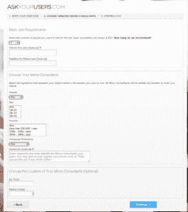

# 新的众包发布:AskYourUsers.com 使用 LinkedIn 帮助你为微型咨询项目找到人 TechCrunch

> 原文：<https://web.archive.org/web/https://techcrunch.com/2012/04/19/new-crowdsourcing-launch-askyourusers-com-uses-linkedin-to-help-you-find-people-for-microconsulting-projects/>

众包和众筹一直是影响企业——尤其是小企业和个体交易者——融资方式的两个最大趋势，Kickstarter.com 和英国融资圈(in the UK Funding Circle)等网站吸引了人们的关注，因为它们是绕过传统且昂贵的银行贷款，为项目或商业创意获得支持的绝佳方式。

现在，一个网站正在推出，给这种模式带来了额外的变化:[AskYourUsers.com](https://web.archive.org/web/20221207195906/http://www.askyourusers.com/)是一种简单的服务，帮助你为持续时间不超过 15 分钟的微型咨询项目找到人——它使用你的 LinkedIn 网络来帮助你找到他们。

从我看到的演示来看，这项服务基本上就是这么简单，但它运行得非常流畅，并且肯定解决了一个需求——这是 Amelia Dunne 和她的联合创始人 Chris Bumgardner 无意中发现的:

两人在过去的四年里一直在一起研究创业想法，最终两人都辞去了日常工作，全职专注于创业:

“但经过一个月的开发，我们仍在试图验证这个想法，以便对花费时间和金钱构建原型感到放心，”她说。“验证过程既费时又费钱，而且我们找不到合适的人与之交谈或获得客观的反馈。AskYourUsers.com 是我们希望可以使用的工具，但它并不存在。我们认为其中的价值使得 AskYourUsers.com 值得开发，即使只是为了我们自己的使用。很快，它也有了明确的商业意义。我们惊讶地发现，其他初创公司在进行市场调查、组织焦点小组和了解客户需求/兴趣方面效率低下。"

这包括参与开展面对面焦点小组的漫长而昂贵的过程的企业；企业利用 Craigslist 上的帖子招募可以提供反馈的人；使用 Surveymonkey 筛选出受访者，并选择要采访的人。那么花在分析结果上的时间就是另一个问题了。“我们知道这个过程可能比我们(和其他初创企业)经历的更容易，”她说。

解决方案是一个简单的网络界面，让你设置问题，决定任务(用户测试，对某个功能的反馈等等)，你想针对多少人，甚至一些人口统计信息。然后你支付每个“顾问”22 美元。在咨询方面，潜在的帮手设定的时薪在 20-40 美元之间，每份工作的最低报酬为 7.5 美元。该网站建议，如果你收取 40 美元或更多，你可能得不到多少工作。

然后 AskYourUsers 完成剩下的工作。

邓恩说，她相信这可能是第一次使用 LinkedIn 来帮助寻找人。这是一种有趣的方式，使用以企业为中心的社交网络不仅仅是为了建立关系网，而是为了真正赚点钱。然而，她说，LinkedIn 只是一个开始。除了计划在下个季度推出的其他新服务外，该公司计划很快整合脸书连接。

至于资金，该公司目前走的是不那么网络化的路线:完全自筹资金。“我们还没有探索额外的资金或与任何潜在的支持者交谈，但我们打算在这个测试版推出后不久就开始寻找天使投资，”邓恩说。

计划是从现在开始，在接下来的两个月里进行封闭测试。邓恩说，该公司已经有一些初创公司等着成为推出时的第一批客户。

对于那些想用他们自己的微咨询请求尝试一下的读者，我们有一个代码。前 1000 名用户前往[站点](https://web.archive.org/web/20221207195906/http://www.askyourusers.com/)并输入 66214506-5229-48d 6-be5f-6 eff 5a 164 b 68 可以免费完成。我相信他们会喜欢你的反馈。

哦，对了，他们在做的那个创业公司？一个实时促销的移动应用程序，其中商家提供免费的东西(积压，赠品，廉价产品)。我想这是一个值得期待的未来。