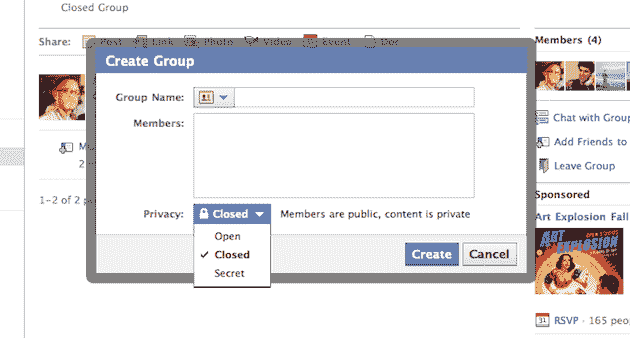
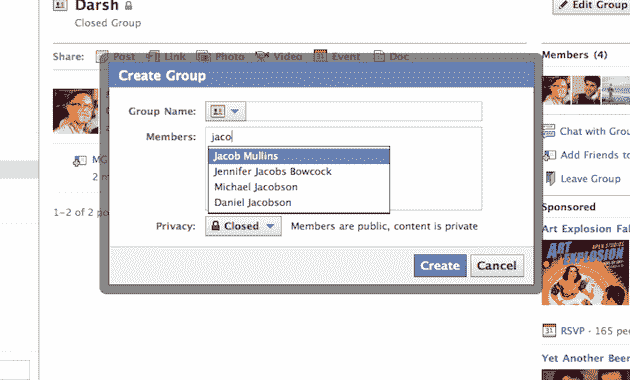
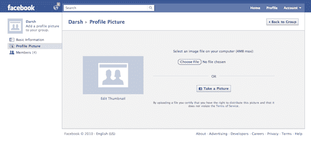

# 快速浏览新脸书集团 TechCrunch

> 原文：<https://web.archive.org/web/https://techcrunch.com/2010/10/06/new-facebook-groups/>

# 快速浏览新脸书集团

今天在帕洛阿尔托总部举行的[活动](https://web.archive.org/web/20221209234341/https://beta.techcrunch.com/2010/10/06/live-from-todays-special-facebook-event/)上，脸书公布了[一个全新的团体特色](https://web.archive.org/web/20221209234341/https://beta.techcrunch.com/2010/10/06/facebook-groups/)。有了它，你可以将你社交网络中的人添加到脸书的一个新领域，在那里你可以更容易地与他们交流。下面，找到一些有趣的事情的初步浏览。(脸书说，这项功能今天已经对一些人开放，并将在未来几周内全面推出。)

这是“创建组”弹出窗口:

您可以将群组设置为“开放”、“封闭”或“秘密”(默认为封闭):

正如您所料，只需开始键入某人的姓名，即可轻松将其添加到群组中:

您也可以更改群组的图标:

每个组都可以有一个电子邮件地址:

您还可以上传自己的群个人资料图片:

每个小组都有一面墙，任何成员都可以在上面发帖:

有一项新功能允许您创建文档，组中的任何人都可以编辑该文档:

【T2

以下是编辑文档的样子:

以下是群组聊天的样子:

