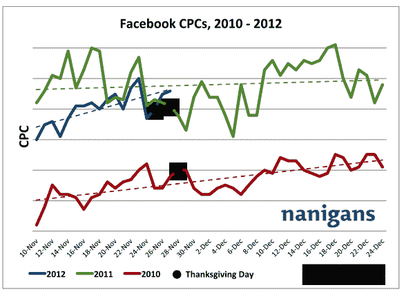
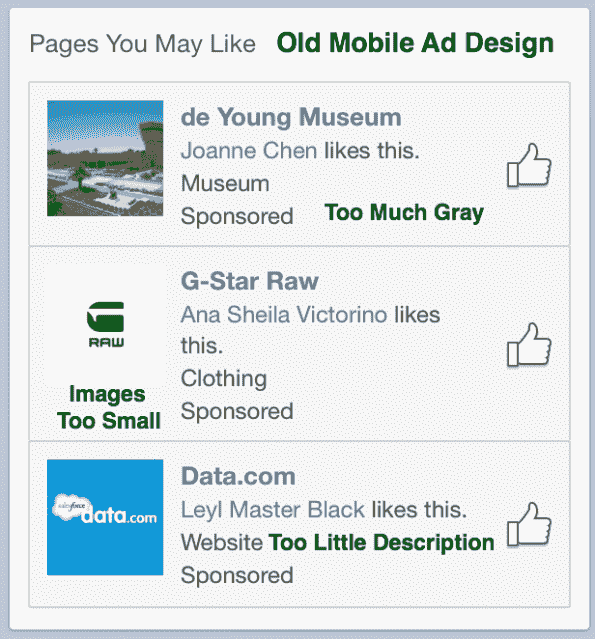
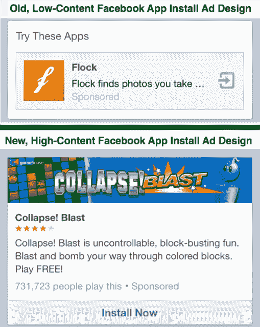

# 脸书赋予新的移动页面广告更多的色彩和内容，让每一个像素都有价值

> 原文：<https://web.archive.org/web/https://techcrunch.com/2012/11/28/new-facebook-mobile-ads/>

你滚动浏览了脸书“你可能喜欢的页面”移动广告的旧设计。灰色太多，描述不够。但他们刚刚更新，显示彩色横幅，并解释企业是做什么的。他们的设计师杰夫·坎特认为你会停下来看一眼。甚至可能是水龙头。凭借风格和定位，脸书正把有限的移动广告空间变成其秘密武器。

作为 news feed 广告团队的产品经理，Kanter 的工作是以不中断脸书体验的方式传达脸书广告客户的信息。为了确保他在正确的轨道上，坎特告诉我“我们首先与员工分享所有这些不同的广告体验。我们会给出反馈，进行调整，找出漏洞，然后推出一个小型的外部测试。”

接下来，脸书观察以确保它们不会激怒用户。坎特告诉我，“这里有专门的团队和人员，他们每天都在思考这个问题，仔细衡量情绪和参与度。”

脸书三月份才开始在手机上展示广告，所以还在摸索中。“今年我们学到了很多，并将继续学习。我们发现，新闻提要广告体验与我们多年来一直致力于的右栏广告体验截然不同，我们已经做出了一系列调整。”

总的来说，广告业务做得很好，脸书准备在假期里大捞一笔。脸书广告技术开发商 [Nanigans](https://web.archive.org/web/20221206014452/http://www.nanigans.com/) 将于今天晚些时候发布数据，指出广告客户在黑色星期五/网络星期一购物周末支付给脸书的每次点击费用比 11 月初上涨了 25%，广告费率现在是 2010 年的两倍。

但是未来取决于手机。自从脸书首次公开募股以来，每个人都害怕向移动业务的转移会扼杀 T4 的广告业务。批评者似乎忽略了一个关于广告和移动设计交集的重要事实:如果你展示广告的空间较小，那么每一个广告都必须更吸引眼球，与观众更相关。

每一家网络广告公司都不得不经受同样的风暴。然而，脸书有非常强大的方法来解决这两个需求，可以在其他所有人都陷入困境的时候让它继续前进。首先，脸书有你朋友的名字和面孔。它们天生引人注目。其次，它比几乎任何网站甚至政府都更了解更多的人:你的年龄、性别、位置、兴趣、你使用的设备、你玩的应用程序，以及你的朋友是谁。这意味着如果它只能向你展示一个广告，那么它更有可能是你真正想要的东西。

坎特利用这两项资产让脸书改版后的“你可能会喜欢的页面”广告变得更好。新的广告单元不是一次推荐三个不同的企业，而是依靠脸书的定位来显示一个高度相关的页面。除了显示已经喜欢该页面的一个朋友的名字，广告还显示了喜欢该页面的其他人的数量，提供了更强有力的同行推荐。“如果这些人都喜欢，我的朋友们也喜欢，也许我也会喜欢。”

脸书还通过直接从页面上引入创意材料，改善了广告的视觉感受，而没有增加广告商的负担。广告不再是页面简介图片的小缩略图，而是取其封面图片并覆盖一张更大的简介图片。因为封面应该是大而漂亮的图像，通常代表一个页面的身份，所以它们在广告中很好地工作，并且经常可以给它们增添色彩。

最后，底部有一个大的“喜欢页面”按钮，可以将兴趣转化为订阅。坎特总结了新设计如何更好地利用小空间，他说:“我们不是一次展示三个，而是展示一个有更多背景的，更突出的行动号召。”

个人觉得这些广告很好看。碧玉市场广告上那些多汁的青苹果比旧的灰色盒子或碧玉单独的个人资料照片更引人注目。脸书最近在[推出了类似的移动应用安装广告](https://web.archive.org/web/20221206014452/https://beta.techcrunch.com/2012/10/17/facebook-mobile-app-install-ads/)的重新设计，以大幅横幅和对应用或游戏功能的描述为特色，以取代低内容的“尝试这些应用”设计，这种设计只显示一张个人资料图片和一个经常被删减的广告。这两个新的广告单元肯定比旧的更引人注目，旧的应该会获得更多的点击。脸书只需确保它们不会过于公开，以免分散对有机内容的注意力。

除了这些设计，坎特告诉我“我们还在测试一系列不同的移动广告功能，包括页面和应用类别和描述、社交环境、标题等等。朋友的脸目前更多地用在桌面上…虽然我们目前没有在手机上测试这些赞助故事之外的内容，但这可能是我们未来可以考虑的事情。"

脸书正在慢慢转型为一家移动广告公司。上个季度，其广告收入的 14%来自小屏幕，广告技术初创公司告诉我，[品牌正在排队购买移动库存。这相当令人印象深刻，因为我认为旧的移动广告设计不是很引人注目。现在，华尔街似乎终于](https://web.archive.org/web/20221206014452/https://beta.techcrunch.com/2012/09/27/cheapest-way-to-buy-facebook-fans/)[有足够的信心开始在脸书移动广告业务的未来上下赌注](https://web.archive.org/web/20221206014452/https://beta.techcrunch.com/2012/11/21/surprise-facebook-stock-up-28-in-past-month-highest-since-july/)，这就是它看起来的样子。