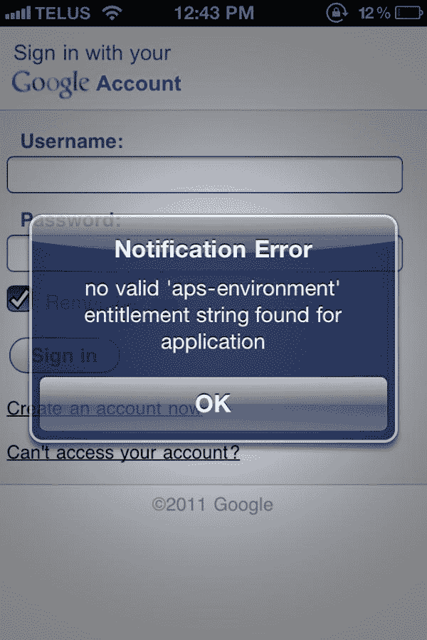
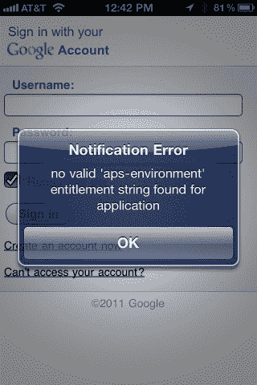

# iPhone 版新 Gmail 应用不可用，启动时显示错误 

> 原文：<https://web.archive.org/web/https://techcrunch.com/2011/11/02/new-gmail-app-for-iphone-is-unusable-shows-errors-on-launch/>

嗯，那真是太令人失望了。谷歌[今天早上刚刚发布了第一个用于 iPhone、iPad 和 iPod Touch 的原生 Gmail 应用程序，这个应用程序一团糟。不能用了。它甚至不能正常启动，启动时会显示一条错误消息。](https://web.archive.org/web/20221226041620/https://techcrunch.com/2011/11/02/google-launches-native-gmail-app-for-iphone-ipad-and-ipod-touch/?preview=true&preview_id=446106&preview_nonce=cf8db1fae6)

该应用程序在 iTunes 中可用后不久，Gmail 用户就在 Twitter 上发帖抱怨、截图，并普遍抱怨 Gmail 的糟糕状态，而这本来可以是一个更好的体验。

该应用最有前途的功能之一是支持推送通知。这是 iPhone 默认为 Gmail 做不到的。不幸的是，谷歌在其[博客帖子](https://web.archive.org/web/20221226041620/http://googlemobile.blogspot.com/2011/11/introducing-gmail-app-for-iphone-ipad.html)中承诺的功能没有一个是可访问的，因为对许多用户来说，这个应用程序已经胎死腹中。连登录都不行。(见下图截图)。

推特上的反应很激烈:

http://twitter.com/#!/Paris lemon/status/131773672687009793

http://twitter.com/#!/Scobleizer/status/131773218825580544

http://twitter.com/#!/EDL amblet/status/131784673285246976

http://twitter.com/#!/ljsgecko/status/131564392327286787

http://twitter.com/#!/woainidepigu/status/131519422086127617

http://twitter.com/#!/SolidMail/status/131776039188828160

http://twitter.com/#!/kevsweetwater/status/131776857535295489

http://twitter.com/#!/kmore/status/131773744376061953

http://twitter.com/#!/opasco/status/131778136961597442

http://twitter.com/#!/kyledhebert/status/13178846462801920

然而，显然不是每个人都认为这款应用是坏消息。有些人已经能够加载它:

http://twitter.com/#!/garten Berg/status/131770151774330880

http://twitter.com/#!/罗斯/status/131781709069955072

安装后，这款应用看起来是这样的(感谢 Twitter 用户从许多不同的手机提供商那里获得的截图):

真正的问题是，这些问题是如何在测试中没有被发现的，无论是谷歌还是苹果？(阴谋论:苹果确实发现了错误，但还是批准了这款应用)。

**更新**:谷歌现已撤下该应用，并发布消息称:

> 今天早些时候，我们推出了新的 iOS 版 Gmail 应用程序。不幸的是，它包含一个错误，破坏了通知，并导致用户在第一次打开应用程序时看到一条错误消息。我们在纠正问题时已删除该应用，我们正在努力尽快为您提供新版本。已经安装了该应用程序的每个人都可以继续使用它。