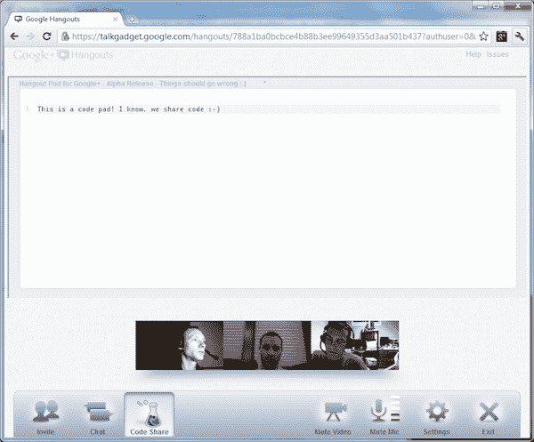

# 新的 Google+扩展为 Hangouts 增加了实时代码协作 

> 原文：<https://web.archive.org/web/http://techcrunch.com/2011/08/08/new-google-extension-adds-real-time-document-collaboration-to-hangouts/>

之前为我们带来了[脸书朋友出口商](https://web.archive.org/web/20230205005815/https://techcrunch.com/2011/07/05/google-facebook-friends-yahoo/)的开发者 Mohamed Mansour，已经创建了一个新的、实验性的 Google Chrome 扩展，为 Google+ Hangouts 添加了基于文本的文档协作功能。对于那些尚未精通所有 G+术语的人来说，Hangouts 是谷歌社交网络服务中的多人视频聊天功能，一次最多支持 10 个人。

有了这个新的 Hangout 扩展，现在您可以做的不仅仅是聊天，还可以在基于文本的文件上进行协作。Mansour 认为，这将是一个很好的扩展，例如，供开发人员用于代码协作。

**越野车，但作品**

在我们继续之前，有一些警告:**这个扩展“错误百出”**(曼苏尔的话，不是我的)。这是一个 alpha 产品，旨在作为一个技术预览，而不是你应该期望在现实世界或任务关键的情况下使用的东西。在 Mac 电脑上似乎也不行。尝试在我的 MacBook Pro 上加载扩展时出现错误信息。然而，在我的 Windows 7 个人电脑上，它成功了。

该扩展是在没有访问官方 Google+ API(应用程序编程接口)的情况下开发的，因为这样的东西还不存在。换句话说，就像迄今为止所有的 Google+ Chrome 扩展一样，这是一个未经批准的黑客行为。

也是挺牛逼的。

**技术细节**

Mansour 说，Hangouts 目前使用传统的 Google Wave 技术，jQuery 使用 Google 共享空间。为了构建扩展，他模仿了 YouTube Hangout 小工具，拦截了所有来自 Google Wave 的消息。该扩展广播一个惟一的 ID，它存储在 Wave 中，每个参与者在加入时都可以读取。该 ID 仅在 Hangout 会话中是持久的。

曼苏尔承认，这是一个相当复杂的黑客攻击。对我们来说幸运的是，他把代码发布到了 GitHub 上，这样其他人也可以参与进来。

**如何使用**

要使用该扩展，您首先从 [Chrome Web Store](https://web.archive.org/web/20230205005815/https://chrome.google.com/webstore/detail/kdeeabahpojjdkhocdedhfcldgegnmcc) 安装该插件，然后前往 Google+并开始闲逛。你再也不用做什么了——文本编辑界面直接出现在视频屏幕上方的“闲逛”窗口中。

但是为了让其他 Hangout 参与者与您共享代码，他们也需要安装扩展。

曼苏尔说，在约翰·巴林顿·克莱格斯和杰克·麦克奎斯蒂安的支持下，延期成为可能。如果您想试试，请告诉我们您的近况。