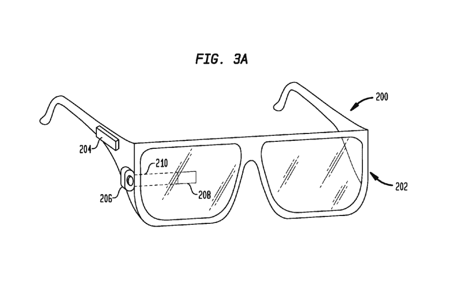
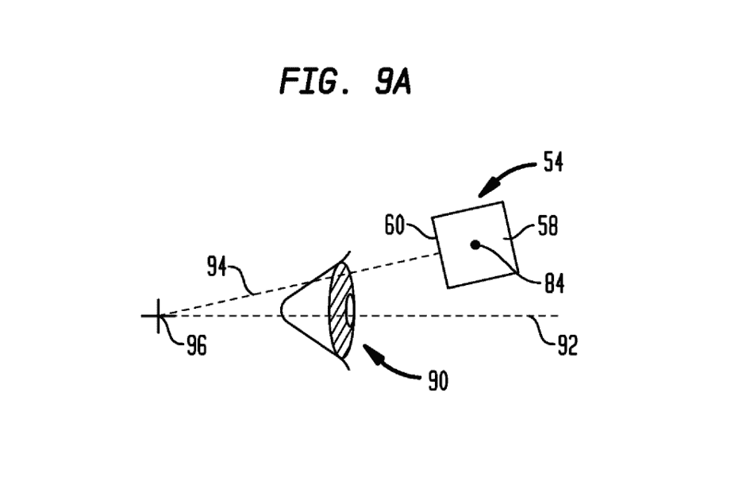

# 谷歌眼镜的新专利是谷歌基于面部的可穿戴计算机最全面的专利

> 原文：<https://web.archive.org/web/https://techcrunch.com/2013/02/21/new-google-glass-patent-is-the-most-comprehensive-yet-for-googles-face-based-wearable-computer/>

# 谷歌眼镜的新专利是谷歌基于面部的可穿戴电脑迄今为止最全面的专利

美国专利商标局今天[公布了谷歌的一项新专利申请](https://web.archive.org/web/20230314123606/http://appft.uspto.gov/netacgi/nph-Parser?Sect1=PTO2&Sect2=HITOFF&u=%2Fnetahtml%2FPTO%2Fsearch-adv.html&r=13&p=1&f=G&l=50&d=PG01&S1=(20130221.PD.%20AND%20Google.AS.)&OS=PD/20130221%20AND%20AN/Google&RS=(PD/20130221%20AND%20AN/Google))，全面详细地描述了将成为谷歌眼镜的完整系统，最初于 2011 年 8 月提交。这项新发现的专利不仅描述了我们之前看到的玻璃的单个组件，还描述了整个系统，包括显示器、框架、图像投影和捕捉、无线连接、传感器等。

专利中包括的一些技术图纸看起来很像谷歌眼镜，我们从它的公开亮相[开始了解和喜爱它，装饰天空潜水员](https://web.archive.org/web/20230314123606/https://techcrunch.com/2012/06/28/how-google-pulled-off-their-live-video-skydiving-with-glasses-demo/ "How Google Pulled Off Their Live Video Skydiving With Glasses Demo")和科技公司[创始人，他们可能被误认为珠宝窃贼](https://web.archive.org/web/20230314123606/https://techcrunch.com/2013/01/21/sergey-brin-dons-google-glass-dresses-like-an-international-jewel-thief-for-nyc-subway-ride/ "Sergey Brin Dons Google Glass, Dresses Like An International Jewel Thief For NYC Subway Ride")。但其他人描绘了类似廉价纸质 3D 眼镜的设计，以及你可能会在 Warby Parker 看到的时髦眼镜。除了已经展示的科幻风格的护目镜，谷歌显然正在寻找多种方式将谷歌眼镜推向市场。

 该专利的文本进入了极端的技术细节，提供了一个关于玻璃实际功能的颗粒视图。它描述了安装有透镜的显示器如何与佩戴者头部的运动相关联地操作，以保持投影图像的一致性，以及如何将现实世界中的物体与数字图像叠加，以创建增强现实体验。它详细介绍了眼镜臂的各种配置，以及设备“大脑”的外壳相对于眼镜设备其余部分的位置，并谈到了在框架中构建触摸感应表面以接受用户输入。

谷歌还在背景一节中描述了当前可穿戴技术界面的局限性，它用这些来为其创造谷歌眼镜提供基本的理由。一句话，根据该公司的文件，现有系统存在缺陷:

> 头戴式显示器和平视显示器都可以连接到接收视频信号的视频源，设备可以读取该视频信号并将其转换为呈现给用户的图像。视频源可以从诸如视频播放器、便携式媒体播放器或计算机之类的便携式设备接收。然而，这些类型的显示器的功能限于被动动作，其中显示器简单地从外部源接收信息，并以有限的形式呈现给佩戴者。因此，需要包括显示器在内的可穿戴设备的进一步发展。

该专利的详细描述中的一些更有趣的元素包括可选的显示方法。我们已经在当前的原型中看到了镜头安装显示器的使用，但该专利还描述了替代方案，包括“激光或 LED 光源和扫描系统，可用于将光栅显示直接绘制到用户一只或多只眼睛的视网膜上。”这听起来有点可怕，但也可能令人兴奋。

总的来说，这项专利主要是以尽可能详细的技术方式锁定谷歌在谷歌眼镜项目上的知识产权，但对于那些想了解谷歌最大胆的消费硬件项目背后的真相背景的小工具负责人或工程师来说，这是一个有趣的阅读材料。