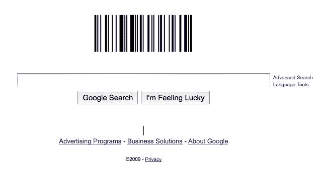

# 新谷歌标志庆祝条形码| TechCrunch

> 原文：<https://web.archive.org/web/https://techcrunch.com/2009/10/06/new-google-logo-celebrates-the-barcode/>

谷歌的新标志是一个[条形码](https://web.archive.org/web/20230222160322/http://en.wikipedia.org/wiki/Barcode)，据我们所知，上面写着“谷歌”今天是第一个条形码专利的 57 周年纪念日。发明人诺曼·伍德兰德和伯纳德·西尔弗于 1949 年 10 月申请了该专利，并于 1952 年 10 月 7 日被授予[第 2612994 号](https://web.archive.org/web/20230222160322/http://www.adams1.com/pub/russadam/shareware/2612994.pdf) (pdf)。最初的专利是一个将数据编码成圆形(靶心图案)的系统，这样它就可以在任何方向上被扫描。

谷歌主页上的条形码是 Code 128 编码，这是一种标准的 ASCII 字符串编码方式(即 A-Z，a-z，0-9 等。)转换成条形码。可以肯定的是，谷歌使用了他们自己的开源条形码项目 [ZXing](https://web.archive.org/web/20230222160322/http://code.google.com/p/zxing/) 来生成条形码。Android 中使用相同的库进行条形码识别。

条形码是一项技术创新，它已经成为现代生活中一个经常被忽视但又必不可少的部分。该格式是一种全球标准，任何制造商的扫描仪都可以从任何地方解读几乎任何符合标准的条形码(假设它可以解读编码格式——对于产品来说是 UPC，对于其他应用来说是 Code128 或其他格式，具体取决于此)。条形码是一个很好的例子，说明了为什么统一的协议和标准对每个人都有好处，同样的道理当然也适用于网络。

我们不得不再次检查这个例子中的条形码是否正确(这里的一些极客坚持认为条形码不是 100%正确)，因为谷歌以前在他们试图谈论极客肮脏时搞砸了事情。

谷歌会定期为节假日和其他特殊事件更换标识。例如，这是他们去年 10 岁生日的标志。最近，他们庆祝了甘地的生日。谷歌在这里托管了他们的一些节日标识[，范在这里](https://web.archive.org/web/20230222160322/http://www.google.com/intl/en/holidaylogos.html)创作了标识[。](https://web.archive.org/web/20230222160322/http://www.google.com/intl/en/customlogos.html)