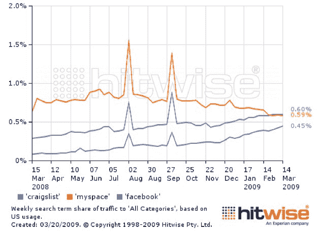
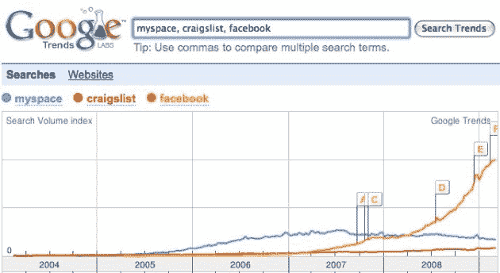

# 新的 Hitwise 统计显示 Hitwise 数据有多糟糕

> 原文：<https://web.archive.org/web/https://techcrunch.com/2009/03/20/new-hitwise-stats-show-how-bad-hitwise-data-is/>

# 新的 Hitwise 统计显示 Hitwise 数据有多糟糕

众所周知[大多数分析公司在收集互联网流量的统计相关数据方面有多糟糕。所有这些，Quantcast，康姆斯克，Hitwise，Compete，Alexa 等。在各方面和各种程度上都有缺陷。](https://web.archive.org/web/20230327053259/https://techcrunch.com/2006/12/28/google-v-technorati-and-hitwise-v-comscore/)

但是今天 Hitwise 的[博客文章](https://web.archive.org/web/20230327053259/http://weblogs.hitwise.com/heather-dougherty/2009/03/craigslist_top_search_term_las.html)显示了他们的数据到底有多糟糕。他们说 Craigslist 现在是互联网上最热门的搜索词汇，取代了 MySpace 的这一荣誉。脸书排名第三。

但是真实的数据就在那里等着我们去获取。谷歌趋势显示的是谷歌搜索数据，由于谷歌在大多数国家的搜索领域都遥遥领先，因此这些数据应该是准确的。Google trends [显示](https://web.archive.org/web/20230327053259/http://www.google.com/trends?q=myspace%2C+craigslist%2C+facebook&ctab=0&geo=all&date=all&sort=0)与 Hitwise 完全相反的数据——脸书是目前被查询最多的词，其次是 MySpace 和 Craigslist。

谈到准确的搜索趋势，我把我的钱押在谷歌上。如果我是 Hitwise，我会确保我的搜索数据与谷歌所说的一致。