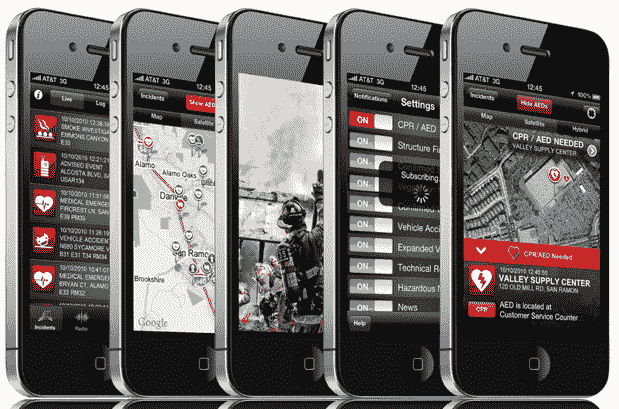

# 新计划利用智能手机帮助心脏病患者存活 

> 原文：<https://web.archive.org/web/https://techcrunch.com/2011/01/25/new-initiative-harnesses-smartphones-to-help-keep-heart-attack-victims-alive/>

我很少能写出一款真正能拯救生命的智能手机应用。这就是为什么我对这个故事如此兴奋。

目前，在加州圣拉蒙的旧金山郊区，一场发布会正在举行，以推出一款听起来有点普通的 iPhone 应用程序 *[消防局](https://web.archive.org/web/20221209040324/http://itunes.apple.com/us/app/fire-department/id376052787?mt=8)* 。参加会议的有消防队长 Richard Price、国际消防队长协会(IAFC)主席 Jack Parow、Workday 首席执行官 Dave duff ield(PeopleSoft 的联合创始人)和 O'Reilly Media 的 Tim O'Reilly。这是一个有趣的组合，它可能是一个非常重要的运动的开始，可以拯救许多生命。

这款应用的要点是:你启动它，它会提示你是否接受过 CPR 培训，是否愿意在紧急情况下帮助陌生人。如果您接受这一点，那么应用程序将利用 iPhone 的位置监测来大致了解您的位置(最新更新中启用的新功能允许以最小的电池消耗来实现这一点)。然后，下次 911 调度中心收到您附近发生的紧急情况呼叫时，您将收到推送通知，告诉您需要帮助。该应用程序还会告诉你附近是否有自动体外除颤器(那些可以启动心脏的电击器)。

这听起来很简单，但可能非常有效。心脏病发作时需要救护车帮助的人的存活率低得令人沮丧。每一分钟都是绝对重要的，但救护车通常需要 8 分钟或更长时间才能到达。在此期间，即使是接受过基本训练的人进行心肺复苏术，也能决定生死。更糟糕的是，aed 无处不在，包括公共场所、机场、图书馆和商店。但是没有人知道它们在哪里，所以它们经常被闲置。这个应用程序可以改变这种情况。

该项目由圣拉蒙谷防火区牵头，由普莱斯局长和卢卡斯·赫斯特(他实际上是我高中时的朋友)领导。**更新**:我们应该注意到，iPhone 应用程序的开发一直由北肯塔基大学应用信息学中心的实习生负责。该应用程序本身已经存在了一段时间，其基本功能包括能够监控圣拉蒙地区当前的紧急情况。现在他们希望把它变成更大的东西。

为了做到这一点，他们正在创建一个基金会来监督该计划。Workday 承诺帮助他们开发更多平台的移动应用程序。一切都将是开源的。赫斯特告诉我，他们真的想把这件事做好——他们不想赚钱，他们想拯救生命。

这涉及到许多后勤方面的障碍。圣拉蒙谷的消防部门比全国其他许多消防站都要先进。例如，它有一个每个 AED 的数据库和他们位置的准确描述(在梅西百货的收银台下)，而许多地区没有列表或只是模糊地列出了场地的名称(“机场”)。该系统还需要 911 调度中心来增加对该服务的支持，尽管 Price 局长告诉我，这些系统通常会增加这样的中继系统，所以增加一个也不是不可行的。

这很重要。对于这个项目来说，现在还为时过早，还需要做大量的工作，但正如赫斯特所说，“即使它拯救了一条生命，也是值得的。”

[维梅奥·http://vimeo.com/19139695]