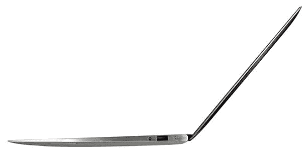

# 新的英特尔超极本参考型号可能会大幅削弱 MacBook Air 

> 原文：<https://web.archive.org/web/https://techcrunch.com/2011/08/04/new-intel-ultrabook-reference-models-could-undercut-macbook-air-significantly/>

# 新的英特尔超极本参考型号可能会大幅削弱 MacBook Air

当英特尔推出其[超极本](https://web.archive.org/web/20230205004846/https://techcrunch.com/2011/05/31/intel-pitches-new-category-of-thin-and-light-laptops-ultrabooks/)计划时，我们非常兴奋:一台 MacBook Air 大小的全功能 PC 笔记本？[阿达莫斯](https://web.archive.org/web/20230205004846/https://techcrunch.com/2011/05/03/vague-details-surface-for-next-dell-adamo-laptops/)和[系列 9s](https://web.archive.org/web/20230205004846/https://techcrunch.com/2011/07/01/samsung-offers-trimmed-down-series-9-to-better-combat-macbook-air/) 的承诺在我们眼前舞动，性感但价格过高。这个新的规范会让我们的飞行朋友们嫉妒吗？

不幸的是，很少有超极本出现，那些有[的超极本在价格上并没有真正的竞争力](https://web.archive.org/web/20230205004846/https://techcrunch.com/2011/07/27/macbook-air-killers-first-batch-of-pc-ultrabooks-to-carry-an-ultra-pricetag/)。就在今天，我们听说苹果正在霸占所有的铝，所以人们打算用玻璃纤维制作笔记本。玻璃纤维！

别担心:英特尔正在跟进此案，一切都会好的。

英特尔明白，如果 ODM 想要参与竞争，就必须把价格降到 1000 美元以下。 [Digitimes 报道](https://web.archive.org/web/20230205004846/http://www.digitimes.com/news/a20110804PD217.html)他们将在下周召开一次会议，讨论一些新的标准物料清单，总额为非常合理的 500-700 美元，如果他们聪明的话，使用制造商实际上可以得到的组件。

最新款 MacBook Airs 还没有任何~~拆解~~的成本明细，但上一代的 BOM 估计略高于 700 美元，由于更新[相当小](https://web.archive.org/web/20230205004846/https://techcrunch.com/2011/07/21/teardown-of-new-13-macbook-air-finds-almost-no-differences-from-old-model/)(新处理器，Thunderbolt)，这可能仍然是一个不错的估计。

英特尔的目标是 18 毫米笔记本电脑和 21 毫米厚(分别用于 11-13 英寸和 14-17 英寸屏幕)的设计，届时将有空间升级到最新的处理器。也没有光驱，这对于 Windows 用户来说无疑是比 Mac 用户更大的进步。根据不同的选择，两者的价格最多都在 700 英镑左右，加上 25%的利润率和组装及运输空间，你的价格应该在 1000 美元左右。这是最高端的。

我们什么时候能真正看到这些设计还是个谜；我猜最先出现在百思买货架上的将是 2012 年初的 Ivy Bridge 型号。希望到那时我们能从这些公司那里听到更多。