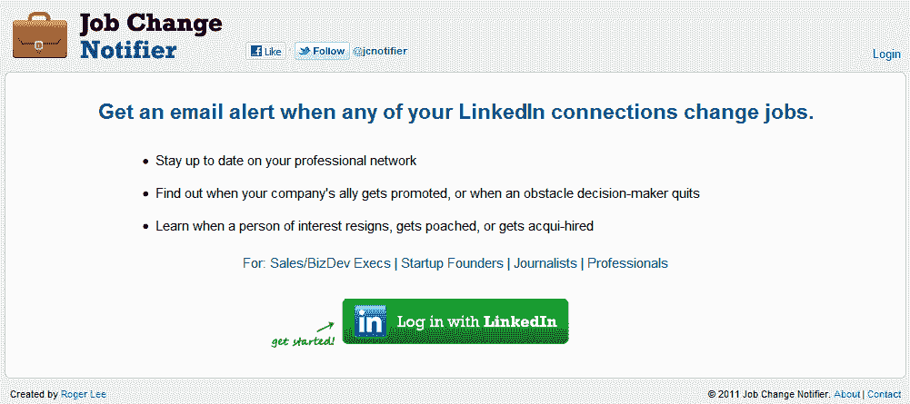

# 新的 LinkedIn API 限制迫使工作变动电子邮件通知服务关闭 

> 原文：<https://web.archive.org/web/https://techcrunch.com/2013/07/12/new-linkedin-api-restrictions-force-job-change-email-notification-service-to-shut-down/>

由于 LinkedIn 对其 API 的新限制，LinkedIn 用户可以使用一个很酷的小工具——工作变动通知程序(Job Change Notifier),来跟踪并通过电子邮件获得通知。根据工作变动通知程序的创建者李劼的说法，这些变化影响了像他这样的“一劳永逸”服务的功能，因为现在第三方应用程序只能在 60 天内访问用户数据，除非用户重新通过应用程序验证。

“我们必须提醒用户至少每 60 天登录一次应用程序，否则应用程序将无法访问，”Lee 解释道。"当然，这使得这项服务大打折扣."

在这项服务上线运行的两年里，Lee 表示，它已经跟踪了 LinkedIn 近 10%的用户群(2200 万个连接)，记录了 1400 万次工作变动，并发出了 700 万封通知邮件。虽然可以说是 LinkedIn 海洋中的一滴水，但这项服务在初创公司、销售和商业发展高管，当然还有招聘人员中很受欢迎。

对广告技术公司 [PaperG](https://web.archive.org/web/20221206123300/http://www.paperg.com/) 的联合创始人李来说，幸运的是，工作变动通知只是一个副业。(他[曾经](https://web.archive.org/web/20221206123300/https://beta.techcrunch.com/2011/07/08/now-you-can-use-linkedin-to-stay-up-to-date-on-whos-getting-hired-and-fired/)甚至提出加入 LinkedIn，但已经婉拒。)

虽然工作变动通知不再存在，但竞争服务，如 [Bullhorn Reach](https://web.archive.org/web/20221206123300/http://www.bullhornreach.com/reach/) 和 [SalesLoft](https://web.archive.org/web/20221206123300/http://my.salesloft.com/signin) 仍在运行，但只是因为它们提供了一个网络应用程序，而 Lee 的工具只是一个电子邮件服务。为了保持其功能，李开复不得不向用户发送电子邮件，要求他们重新认证。这会引起更多的麻烦，不值得。

**网络公司的“开放”API 似乎永远不会持久**

LinkedIn 正在实施的 API 变化反映了当今互联网参与者的一个更大趋势——随着第三方开发者的成长，服务向他们提供开放的 API，并在达到显著规模后开始限制。

我们一次又一次地看到同样的故事在脸书和 Twitter 等公司上演，现在是 LinkedIn。即使在今天，脸书也通过提升应用程序访问用户社交图谱数据的能力来应对竞争服务对其业务的威胁。例如，它最近关闭了消息应用的 [Path](https://web.archive.org/web/20221206123300/https://beta.techcrunch.com/2013/05/04/path-blocked/) 和 [MessageMe 的](https://web.archive.org/web/20221206123300/https://beta.techcrunch.com/2013/03/15/facebook-messageme/)“寻找朋友”功能，尽管它仍然提供脸书登录和分享选项。

与此同时，Twitter 多年来一直在重新调整其 API，努力为最终用户标准化 Twitter 体验。2011 年春天， [Twitter 通知第三方开发者，他们不应该再创建 Twitter 客户端](https://web.archive.org/web/20221206123300/https://beta.techcrunch.com/2011/03/11/twitter-ecosystem-guidelines/)，这让一个繁忙的替代生态系统——通常功能更丰富——停止了运行。这个套索在 2012 年进一步收紧。它还关闭了对 GeoAPI 的访问，geo API 提供了一个构建基于地理的应用程序的平台，并涉足了自己的“寻找朋友”禁令，其中包括最著名的 Instagram。

本周，快速增长的云存储初创公司 Dropbox 开始了我们多年来从网络公司看到的同样熟悉的歌曲和舞蹈——对第三方开发者社区的吸引力。首席执行官德鲁·休斯顿告诉记者，在宣布推出两个新的 API[以实现从云端下载文件和同步后，公司](https://web.archive.org/web/20221206123300/https://beta.techcrunch.com/2013/07/09/dropbox-launches-datastore-api-and-drop-ins-to-sync-data-to-and-from-apps/)[没有向开发者](https://web.archive.org/web/20221206123300/https://beta.techcrunch.com/2013/07/09/dropbox-says-it-has-no-plans-to-charge-developers-or-otherwise-change-its-business-model/)收费的计划。公司[的平台](https://web.archive.org/web/20221206123300/https://beta.techcrunch.com/2013/07/09/it-shouldnt-matter-if-youre-off-or-on/)上已经有 100，000 个应用程序，但是想要进一步发展——它需要开发者的帮助。

但如果历史可以借鉴的话，开发者应该谨慎——即使 Dropbox 现在计划通过付费订阅来创收，也没有理由说这些计划不能改变。就连休斯顿也给出了自己的答案，称“可以想象，未来会有一些服务会产生一些与开发者相关的成本，”然后又隐晦地表示，该公司认为这永远不会成为其商业模式的一大部分。

但 Dropbox 的业务本身仍在形成之中——该公司一直在收购那些参与照片共享、音乐和电子邮件管理的初创公司。未来的 Dropbox 是什么样子，还是一个未知数。

工作变动通知从 LinkedIn 应用生态系统中消失不会影响大多数用户；这只是该公司进一步限制访问其数据的又一个例子。此外，如果你真的想知道你的哪些关系换了工作，你就不能看看 LinkedIn 现在每天发的那封电子邮件吗？