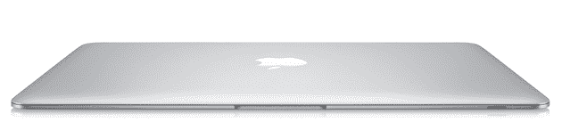
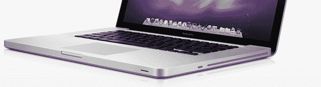

# MacBook Air Apparent:我从未用过我电脑的光驱 

> 原文：<https://web.archive.org/web/https://techcrunch.com/2010/10/15/new-macbook-air/>

我的 MacBook Pro 侧面有个奇怪的裂缝。它看起来就像信用卡刷卡，或收据分发器，或通风口，或其他东西。哦等等。那是一个光驱。如果我不确定，请原谅。你看，我从来没用过那东西。

前几天我突然明白了这一点。我拥有这台电脑已经几个月了，我从来没有需要把光盘或 DVD 插入这台电脑来做一些事情。一次都没有。展望未来，我无法想象有一天我会。好吧，也许如果我的电脑坏了。但即便如此，我也可能会把它拿到苹果商店，让他们来处理。

所以这个驱动器是一个巨大的空间浪费。没有它，这台伟大的机器肯定会更加苗条。我想要的，当然是 MacBook Air。但是苹果最近似乎忽略了这些。如果最新的谣言是真的，那么在周三到来的时候[将会改变](https://web.archive.org/web/20221006134852/http://www.crunchgear.com/2010/10/15/source-claims-11-6-macbook-air-incoming/)。

最近的[传言](https://web.archive.org/web/20221006134852/http://news.cnet.com/8301-31021_3-20019766-260.html)称苹果将发布一款新的更小的 MacBook Air，屏幕将为 11.6 英寸(目前为 13.3 英寸)。这个东西可能重约 2 磅(现在是 3 磅)。它甚至可能拥有一种新的固态存储系统，这将使它比普通的更薄，启动速度更快。

这正是我想要的系统类型。

最近几个月我被宠坏了。我现在的 15 英寸 MacBook Pro 是在 iPad 发布前一点点买的。这是一台神奇的机器，但 iPad 改变了我现在对它的看法。当我可以随身携带一台 1.5 磅重的 iPad 时，一想到要随身携带一台 5.6 磅重的机器，我内心就有点抱怨。2 斤？我能做到。

为什么不随身携带 iPad 呢？因为尽管它很棒，但它仍然不够好，不足以在日常工作中专业地使用。即使我随身携带键盘配件，它也缺少一些我需要用来写重要事情的多任务特性，比如 iPhone 地铁频段。

也就是说，我也绝对不需要这款双显卡 i7 MacBook Pro 提供的所有功能。我需要介于两者之间的东西。再说一遍，这款新的 MacBook Air 听起来很理想。

几天前，Piper Jaffray 分析师 Gene Munster [在](https://web.archive.org/web/20221006134852/http://www.businessinsider.com/apple-macbook-air-gene-munster-2010-10)表示，最初的 MacBook Air 没有达到目标，因为苹果低估了有多少人想要在他们的机器上安装光驱。我不知道。对我来说，MacBook Air 一直很有趣，但相对于其相对较高的价格来说，它似乎动力不足。苹果最终降低了价格，但这可能还是太贵了。新版本的传闻表明价格会便宜得多。那会非常有趣。

当苹果首次推出只有可选光驱附件的 Air 时，很多人都在抱怨和抱怨。但事实仍然是，这是一个正确的举动，苹果只是稍微领先了一点(就像他们在软驱等方面一样)。这些驱动器占用了太多的空间，而且越来越少被使用。备份通过 USB 或 Firewire(或互联网)完成。软件安装现在可以通过互联网或 USB 完成。电影和音乐？同样的事情。光驱快不行了。而且很快。

展望未来，我怀疑我的大部分计算将在以下设备上完成:iPhone、iPad、MacBook Air(也许还有 ChromeBook，或者谷歌称之为 Chrome OS 笔记本的任何东西)。它变得非常便携。正如苹果公司首席执行官史蒂夫·乔布斯最近所说的一句名言，个人电脑将变得像卡车一样。台式电脑和这些更大的笔记本电脑出于实用目的仍将存在——但我不想整天坐在它们后面。或者更糟，不得不随身携带。

我想要一个立即启动的系统。一个总是连接到互联网的手机(这可能是新款 MacBook Air 的另一个有趣之处——内置 3G)。会持续很长很长时间。我会毫不犹豫地随身携带。

甚至我使用的这台相对较新的 MacBook Pro 也开始感觉像是那种需要你在包里带着录像机才能录制东西的老式摄像机。是时候关掉录像机了——在这种情况下，是光驱。是时候继续向便携式计算进军了。是时候减轻负担了。