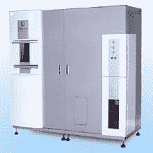

# 新机器将办公室垃圾变成卫生纸-就在办公室 

> 原文：<https://web.archive.org/web/https://techcrunch.com/2009/06/01/new-machine-turns-office-waste-into-toilet-paper-right-in-the-office/>

# 新机器将办公室垃圾变成卫生纸——就在办公室里

总部位于东京的 [Nakabayashi](https://web.archive.org/web/20230125093055/http://www.nakabayashi.co.jp/en/index.html) 提供从装订服务、儿童汽车座椅到办公产品的一切。但这家 2000 人公司的最新(当然也是最酷的)产品是一台办公室机器，它可以在办公室里把用过的复印纸变成卫生纸。太棒了。

卫生纸机每小时能够从大约 1，800 张(或 7.2 千克)A4 大小的废纸中生产两卷，这些废纸通常会被扔掉。它重达 600 公斤，似乎是一个危险的巨型硬件。

日本的销售从 8 月份开始，Nakabayashi 希望第一年能卖出 60 台。祝你好运，因为每台机器的价格标签是 95，000 美元。不幸的是，还没有运营成本的信息，但我无法想象这些是成比例的。

Via [每日](https://web.archive.org/web/20230125093055/http://mainichi.jp/life/money/kabu/nsj/news/20090528159737.html)