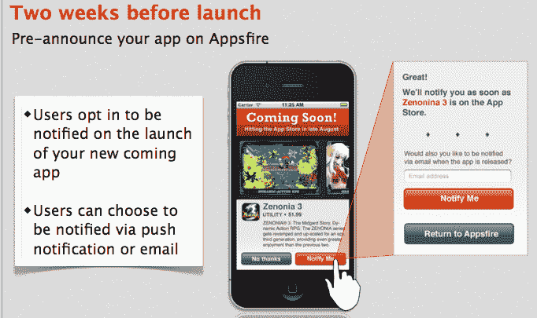
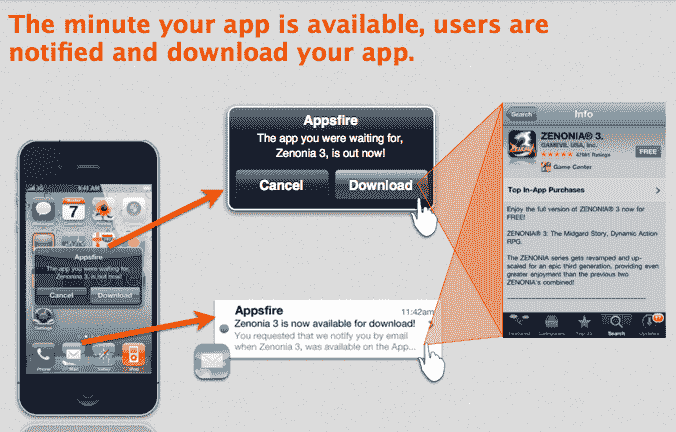

# 新的移动广告单元让开发者推广“即将推出”的应用

> 原文：<https://web.archive.org/web/http://techcrunch.com/2011/10/31/new-mobile-ad-unit-lets-developers-promote-apps-that-are-coming-soon/>

# 新的移动广告单元让开发者推广“即将推出”的应用

移动营销平台 [Appsfire](https://web.archive.org/web/20230203153832/http://appsfire.com/) 正在为 iPhone 推出一个新的广告单元，让应用开发者推广他们即将推出的应用。然而，“即将推出”的广告不仅宣布即将推出的应用程序，还可以通过其“通知我”按钮收集潜在用户的早期注册。

根据 Appsfire 联合创始人 Ouriel Ohayon(T2 科技博客 TechCrunch France T3 的前编辑)的说法，大多数应用程序开发者等到他们的应用程序发布后才开始营销，而实际上他们应该在此之前就开始了。在这一点上，我不得不同意他的观点——毕竟，这个公式对于我们在这里讨论的所有初创公司来说都非常成功，例如，它们经常通过来自 [LaunchRock](https://web.archive.org/web/20230203153832/http://www.crunchbase.com/company/launchrock) 或 [KickOffLabs](https://web.archive.org/web/20230203153832/http://www.crunchbase.com/company/kickofflabs) 的登录页面来推广它们即将推出的服务。为什么手机应用开发者不应该这样做呢？

新的广告单元，功能有点像移动应用的预告片，包括全屏预览，一些视觉效果和上面提到的“通知我”按钮。根据用户的偏好，可以通过推送消息和电子邮件通知用户。在后端，Appsfire 实时跟踪应用程序，因此它知道应用程序何时上线，然后处理自动通知过程。

ad 单元在几周前启动了私人 beta 测试，Tinyco、Capcom Labotec、UsTwo、Metamoki 等都是测试者。Ohayon 说，早期的结果很好,“通知我”按钮的点击率高达 30%。

该公司目前正在努力将相同的广告单元引入 Android，并将在其他应用程序中使用(不仅仅是 AppsFire)。该单元也可以被扩展以支持 beta 测试者的集合。

今年早些时候，AppsFire [在首轮融资中筹集了 360 万美元](https://web.archive.org/web/20230203153832/https://techcrunch.com/2011/05/30/appsfire-3-6-million/)，现在被列为 iTunes 上排名前 15 的免费应用。

