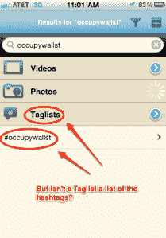

# 新的移动应用程序 Eye-C 让你“玩”Twitter 标签 TechCrunch

> 原文：<https://web.archive.org/web/http://techcrunch.com/2011/10/13/new-mobile-app-eye-c-lets-you-play-twitter-hashtags/>

Eye-C 是一款适用于 iPhone 和 Android 的新移动应用，可以让你在手机、电视、PC 或机顶盒上“播放”Twitter 标签。该服务寻找与特定标签相关的任何媒体，然后创建各种播放列表(“标签列表”)，允许您观看视频、听音乐或查看与特定标签相关的照片。例如，搜索#occupywallst 会显示抗议活动的照片和视频以及相关的新闻报道。

我不得不承认，这项服务的宣传一开始给我留下了一点印象。该公司显然很难用通俗的语言来定义这项服务是什么以及它做什么。不相信我？在 [iTunes](https://web.archive.org/web/20230204214352/http://itunes.apple.com/us/app/eye-c-play-tags/id470605598?mt=8) 或 [Android Market](https://web.archive.org/web/20230204214352/https://market.android.com/details?id=com.eyecon.eyec&pli=1) 阅读该应用的描述。更好的是，阅读[新闻稿](https://web.archive.org/web/20230204214352/http://eye-c.com/press-releases/eye-c-ios-5-lets-users-play-hashtags-multiple-screens)，如果你想看到过于华丽的公关演讲变得糟糕。*(人啊，为什么说“它确实 X”这么难？它并没有“减少决定下一步玩什么的工作”它播放与标签相关的媒体。[亲亲](https://web.archive.org/web/20230204214352/http://en.wikipedia.org/wiki/KISS_principle)。)*

不过，据我所知，这款新应用允许你搜索关键词或 Twitter 标签，以便找到人们正在分享的媒体，比如在线照片上的 YouTube 视频。然后，你按下底部的“播放”按钮开始观看。这些内容也可以通过 [DLNA](https://web.archive.org/web/20230204214352/http://en.wikipedia.org/wiki/DLNA) 或 AirPlay 传输到其他设备，比如电视。

**呃:请看下面的更新。**

 因为苹果的 iOS5 内置了 Twitter 集成，这个想法是人们将开始更多地在 Twitter 上发布他们在手机上观看的多媒体内容。从理论上来说，这款应用让这些内容更容易找到和观看。

这个想法本身并不坏——把 Twitter 标签变成一个播放列表。但是应用程序本身，就像球场一样，需要改进。在测试中，我发现程序加载缓慢，界面混乱。*(例如，为什么时间线包括一些没有标签的项目？为什么标签会出现在一些搜索结果的“标签列表”下面？它们不是一回事吗？见右边的照片。)F* 说实话，这款应用的设计也没那么吸引人。

尽管如此，制作可播放的 Twitter 列表的想法仍然有希望，除了在手机上播放之外，还可以在 iPads 和电视上播放。我只是希望有比 Eye-C 执行得更好的东西。

更多关于 Eye-C 的信息请点击[这里](https://web.archive.org/web/20230204214352/http://eye-c.com/)。

这款应用是 Eyecon 的创造，到目前为止，该公司一直专注于更令人讨厌的“联网家庭”产品。这解释了很多。

***更新** :* 实际上，搜索 Twitter 标签和相关内容的功能会在以后的版本中出现。如今，该应用程序仅支持应用程序中共享项目的评论中放置的标签。我还没有发现应用内共享机制。

据 Eyecon 的营销副总裁 Alec Marshall 称，这项服务使用了与 Twitter 标签相似的结构，但并不依赖于 Twitter。

他是这样说的(非常简单):

> 1.您在 YouTube、脸书、Picasa 和其他即将推出的资源中找到您认为感兴趣的视频。
> 2。你可以在手机、联网电视、苹果电视或其他 Airplay 和 DLNA 设备上播放这些视频。
> 3。您可以单独播放它们，也可以通过我们应用程序中的列表以流的形式播放。列表可以来自你的朋友，也可以来自用某个术语标记视频的用户，比如#occupywallst。
> 4。如果你想在列表中添加另一个视频、歌曲或图片，只需找到它并将其标记为#occupywallst。这样做的人越多，这个列表就变得越长越有趣。