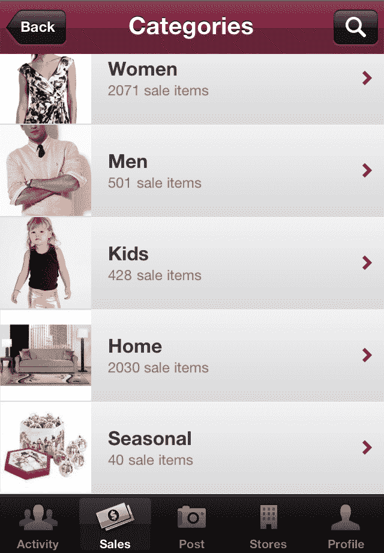
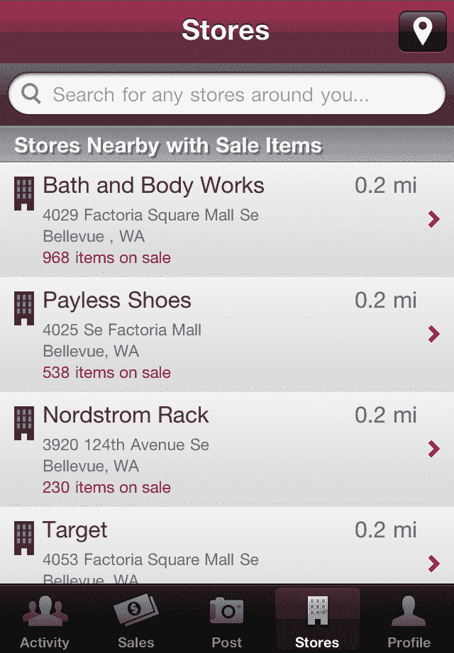

# 新的移动应用 Zoomingo 帮助你找到附近的销售 

> 原文：<https://web.archive.org/web/http://techcrunch.com/2011/10/12/new-mobile-app-zoomingo-helps-you-find-nearby-sales/>

新推出的 Zoomingo 是一款购物发现应用，旨在帮助你使用安卓或 iPhone 找到附近的销售。例如，该应用程序专注于衣服、鞋子、珠宝、手袋、美容和家居产品，吸引了日常便宜货购物者，而不是日常交易搜索者或希望在高清电视上比较价格的电子产品专家。

全美各大零售商的销售数据都有，包括 Nordstrom、Macy's、JC Penney、Williams Sonoma、Target、美国柯尔百货公司、Dillard's、沃尔玛等商店。

总的来说， [Zoomingo](https://web.archive.org/web/20230203110046/http://www.zoomingo.com/) 利用自动化方法、手动数据收集和位于美国前 10 大城市的“交易侦察兵”相结合，汇编了超过 70，000 家零售店的销售数据。目前，交易侦察兵由该公司支付，以帮助建立其交易数据库，但在未来，随着社区的发展，每个人都有机会成为侦察兵。届时，交易发现者将获得徽章、积分和奖品，就像零售商礼品卡一样。

该公司由语言学习服务 Livemocha 的联合创始人[雪莉什·纳德卡尼](https://web.archive.org/web/20230203110046/http://www.crunchbase.com/person/shirish-nadkarni) (Zoomingo 首席执行官)和[克里斯南·塞沙德里纳坦](https://web.archive.org/web/20230203110046/http://www.crunchbase.com/person/krishnan-seshadrinathan)(首席技术官)创建。当 Livemocha 开始运作时，在人群到来之前，它最初聘请了语言教师来启动社区的最初几个月的运作。现在，他们正在对 Zoomingo 的球探做类似的事情。(我们多么希望其他服务也能这样做，而不是推出无人居住的荒地！)

尽管我所在的社区(佛罗里达州可爱的坦帕市)通常不被认为是美国最大的都会区，但我惊喜地发现我所在的地区有大量的交易，从儿童玩具到新手袋到美容用品等等。

在应用中，你可以关注喜欢的商店和其他 Zoomingo 用户。此外，如果你选择与脸书联系，你可以关注你的朋友，帮助 Zoomingo 向你推荐更好的交易。(例如，如果你的性别是“女性”，你可能会看到香水，“男性”可能会看到男装)。

随着社区的发展，你可能会找到有相似兴趣的其他用户，你将能够使用类似 Twitter 的“关注”模型来跟踪他们的发现。你也可以通过抓拍照片、添加描述和销售价格来分享自己的发现。

该应用的未来版本将提供与 Foursquare 和脸书签到服务的集成，而不是应用内的“在这里签到”选项，该选项目前并没有太多作用。纳德卡尼告诉我们，后来，零售商可以利用 Zoomingo 的签到功能推出优惠券或其他优惠。零售商也可以在晚些时候举办店内寻宝游戏。

纳德卡尼说，他从 Livemocha 休假一段时间后，发现他的妻子在移动电话上查找附近的销售时遇到了麻烦，于是有了这个服务的想法。如此多的应用程序专注于价格比较和条形码扫描(ShopSavvy，Red Laser)，独立签到(Foursquare)或促销(ShopKick，Groupon)，但没有简单的方法来浏览当地销售和搜索商品。

Zoomingo 目前是自筹资金。

这款应用现在在 iPhone 手机和安卓手机上都可以使用。

