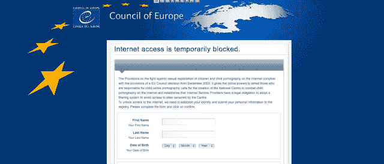

# 新的勒索软件会阻止您的 DNS 连接，并迫使您的计算机挖掘比特币 

> 原文：<https://web.archive.org/web/https://techcrunch.com/2014/02/06/new-ransomware-blocks-your-dns-connection-and-forces-your-computer-to-mine-bitcoins/>

# 新的勒索软件会阻止您的 DNS 连接，并强制您的计算机挖掘比特币

一种新的恶意软件 Linkup 是一个聪明的女孩。首先，它控制你的电脑连接互联网的 DNS 服务器，当你想知道如何删除它时，它开始偷偷地挖掘比特币。反病毒供应商 [Emsisoft](https://web.archive.org/web/20221005185945/http://support.emsisoft.com/) 在野外识别出勒索软件。

该程序基本上阻止了所有的互联网接入，而是抛出了一个来自欧洲委员会的虚假警告，称你的机器上可能存在儿童色情内容(你可以在 62.75.221.37/worlds/test/index.html 看到它，直到它不可避免地被阻止，但不要允许它安装任何东西并输入 URL，风险自负)。要重新访问互联网，你需要用信用卡支付 0.01 欧元(Emsisoft 写道，这可能是一个弥天大谎，我们对此表示赞同)，并提交个人信息。

[Emsisoft 在其网站上发布了一份对恶意软件的精彩分析。](https://web.archive.org/web/20221005185945/http://blog.emsisoft.com/2014/02/03/malware-analysis-ransomware-linkup-blocks-dns-and-mines-bitcoins/)

在牢牢融入你的系统并重新路由所有互联网流量后，该程序下载并运行 pts2.exe，一个独立于 ransomware 运行的比特币挖掘僵尸网络系统。

勒索软件和比特币挖掘的结合是一个新的迷人的发展。然而，在这一点上，它的功能仍然非常有限，因为下载的 jhProtominer 只能在 64 位操作系统上工作。随着时间的推移，看看 Linkup 是否被修改以下载更灵活的变体将会很有趣。

如果你支付赎金会发生什么？据推测，一旦犯罪分子获得了你的信用卡号和个人信息，他们就会远程打开你的互联网，这是一个令人不寒而栗的想法。鉴于该软件真实的登录页面和令人困惑的行为，很明显，如果有足够多的用户相信它的说法，Linkup 可能是一个相当危险的软件。Emsisoft 写道: