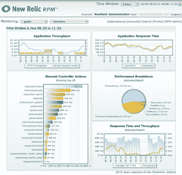

# 监控 Rails 应用程序性能的新遗迹 

> 原文：<https://web.archive.org/web/https://techcrunch.com/2008/04/30/new-relic-to-monitor-performance-of-rails-applications/>

# 监视 Rails 应用程序性能的新遗迹

[New Relic](https://web.archive.org/web/20221209135333/http://www.newrelic.com/) 正在寻求利用日益增长的 Ruby on Rails 应用程序部署，最近从[基准资本](https://web.archive.org/web/20221209135333/http://www.crunchbase.com/financial-organization/benchmark-capital)为他们的 Rails 性能管理(RPM)产品筹集了 350 万美元。

RPM 是已安装软件和云服务的组合，帮助开发人员了解他们的 RoR 应用程序中的性能问题。Rails 开发人员首先安装一个标准插件，该插件不断向 New Relic 的服务器发送性能数据。然后，他或她可以使用 RPM 仪表板来识别代码中导致瓶颈的具体点。

一些品牌 Rails 开发者已经在使用 RPM 服务的测试版，包括 Rails 核心开发者 Rick Olson。虽然该公司不愿意透露其目前的企业级客户，但他们显然在追逐已经在生产中使用 Rails 的数十亿美元以上的企业。

New Relic 由 Lewis Cirne 创建，他在 1998 年创办了一家公司，为当时年轻的 Java 应用程序行业提供类似的监控软件。Cirne 成功地卖掉了那家公司，并把他的几个老同事带到了这个新的 Rails 项目中。

其他致力于减轻 Rails 部署痛苦的初创公司包括提供在线开发和一键式云部署的 [Heroku](https://web.archive.org/web/20221209135333/http://www.heroku.com/) ，以及提供托管 Rails 服务基础设施的 [Engine Yard](https://web.archive.org/web/20221209135333/http://www.engineyard.com/) 。