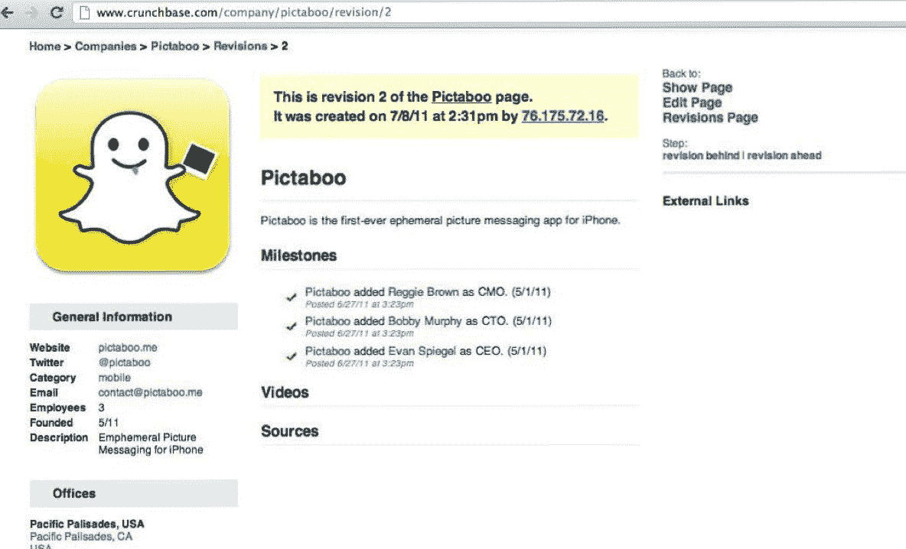
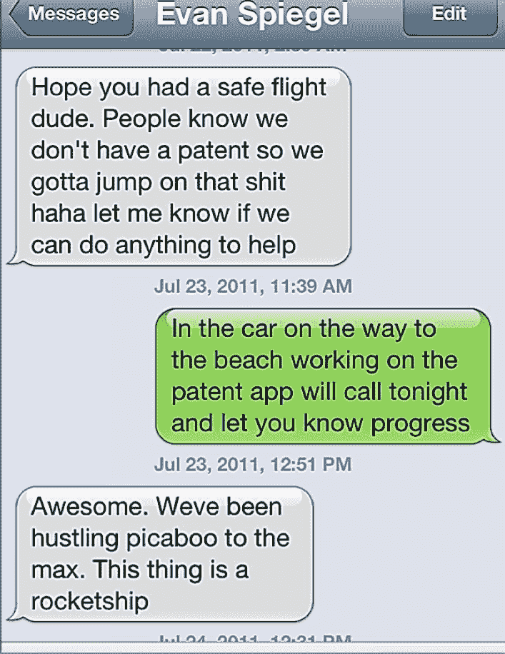

# Snapchat 的 Spiegel 在新的法庭文件中承认布朗“想出了消失图片信息的主意”

> 原文：<https://web.archive.org/web/https://techcrunch.com/2013/07/01/new-snapchat-docs/>

如果一张照片胜过千言万语，一张消失的照片价值 8 亿美元，那么一个想法值多少钱？

雷吉·布朗周四在加州法院提交了一份动议，要求取消埃文·斯皮格尔、鲍比·墨菲和 Snapchat 的律师奎因·伊曼纽尔的资格。这些文件还显示了可能支持布朗声称自己是 Snapchat 联合创始人的证据。

今年 2 月，布朗[起诉了斯皮格尔、墨菲和 Snapchat](https://web.archive.org/web/20230326023631/https://techcrunch.com/2013/02/27/stanford-grad-files-lawsuit-claiming-he-came-up-with-snapchat-snapchat-calls-lawsuit-devoid-of-merit/) ，声称他共同创建了广受欢迎的照片信息应用程序，而[刚刚以 8 亿美元的预投资估值筹集了 8000 万美元](https://web.archive.org/web/20230326023631/https://techcrunch.com/2013/06/22/source-snapchat-snaps-up-80m-from-ivp-at-a-800m-valuation/)，并被斯皮格尔和墨菲赶出了公司。

今年 2 月，Spiegel 称该诉讼“完全没有法律依据”。布朗周四提交的文件包括布朗的律师在发现阶段发现的一些证据。

请记住，在这个阶段，Snapchat 可以公开说的很少；因此，尽管这些文档很有趣，但请记住，这是情况的一面，我们没有看到 Snapchat 的支持文档。例如，[一位消息人士在三月份](https://web.archive.org/web/20230326023631/https://techcrunch.com/2013/03/07/snapchat-lawsui/)告诉我，有书面记录表明布朗愿意持有公司较少的股份。正如我当时写的那样，

> 一位消息人士称，主修英语的布朗承认他“能做的不多，但仍在尽力而为”，并且有电子邮件称斯皮格尔和墨菲接受了比布朗更多的同等削减。斯皮格尔主修产品设计，墨菲学习数学和计算科学。”

以下是布朗的律师在上周四的法庭文件中透露的内容，以及每一条的真正含义:

> 与诉讼前的公开声明相反，被告 Spiegel 承认原告想出了让图片信息消失的主意

这证实了消息人士在 3 月份告诉我的关于公司成立的事情，显然这对 Snapchat 的公众形象是一个打击，因为斯皮格尔和墨菲此前否认了布朗的说法，并表示这一想法完全是他们的。

> “在原告邀请被告 Spiegel 参与该项目后，他们一起试图招募一名编码员/程序员。在遭到其他兄弟会成员的拒绝后，原告和被告斯皮格尔选定被告墨菲作为该项目的编码员

虽然墨菲不是 Spiegel 和 Brown 的第一选择有点有趣，但有消息称，他在领导应用程序和公司的技术方面做得很好。向朋友反映想法，被忙碌的同学拒绝也是家常便饭。

> “2011 年 6 月 9 日，在给原告的短信中，被告 Spiegel 提到了他父亲的房子，原告和被告 Spiegel 和 Murphy 在那里生活和工作，申请为“startuphou5”(意思是“创业之家”)；
> 
> 2011 年 6 月 28 日，被告 Murphy 向他的朋友发送了一封群发邮件，要求他们试用他、Spiegel 和原告一直在开发的应用程序的测试版，并在邮件中署名为“Bobby，Evan，Reggie”
> 
> 2011 年 7 月 1 日，被告斯皮格尔的父亲(一名律师)给原告的母亲发了一条短信，并承认他们三人是这家初创公司的平等合作者:“感谢您的来信。很高兴今年夏天雷吉和我们在一起，他、埃文和鲍比正在创业。他们工作努力，玩得开心，似乎学到了很多东西[…]；”
> 
> 2011 年 7 月 8 日，大约在该应用程序在 iTunes store 上推出的时候，被告墨菲在科技公司数据库 Crunchbase 上将原告列为“CMO”(被告墨菲和斯皮格尔分别为“首席技术官”和“首席执行官”)

这里没有什么新东西——这是显示布朗在 2011 年夏天与斯皮格尔和墨菲一起工作的基本证据。

> “2011 年 7 月 17 日，他们三人一起拍了一张照片，用一个装饰有初创公司幽灵标志(由原告设计)的蛋糕来庆祝该应用程序在 iTunes store 上的发布。约翰·斯皮格尔的女友给他们发来了照片，并附上了以下说明:“伟大的产品上市了！！！；"
> 
> 2011 年 7 月 21 日，被告墨菲将原告标记为皮卡布脸书公司的“雇主”

蛋糕图片已经在所有的博客上流传；这里没什么新鲜的。

> " 2011 年 7 月 23 日，在启动该应用程序几天后，被告 Spiegel 向原告发送短信，报告该应用程序越来越受欢迎的情况，并表示"这是一艘火箭船；"
> 
> 2011 年 7 月 27 日，被告斯皮格尔就该应用程序给一位博客作者发了一封电子邮件，称:“我刚刚和我的两个朋友开发了一个应用程序(certified bros our frat 刚刚被踢出校园)”——指的是原告和被告墨菲；"

虽然布朗的律师把斯皮格尔描绘成一个没有头脑的兄弟会成员，但完整的电子邮件链显示出一个精明得多的斯皮格尔在管理媒体，并对产品有长远的眼光。

有消息人士告诉我，布朗对这个应用程序的最初想法来自于一次关于性短信的谈话；事实上，当 Spiegel 向博客写手 Nicole James 提出这个想法时，她立即转而使用了性短信。

“啊，好的。所以基本上来说，发短信最好的方式。因为你不能保存图像？”詹姆斯写道。

“有些人用它来做这个..但这也是快速与朋友分享短暂时光的最佳方式——想想名人(布莱克·莱弗利？)，街上可爱的家伙，你在哪里……它使你发送的图像特别是世界上最独家的照片哈哈，”斯皮格尔回答说。

“我喜欢，”她反驳道。

“博客目标 1 号被收购，”斯皮格尔给墨菲和布朗写道。

几个月后，也就是 9 月，詹姆斯[在她的 Tumblr 博客上写了关于这个应用](https://web.archive.org/web/20230326023631/http://thatwhitebitch.com/post/10229701134)的文章:

> “我的网友 Evan [Spiegel]开发了一个名为 Picaboo 的应用程序，你可以通过这个程序向任何人发送照片，但你会对照片设置时间限制，只有 1 到 10 秒。这个人没有办法保存照片。想象一下你会得到多少零零碎碎的东西，因为人们会觉得很安全！！！！
> 
> 一天，埃文给我发邮件，让我查看他的应用程序…
> 
> 为了埃文的缘故，当他可能正在读这篇文章时，我应该提到他不是我的性短信伙伴——他给我发了一些照片，比如海滩和墨西哥玉米饼以及人们在加利福尼亚做的其他事情，而我给他发了一些照片，比如时代广场和出租车，以及一个打扮成被警察传讯的倒霉米老鼠分发优惠券的女人(真的)。你知道，纽约的狗屎。现在我们是照片朋友了！很整洁。"

尽管詹姆斯仍然认为这款应用是用来发送色情短信的，并向她的读者推销它是一款色情短信应用，但她自己使用它的方式与大多数当前 Snapchat 用户一样:正如 Spiegel 所设想的那样，它是一款个人照片共享工具。

> 2011 年 8 月 11 日，原告提交了临时专利申请，将他和被告 Spiegel 和 Murphy 列为“共同发明人”;"
> 
> 2011 年 8 月 11 日，在原告(当时正在南卡罗来纳州拜访他的家人)建议被告 Spiegel 和 Murphy 庆祝专利申请的提交后，被告 Spiegel 告诉原告如下:“没有机会庆祝我们的兄弟；
> 
> 2011 年 8 月 16 日，当被告 Spiegel 因专利申请中共同发明人的名字排列顺序(他的名字排在最后)而生气时，他们三人在电话中大吵了一架。打完电话后，被告 Spiegel 给原告发了一条短信道歉，并承认原告想出了这个应用程序的主意:“我想确保你觉得消失消息的想法是值得称赞的……”

这也证实了三月份有消息人士告诉我的——一场专利纠纷导致 Spiegel 和 Murphy 将 Brown 排除在公司之外。然而，这项专利并不是 Spiegel 和 Murphy 在 2012 年 8 月申请的[单触拍照/按住视频](https://web.archive.org/web/20230326023631/https://techcrunch.com/2013/06/21/snapchat-has-a-patent-that-could-help-it-become-the-defacto-camera-app/)专利。

这里讨论的专利要宽泛得多，本质上是一款用于消失照片的应用。代表 Snapchat 的库利·LLP 在 2012 年 5 月给布朗的一封信中称，布朗的所有权主张与这项专利有关。

这封信解释说，专利不太可能获得批准，Snapchat“确信该应用的主题属于‘现有技术’。”这封信引用了由 [TigerText](https://web.archive.org/web/20230326023631/http://www.tigertext.com/) 持有的一项专利，该专利涵盖了对非永久性消息内容的处理，并认为布朗的贡献是“对非永久性传输的消息将是可取的这一平凡观察。”

在库利的信中，该公司认为“除非并直到一项专利发布…你的索赔是零的 1/3。”该专利尚未获得批准，可能已被 Spiegel、Murphy 或 Brown 删除。美国专利局[的一名代表之前告诉我](https://web.archive.org/web/20230326023631/https://techcrunch.com/2013/06/21/snapchat-has-a-patent-that-could-help-it-become-the-defacto-camera-app/)“发明者可以要求在专利实际发布之前完全不公布申请。”如果专利从未被发布，它最终会被放弃，如果一项申请有多个发明人，他们中的任何一个都可以提出不公开的请求。

“当然，该公司已经开发了处理非永久性信息内容的专有技术解决方案，但你在开发这种专有技术解决方案中没有任何角色，”库利的信继续说道。"因此，公司确信你不是任何公司知识产权的所有者."

与此同时，布朗的律师正在推动布朗获得该公司三分之一的股份，而不是与斯皮格尔和墨菲相等的份额。

“我们的立场是，它不会也不应该被稀释，因为每个后来的投资者都知道或应该知道雷吉在该公司的利益，”李中清告诉我。“如果我们将这一切带到审判，我们的立场将是雷吉有权获得全部的 1/3…我们不会要求陪审团与埃文和鲍比今天因不恰当地驱逐雷吉而获得的平等。”

双方将于 8 月 1 日在法庭会面，解决取消 Snapchat 律师资格的动议。

*披露:我现在是斯坦福大学的高年级学生，也是卡帕适马斯坦福分会的主席。布朗、斯皮格尔和墨菲在斯坦福大学期间都曾是卡帕适马的成员。等我加入兄弟会的时候，2011 年春天(我大一)，墨菲已经从斯坦福毕业了，斯皮格尔和布朗已经离开了兄弟会。*

我从未见过布朗。我见过墨菲一次。我从 2012 年春天开始了解 Spiegel，主要是通过 TechCrunch 的采访。这丝毫不会影响我报道这起诉讼或公司的客观性或能力。