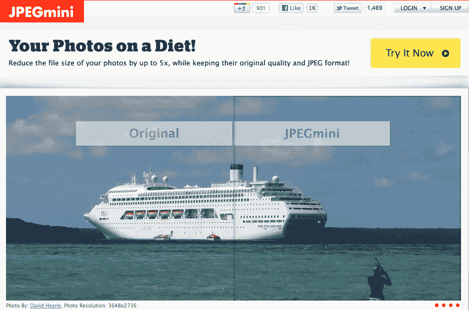

# 新创公司 JPEGmini 缩小照片尺寸，而不是降低照片质量 TechCrunch

> 原文：<https://web.archive.org/web/https://techcrunch.com/2011/09/06/new-startup-jpegmini-reduces-photos-size-not-their-quality/>

摄影师们，请注意。一家名为 [JPEGmini](https://web.archive.org/web/20230204104026/http://www.jpegmini.com/) 的初创公司正在为 JPEG 照片引入一种新的照片压缩技术，这种技术可以减少整体文件大小(最多 5 倍)，同时保持照片的质量和分辨率。

这项技术是专门为网络设计的，因为越来越多的摄影师，无论是业余的还是专业的，都使用在线存储来保存照片。有了 [JPEGmini](https://web.archive.org/web/20230204104026/http://www.jpegmini.com/) ，照片可以更快地上传、通过电子邮件发送和分享，同时节省存储和带宽成本。

当然，听起来很棒。但问题是:这有用吗？

据该公司称， [JPEGmini](https://web.archive.org/web/20230204104026/http://www.jpegmini.com/) 技术通过使用模仿人类视觉系统的独特质量检测器分析输入图像来工作。基于这种分析，它应用不会导致可见伪像的最大压缩量。该系统的第二部分是 JPEG 编码器，它将 JPEG 编码过程应用于原始照片，在 JPEG 标准下创建最紧凑的照片表示。

所以，要明确的是:JPEGmini 是*而不是*一种新的文件格式，它使用的是 JPEG 文件格式。

在某些情况下，它可以实现高达 5 倍的再压缩比率，或 80%的减少。

这里的关键词是“某些情况”JPEGmini 似乎并不总是超越当前技术的能力。旧金山 JMG 画廊的职业摄影师吉姆·戈尔茨坦说，在测试中，JPEGmini 在较大的网页图像上比 Photoshop 节省更多的文件大小。但对于较小的图像，Photoshop 的“存储为网页格式”设置(60%质量)做得更好。(关于测试的更多细节[在这里](https://web.archive.org/web/20230204104026/https://docs.google.com/spreadsheet/ccc?key=0AtROtg3duDfzdGp0YUI2X0NQcndxVnpYRzJ0b1VYSlE&hl=en_US))。

这似乎证实了 JPEGmini 本身所说的——原始 JPEG 照片分辨率越高，它可以提供的文件大小缩减越大。(例如，只有照片 [8 MP 和更高的](https://web.archive.org/web/20230204104026/http://www.jpegmini.com/main/technology)可以使用该技术实现 80%的还原率)。

作为一名专业摄影师，Goldstein 还仔细阅读了 JPEGmini 的服务条款，其中规定，如果你选择将照片上传到网站，他们可以用它来推广他们的服务。这太宽泛了，但是可以简单地通过添加“根据请求”一行来改善

此外，值得注意的是 JPEGmini 保留了照片的所有元数据。

尽管如此，对于专业人士来说，最好的节省和图像质量的平衡来自于将 JPEG 保存为原始文件，理想情况下，分批进行压缩，而不是像 JPEGmini 的服务那样逐个压缩，Goldstein 解释道。*更正:JPEGmini 允许你上传文件夹。*

所以也许专业摄影师根本不需要 JPEGmini。但是其他消费者可能……尤其是那些没有 Adobe Photoshop 或 Lightroom 的用户。这项技术可以集成到手机和数码相机等消费电子产品中，作为保存或共享照片时节省存储空间和带宽的一种方式。

JPEGmini 是由位于特拉维夫的以色列初创公司 ICVT 开发的。其创始人 Sharon Carmel 曾联合创立了开发互联网第一个矢量图形播放器的 Emblaze，先于 Macromedia Flash，以及于 2008 年被 Phoenix Technologies 收购的 P2P 同步和备份公司 BeInSync。JPEGmini 是自筹资金的。