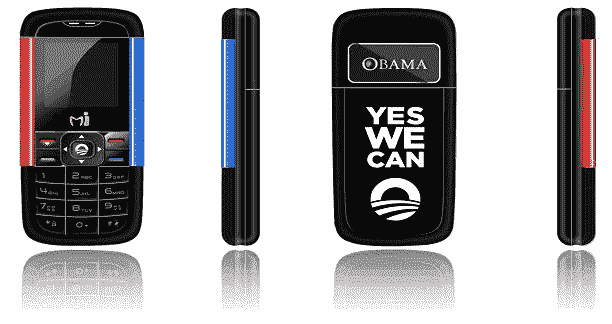

# 新研究:“奥巴马手机”实际上可以产生 40 亿美元的收入 

> 原文：<https://web.archive.org/web/https://techcrunch.com/2011/02/11/new-study-obama-phones-could-actually-generate-4-billion-in-income/>

# 新研究:“奥巴马手机”实际上可以产生 40 亿美元的收入

一项新的研究表明，让纳税人的钱为穷人免费提供手机(T2)实际上为经济创造了财富。尽管生命线援助项目已经存在了很多年，但媒体还是称它们为“奥巴马手机”。这个项目背后的理论是，买不起手机的人会错过工作机会。由新千年研究委员会进行的这项研究发现，该计划新的扩大措施实际上可以为经济带来 40 亿美元。

[研究](https://web.archive.org/web/20221206220209/http://www.sourcewatch.org/index.php?title=New_Millennium_Research_Council)基于来自 22 个州的 5541 名 TracFone SafeLink 无线客户的调查数据。转帖发现，受补贴的手机使用平均每年为每位参与者带来 259 美元的收入。他们接着说，如果所有 2850 万符合条件的成年人都利用这个项目，它可以为穷人带来 37 亿美元的收入。报告称，这对双方来说都很好，“按照这个标准，这个项目已经在为自己买单了。”大约一半的用户报告说，手机“通过帮助他们找到或保住工作，改善了他们的财务状况。”

[通过[手机新闻](https://web.archive.org/web/20221206220209/http://www.cellular-news.com/story/47847.php)