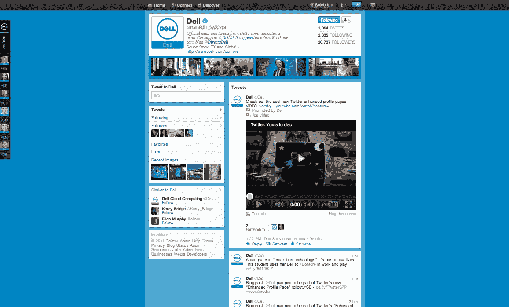

# 新的 Twitter 品牌页面，带有醒目的横幅和固定视频

> 原文：<https://web.archive.org/web/https://techcrunch.com/2011/12/08/new-twitter-brand-pages/>

# 新的 Twitter 品牌页面，带有醒目的横幅和视频

Twitter 今天发布了一个重大的重新设计,将会慢慢推出。我们已经报道了一些[的主要方面](https://web.archive.org/web/20230316040259/https://techcrunch.com/2011/12/08/twitter-resigns-around-four-concepts-home-timeline-connect-discover-me-letsfly/)，比如新的时间线和发现功能，以及 Twitter 如何试图[变得更加主流](https://web.archive.org/web/20230316040259/https://techcrunch.com/2011/12/08/symbolism/)和容易接近。

然而，品牌的一个主要变化是新的品牌页面。还不是每个人都能看到这些是什么样子，所以我在这里贴了一些来自 [@AmericanExpress](https://web.archive.org/web/20230316040259/http://twitter.com/AmericanExpress) 、 [@generalelectric](https://web.archive.org/web/20230316040259/http://twitter.com/generalelectric) 、 [@JetBlue](https://web.archive.org/web/20230316040259/http://twitter.com/JetBlue) 和@ [@McDonalds](https://web.archive.org/web/20230316040259/http://twitter.com/McDonalds) 的截图。两个大的变化是一个新的横幅，就在页面上延伸的个人资料信息下方，以及在每个品牌的信息流顶部发布推文的能力。这将使品牌在 Twitter 上更具特色，并将在 2012 年第一季度更广泛地推出。

固定推文对于带有图像或视频的推文特别有效。有了新的设计，视频和图像可以在你的流中看到(只需点击右上角的“打开”查看带有图像或视频的推文)。在品牌页面上，这些视频或照片推文可以设置为开放，为页面添加另一个视觉上引人入胜的元素。

Twitter 与 21 个合作伙伴一起推出了新的品牌页面。如果你开启了 Twitter 的增强版，你可以在这里看到他们: [@AmericanExpress](https://web.archive.org/web/20230316040259/http://twitter.com/AmericanExpress) 、 [@BestBuy](https://web.archive.org/web/20230316040259/http://twitter.com/BestBuy) 、 [@bing](https://web.archive.org/web/20230316040259/http://twitter.com/bing) 、[@雪佛兰](https://web.archive.org/web/20230316040259/http://twitter.com/chevrolet)、 [@CocaCola](https://web.archive.org/web/20230316040259/http://twitter.com/CocaCola) 、[@戴尔](https://web.archive.org/web/20230316040259/http://twitter.com/Dell)、 [@DisneyPixar](https://web.archive.org/web/20230316040259/http://twitter.com/DisneyPixar) 、[@通用电气](https://web.archive.org/web/20230316040259/http://twitter.com/generalelectric)、[@喜力](https://web.archive.org/web/20230316040259/http://twitter.com/Heineken)、[@惠普【惠普](https://web.archive.org/web/20230316040259/http://twitter.com/HP)

你也可以在[推特的广告博客](https://web.archive.org/web/20230316040259/http://advertising.twitter.com/2011/12/let-your-brand-take-flight-on-twitter.html)上了解这些变化。

 

