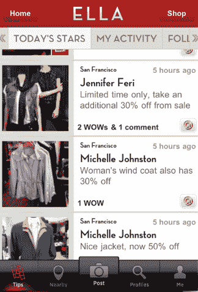

# Next Jump 的移动应用 Ella 奖励你分享当地购物技巧 

> 原文：<https://web.archive.org/web/http://techcrunch.com/2011/07/29/next-jumps-mobile-app-ella-rewards-you-for-sharing-local-shopping-tips/>

# Next Jump 的手机应用 Ella 奖励你分享当地购物技巧

[Next Jump](https://web.archive.org/web/20230203041848/http://www.nextjump.com/),[为数千家公司和信用卡公司的奖励计划](https://web.archive.org/web/20230203041848/https://techcrunch.com/2010/01/14/next-jump/)提供支持，该公司一直在稳步扩大其平台，为消费者提供更多的社交体验。例如，这家初创公司与 LivingSocial 签署了一项[协议，以获得其每日交易清单，而](https://web.archive.org/web/20230203041848/https://techcrunch.com/2011/04/12/livingsocial-next-jump/)[允许用户](https://web.archive.org/web/20230203041848/https://techcrunch.com/2011/06/09/next-jump-oo-com-livingsocial/)使用 Next Jump 的 WOWpoints 从 Target 和沃尔玛等零售商那里购买交易和商品。今天，Next Jump 推出了 Ella，这是一款 iOS 应用程序，允许你通过与朋友分享时尚和购物技巧来赚取和奖励 WOWpoints。

Ella 的 iOS 应用程序会打开你当前位置的地图，向你显示 Ella 的其他用户在哪里发布了附近商店的时尚商品或特价商品的提示和照片。如果你喜欢这个技巧，你可以在分享上发表评论，用一个 WOWpoint 奖励用户，这个 wow point 在 Next Jump 的奖励平台 OO.com 上值一分钱。当你发布提示和照片时，你也有机会获得收益。本质上，下一步是对喜欢购物小费的行为进行奖励。Ella 还展示了拥有 WOWpoints 并通过应用程序分享的顶级用户。

你可以在 OO.com 上使用你积累的这些 WOWpoints，它列出了来自 30，000 多家商家的数百万种产品，包括塔吉特、沃尔玛、亚马逊和 Buy.com。

Next Jump 表示，在未来，Ella 将包括脸书连接，这样你也可以从你的朋友那里获得提示。该公司将很快在其他垂直领域推出类似的应用，如旅游和餐饮。

