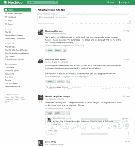
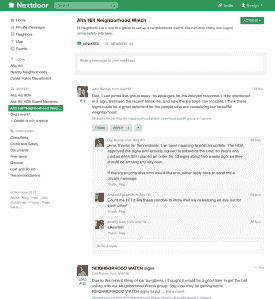
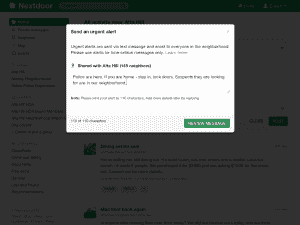

# Nextdoor 完成了 2160 万美元的新 B 轮融资，使其专注于社区的社交网络 TechCrunch 全球化

> 原文：<https://web.archive.org/web/https://techcrunch.com/2013/02/12/nextdoor-closes-21-6-million-in-new-series-b-funding-to-take-its-neighborhood-focused-social-network-global/>

让人们与居住在当地社区的其他人创建私人社交网络的公司 Nextdoor 在由 [Greylock Partners](https://web.archive.org/web/20221206024347/http://www.crunchbase.com/financial-organization/greylock) 牵头的新一轮融资中筹集了 2160 万美元，现有投资者 [Benchmark](https://web.archive.org/web/20221206024347/http://www.crunchbase.com/financial-organization/benchmark-1) 、 [DAG Ventures](https://web.archive.org/web/20221206024347/http://www.crunchbase.com/financial-organization/dag-ventures) 、 [Shasta Ventures](https://web.archive.org/web/20221206024347/http://www.crunchbase.com/financial-organization/shasta-ventures) 、 [Allen & Company](https://web.archive.org/web/20221206024347/http://www.crunchbase.com/financial-organization/allen-and-company) 、 [Pinnacle Ventures](https://web.archive.org/web/20221206024347/http://www.crunchbase.com/financial-organization/pinnacle-ventures) 以及新投资者[贝佐斯探险队参与了融资](https://web.archive.org/web/20221206024347/http://www.crunchbase.com/financial-organization/bezos-expeditions)

这轮融资是 Nextdoor 的 B 轮融资，使该公司的风险投资总额达到 4020 万美元(T21)。作为新资金的一部分，格雷洛克的大卫·司达将加入 Nextdoor 的董事会；随着 Greylock 在新一轮融资中总共投入了大约 1500 万美元，Nextdoor 现在标志着 Sze 作为 Greylock 合伙人迄今为止开出的最大一张支票。

在 Nextdoor 旧金山总部的一次广泛采访中，首席执行官兼创始人 Nirav Tolia 告诉我，新的资金将用于扩大 Nextdoor 在产品供应和地理区域方面的足迹。他说，Nextdoor 的国际发布将在 2013 年底前进行，本地移动应用等产品也在积极筹备中。该公司目前有 43 名员工，并且在未来几周和几个月内还将继续增长。

##### 巨大的增长，但也有巨大的风险

Nextdoor 首席执行官尼拉夫·托利亚

Nextdoor 于 2011 年 10 月首次推出了[，并验证其所有成员的家庭地址以确保隐私和安全，现在据称已经为美国 50 个州的超过 8075 个社区创建了私人社交网络群，每天的消息数量超过 50 万条。这显示了我们三个多月前](https://web.archive.org/web/20221206024347/https://beta.techcrunch.com/2011/10/26/benchmark-backed-nextdoor-launches-as-a-private-social-network-for-neighborhoods/)在 Nextdoor [上一次登录时的稳定增长轨迹，当时该网站有 5500 个社区和 30 万条每日消息。](https://web.archive.org/web/20221206024347/https://beta.techcrunch.com/2012/10/31/one-year-in-nextdoor-the-social-network-for-neighborhoods-talks-numbers-tctv/)

即便如此，考虑到其他专注于本地的网站，如 [EveryBlock](https://web.archive.org/web/20221206024347/https://beta.techcrunch.com/2013/02/07/nbc-shutters-hyper-local-news-and-information-site-everyblock-after-failing-to-find-the-right-business-model/) 、 [Yardsellr](https://web.archive.org/web/20221206024347/https://beta.techcrunch.com/2013/02/11/yardsellr-the-ebay-for-facebook-becomes-the-latest-casualty-in-social-local-commerce/) 和 [AOL 的 Patch](https://web.archive.org/web/20221206024347/https://beta.techcrunch.com/2013/02/08/aols-hyperlocal-effort-patch-misses-40m-50m-sales-target-partly-because-of-sandy-still-aiming-for-profitability-in-2013/) ，Nextdoor 的最新一批大笔资金也可能被一些人视为一场豪赌。

托利亚承认，本地空间一直是一块难啃的骨头，但他相信 Nextdoor 有能力在长期内取得成功。“在社交网络领域，往往是赢家通吃，”托利亚说，同时小心翼翼地指出，Nextdoor 与最近倒闭的竞争对手有着显著的不同。“当你触及表面时，我们对 Nextdoor(与其他网站相比)做出了一千个不同的决定，使它真正成为邻居对邻居的驱动。”

Tolia 说，这种睦邻友好的感觉需要一些工作来建立，但他相信这是真正实现成功的本地社交网络的唯一途径，而且会有回报。他这样说:

> “现在，我们有了更多的银行存款和耐心的投资者，所以我们真的着眼于长远。我们可以考虑改变世界，而不是做一个快速翻转。我们在制作明信片邀请函的时候就知道，从长远来看，这种策略是有价值的，但从短期来看，它可能会非常痛苦——它很慢，而且是肉搏战。
> 
> 你知道，所有的初创公司都希望自己能像 Instagram 一样快速发展，但这个本地空间不是 Instagram。但是我们希望在一段时间后，我们也能拥有 10 亿用户。"

##### Nextdoor 2.0 的全新外观

Nextdoor 直到最近一次融资后才推迟了所有的产品迭代计划。同样在今天，该公司向其所有用户推出了 Nextdoor 2.0，这是其旗舰应用程序的改进版本，对其设计和功能进行了一些不错的更新。

也许最值得注意的是，Nextdoor 2.0 有一个新的功能，让用户可以查看和发布与相邻社区的特定消息，这一功能的增加可能会进一步提高网站的参与度。毕竟，我们中的许多人实际上生活在两三个社区之间的边界上——如果有一只丢失的猫在，比如说，旧金山的狗场，它很可能在 Potrero Hill 被找到。允许附近社区的人看到彼此有限的更新确实有意义。

Nextdoor 2.0 也更加关注网站的犯罪和安全监控功能，并为此类帖子开辟了一个新的专门版块。托利亚说，如今，与犯罪和安全相关的帖子占 Nextdoor 所有信息的 20%，使该网站成为经典邻里守望的现代版。该公司已开始与当地警方和消防部门合作，这些部门可以使用特殊的 Nextdoor 账户向 Nextdoor 2.0 中的居民发出派遣和特殊的“紧急警报”，并计划在未来几个月内加强这种类型的举措。

当然，打击犯罪的倡议和邻里监督组织是必要的和高尚的——但它们并不以有利可图而闻名。就未来的收入来源而言，托利亚表示，Nextdoor 可能会寻求在其他渠道建立立足点，例如每年 1000 亿美元的本地广告市场(在多年被黄页和本地电视、广播和报纸媒体等主导后，这个领域的颠覆时机已经成熟。)但是，托利亚说，Nextdoor 短期内不打算开展任何赚钱的活动。

##### 未来的产品挑战

展望未来，托利亚表示，Nextdoor 面临的最大挑战是在产品方面确立正确的定位。“成功复制地方一级发生的一切是一个真正的平衡之举。你有这些关于隐私的真正严重的问题，你必须核实人们的地址，你有不想显示他们的真实姓名，但想看到其他人的真实姓名的用户，”他说。“随着我们的成长和看到更多的信息和互动，我们更加注重平衡信号和噪声。有是个好问题，但还是个问题。这些都是现实世界中的互动，所以真正的问题是深入了解并正确应对。”

这是一项艰巨的任务。但是，如果任何一家公司现在拥有资金和明显的吸引力，最终能够把事情做好，那它可能就是 Nextdoor。

以下是新设计的 Nextdoor 2.0 的一些图片(点击每张图片可放大):

Nextdoor 新闻源

Nextdoor 群组页面

隔壁紧急警报