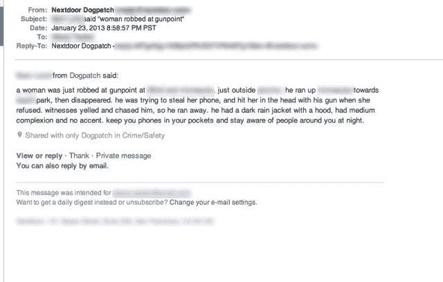
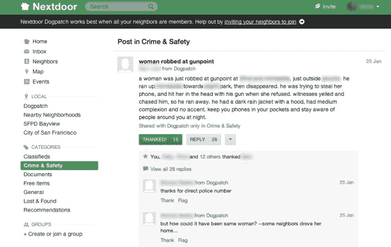

# Nextdoor 袭击 10K 社区，让我停止夜间跑步 

> 原文：<https://web.archive.org/web/https://techcrunch.com/2013/03/30/nextdoor-hits-10k-neighborhoods-gets-me-to-stop-running-at-night/>

在我已经在晚上跑步十多年后，一家相对低调的名为 [Nextdoor](https://web.archive.org/web/20230213163115/http://www.nextdoor.com/) 的初创公司让我开始在白天跑步。

几乎没有人喜欢锻炼，对许多人来说，即使在最好的日子里，克服穿上鞋子和运动服的动机障碍也是很困难的。一月底的一个晚上，我终于克服了最初的入门障碍，正准备停止写博客去做我通常的 30 分钟夜间冲刺时，我收到了电子邮件。

“旧金山 Dogpatch，一名女子在枪口威胁下被抢劫”标题尖叫道。与我经常收到的许多电子邮件不同，这封邮件与我高度相关，特别是因为，经过进一步调查，抢劫发生在离我家一个街区的地方。

在收到这封邮件之前，我并没有过多考虑过 [Nextdoor](https://web.archive.org/web/20230213163115/http://www.nextdoor.com/) ，这是我去年夏天在艾伦& Co 会议上注册的一项服务，在那里，联合创始人 [Nirav Tolia](https://web.archive.org/web/20230213163115/http://www.crunchbase.com/person/nirav-tolia) 发表了一次关于当地社交网络的演讲。

该公司于 2009 年以 Fanbase 的名义成立，试图创建一个用户生成的 ESPN 内容版本。

创始人 Tolia 和 Sarah Leary 在 2010 年 5 月左右决定转向，并在接下来的四到五个月里测试了不同的想法。Fanbase 于 2010 年 9 月正式转向 Nextdoor，在门洛帕克的 Lorelei 社区开始试点。现在是你的邻居的脸书，大约一半的粉丝基金最终结转，Tolia 和 Leary 最终为新的 Nextdoor 产品筹集了额外的 4020 万美元。

起初我很热情，我也邀请我的邻居使用这个平台，当他们的冒险猫 Kiki 失踪时，这导致了一个事实上的邻里支持团体(包括宠物通灵师的服务)。我在 TechCrunch 上写了一篇关于 T1 的文章，然后就忘记了，很少登录查看免费物品和车库拍卖的列表。

嗯，我现在肯定给了服务一些想法:“如果我是那个被抢劫的女人会怎么样？”"如果我早 15 分钟走出家门会怎么样？"经过这么多的努力，我仍然穿着运动服，因为一天的工作而感到坐立不安。更糟糕的是，我现在担心一个我只是在网上听说的陌生人，我仍然非常需要跑步。

灵光一现让我探索 Nextdoor 寻找答案，我在同一篇文章的评论中问道，“我刚要去慢跑时看到了这个。你们觉得还不安全吗？需要慢跑。”

几乎同时有人回应道:“亚历克西亚——现在附近有很多警察。他们还在现场走来走去，寻找衣物或被丢弃的武器。”好吧。太好了。

经过几秒钟的沉思，相对勇敢的我决定，警察的出现减少了我被同一个寻找更多受害者的罪犯抢劫的可能性。我走出家门，开始了我做过的最可怕的慢跑。

从那以后，我再也没有在日落后慢跑过。

互联网上的一项服务几乎立刻改变了我长达十年、可以说是不安全的夜间慢跑习惯。线上行为又一次对线下行为产生了影响。但这一次是在地方一级，以我个人从未经历过的方式。

“有这样的用户故事很酷，”Tolia 和 Leary 在我分享我的经历时说，“因为它不同于‘我分享了我的照片，并获得了 1000 个赞’。”在[马斯洛的‘需求层次’](https://web.archive.org/web/20230213163115/http://en.wikipedia.org/wiki/Maslow%27s_hierarchy_of_needs)中，你住在哪里非常重要。你的邻居很重要，不仅因为你们可以共用一个梯子，或者借一杯糖，还因为有 100 到 1000 双眼睛在关注着你。"

在一个对消费者冷淡的投资环境中，[对企业](https://web.archive.org/web/20230213163115/https://techcrunch.com/2013/01/27/the-enterprise-cool-kids/)热情高涨，争先恐后地了解硬件[甚至比特币](https://web.archive.org/web/20230213163115/https://techcrunch.com/2013/03/28/bitcoin-how-an-unregulated-decentralized-virtual-currency-just-became-a-billion-dollar-market/)的前沿，人们可能很容易忽略将这些目光带到网上的吸引力。投资者[比尔·格利](https://web.archive.org/web/20230213163115/http://www.crunchbase.com/person/bill-gurley)和[大卫·司达](https://web.archive.org/web/20230213163115/http://www.crunchbase.com/person/david-sze)没有。

由于脸书、LinkedIn 和 Twitter(以及 Instagram 和 Snapchat)在他们的公司之间流动，Sze 和 Gurley 对在线社交网络略知一二。最近，两家公司又向这个不太可能的候选项目投入了 2000 万美元，这个项目根据人们的居住地将他们联系起来。

“奇迹正在发生，”Sze 说，这证实了我在我隔壁的 Dogpatch 看到的是一种普遍现象，发生在社会经济多样化的社区，如新奥尔良的第九区和丹佛郊区。“人们互相信任，想要帮助。有一种社区被带回来的感觉。如果附近有一只猫丢了，所有养猫的人都会出去找这只猫。我是一个爱狗的人，我很关心猫。”

Sze 指的是通过这项服务建立的个人联系，比如借来的 tiki 手电筒或找到丢失的宠物，这是 Nextdoor 的“啊哈”时刻。“在 LinkedIn 上，‘啊哈！’当某人需要一份工作并通过他们的关系网找到了工作。脸书的“啊哈”不是一个东西，而是脸书的核心方面，让你对你过去认识的人的生活有更大的了解。这就是魔法。"

除了魔法之外，Nextdoor 还面临着几个挑战:即社交网络疲劳、粘性以及与现实生活类似物的竞争。作为一项服务，在有意制造摩擦的情况下成长是很艰难的。邀请是通过巧妙的口头传播机制传播的，比如给邻居寄明信片。与脸书不同，这项服务不依赖于一个给定的身份，而是依赖于一个给定的地点——你必须提供你地址的物理证明。这项服务还包括一些信任和安全缓冲，比如阻止住在登记的性犯罪者最后已知地址的人加入。

尽管面临这些挑战，但自 7 月份以来，Nextdoor 已经从 3000 个社区发展到 10000 个社区，上周刚刚达到 10K 的里程碑。一个 Nextdoor 社区只有在有 10 个成员时才会启动，而这个社区的中位数约有 750 户。虽然创始人不会给我确切的 dau 或 mau，但人们可以做一下简单的数学计算，假设有超过 100 万个家庭注册了该平台。托利亚说，超过四分之三的会员是活跃的，他们每周至少一次打开电子邮件、发帖或访问网站。

当家庭普及率达到 70%以上时，隔壁邻居就被认为是成熟的——旧金山的 Dogpatch，据我估计，它有一个足够活跃的社区(否则这篇文章不会出现)，刚刚达到 20%。这并不令人惊讶，因为该服务通过非常自由、有时是严厉的电子邮件提醒来保持其粘性。两个月前，Nextdoor 开始允许用户向邻近社区发帖，以进一步提高参与度。

创始人希望该公司的“Instagram moment”将是 3 万个社区，或美国所有社区的 20%，尽管他们也着眼于明年在欧洲的扩张。“有些东西已经存在，并开始发挥作用，”格利说，“但它还没有成为一种广泛的现象。”

“投资者已经习惯了火箭船的事情，”Sze 谈到该公司的缓慢增长，花了整整一年的时间发展到 176 个社区。“脸书是每个人的宠儿，像野草一样疯长。LinkedIn 和 Nextdoor 一样，速度较慢。人们很容易赞美脸书式的增长曲线，而忽略 LinkedIn 式的增长曲线。投资者说，‘它增长不快，不会扩大规模’，结果错过了 LinkedIn。”

机会无疑是巨大的(Tolia 和 Leary 估计其价值为 1000 亿美元)。每一种用于本地广告的载体——黄页、广播、报纸——目前都在走下坡路，但还没有任何可行的方式来取代它们。相反，这个领域充斥着无数的失败案例，Everyblock、Yardsellr、Neighborhood.com 和 Neighborland 要么停滞不前，要么已经死气沉沉。不要让我从 Aol 的补丁开始。

正如 Sze 所言，问题在于许多公司从自上而下的角度接触本地，使用编辑模式，人们向大众广播本地新闻。Nextdoor 和另一家基准公司 Yelp 的正确之处在于，他们培育了一种民粹主义的、自下而上的模式，这种模式由平台上的个人创造，他们形成了一个可以创造价值的市场。

“如果你没有在正确的方向上开始，就很难到达那里，”施告诉我，并在 Aol 的[亏损补丁](https://web.archive.org/web/20230213163115/https://techcrunch.com/2013/02/08/aols-hyperlocal-effort-patch-misses-40m-50m-sales-target-partly-because-of-sandy-still-aiming-for-profitability-in-2013/)上给我的老板蒂姆·阿姆斯特朗这条建议:“关注 Nextdoor，因为你可能需要购买它——或者至少与它合作。”

根据 Gurley 的说法，这家初创公司已经看到了大约 1000 个入站的 biz-dev 请求，它正在用电子表格跟踪这些请求，以便提取价值，并声称 Nextdoor 上讨论的效用可能会比图片共享带来更高的企业转化率。

虽然联合创始人坚称他们专注于增长，但他们告诉我，一旦货币化被纳入 Nextdoor，它将看起来更像谷歌 Adwords，而不是传统显示。这个平台可能会吸引任何人，从安吉的 List、 [GrubHub](https://web.archive.org/web/20230213163115/http://www.crunchbase.com/company/grubhub) 和 [Sittercity](https://web.archive.org/web/20230213163115/http://www.crunchbase.com/company/sittercity) 等依赖本地分销的初创公司，到通常会在黄页或一次性直接邮件中做广告的社区煎饼屋。

托利亚带来了一家名为 [Homeadvisor](https://web.archive.org/web/20230213163115/http://www.crunchbase.com/company/homeadvisor) 的初创公司，在这里，像水管工和承包商这样的本地企业聚集起来，付钱给你，让你听他们的推销，作为一种试金石。“这告诉你有多少需求。我们可以比 Homeadvisor 更进一步——例如，只针对住在 Dogpatch 的人。人们希望支持所在地区的企业，这是一种非常强烈的情感因素。”

随着电视和互联网让我们变得越来越孤立，当地社区的古老表现形式已经慢慢消失，这种形式以迎宾车、家庭教师协会、邻里守望甚至人们可以张贴失踪猫狗传单的柱子为代表。一杯糖的例子可能会让你觉得很老套。谁还会这么做，对吧？信任没了。每次有人提起这个例子，我都会想到糖被下毒的画面。

Nextdoor 或许是逆转这一进程的第一步。托利亚说:“技术在让我们更接近那些并不近在咫尺的事物方面做得很好。“是时候让科技更好地将我们与就在我们家门口的事物联系起来了。”

即使那些东西是抢劫。尤其是那时。

*【丢失猫像[经](https://web.archive.org/web/20230213163115/http://www.flickr.com/photos/cabbit/6799314423/)*