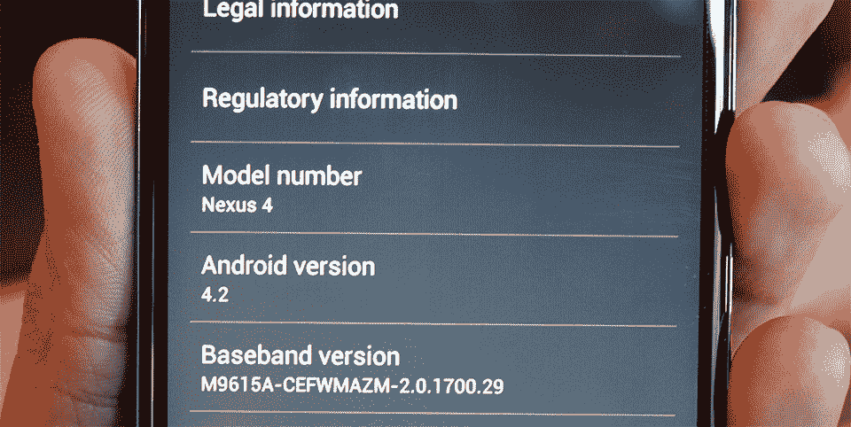
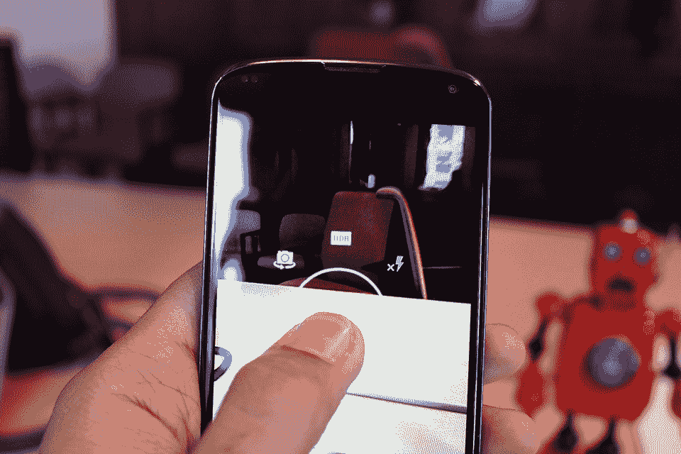
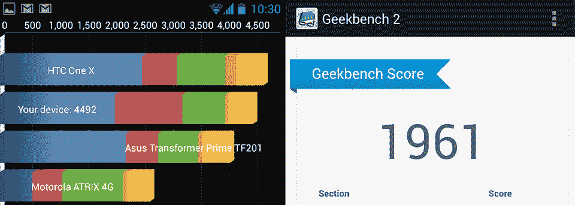

# Nexus 4 评测:不完全完美，但对我来说足够接近了 

> 原文：<https://web.archive.org/web/https://techcrunch.com/2012/11/02/nexus-4-review-not-exactly-perfect-but-close-enough-for-me/>

自从谷歌和 HTC 第一次启动 Nexus 实验以来，似乎已经过了很长时间(那是 2010 年，但谁会去计算呢？).现在我们在这里，两年后，我们在我们的第四个 Nexus 智能手机上。毫无疑问，硬件已经变得越来越好，但在过去的几个月里，Nexus 品牌本身也发生了一些显著的变化。

随着像 Nexus 7 这样的设备获得了大量的主流牵引力(这是 Nexus 智能手机从未真正能够做到的)，谷歌现在似乎正在重组其产品线的其余部分，以吸引大众。Nexus 4 能像它的哥哥一样获得同样的动力吗？还是说它仍然主要面向崇拜 Android 的小众用户？无论如何，我认为 Nexus 4 是一款值得你考虑的明星设备，但你们中的一些人必须比其他人做更多的考虑。

*   4.7 英寸 IPS Plus 液晶屏，运行分辨率为 1280×768
*   1.5GHz 骁龙 S4 专业芯片组，2GB 内存和 Adreno 320 GPU
*   配有 8GB(299 美元)或 16GB(349 美元)的内部存储
*   完全解锁，并与几乎任何 GSM 运营商的 HSPA 数据网络
*   国家足球联盟
*   2，100 毫安时电池
*   11 月 13 日上市，可从谷歌 Play 商店或 T-Mobile 购买(199 w/ 2 年合约)

我花了一大块[我的实践帖子](https://web.archive.org/web/20221208180554/https://beta.techcrunch.com/2012/10/29/hands-on-with-lg-and-googles-first-smartphone-collaboration-the-nexus-4/)来挖掘 Nexus 4 硬件的适合度和光洁度，但我可以用一句话概括大部分内容:Nexus 4 感觉棒极了。我知道，我也很惊讶——LG 在推出坚固耐用的硬件方面从来没有最好的记录，但 139g 的 Nexus 4 设法让人感觉坚固和鼓舞人心，而没有进入庞大的领域。甚至电源按钮和音量摇杆(分别位于 Nexus 4 的左右边缘)都感觉构造良好:它们很坚固，可以承受压力，发出令人满意的咔哒声。我知道，我是个呆子。

从正面看，4 与星系 Nexus 有着非常相似的地方；如果不是扬声器沿着设备的顶部边缘对齐，看起来稍微小一点的摄像头，以及围绕 Nexus 4 弯曲的大猩猩玻璃前板的金属风格塑料环，这两款设备看起来就像双胞胎一样。当你开始转动设备时，差异变得更加明显——与 Galaxy Nexus 的柔和曲线不同，Nexus 4 的侧面是平的，有角度的，由柔软的触摸材料制成，提供了恰到好处的抓握力。

与此同时，后面的事情开始变得完全时髦。像 Optimus G(及其多种变体)一样，LG 选择用一种反射像素化的表面处理来活跃一下气氛，虽然我一开始不太喜欢它，但我慢慢地开始欣赏这种风格。虽然我对这款设备的屁股发表了意见，但除了 LED 闪光灯下方醒目的风格化的 Nexus 标志之外，没有其他提到这款设备的谷歌血统。这一趋势最初是由华硕的 Nexus 7 拉开序幕的，但令人好奇的是，谷歌似乎正在淡化自己的品牌，而倾向于将聚光灯对准 Nexus 的名称及其硬件合作伙伴的身份。

## 像这样的手机没有理由缺少 microSD 卡插槽

我坚定地认为，Nexus 4 看起来非常光滑，但这种光滑远远超出了美学范畴。你看，Nexus 光滑的背板使得它非常容易从口袋中拿出(或塞进)来——只是要小心你把它放在哪里，因为我不得不扑上去抓住它几次，因为它从一个比我想象的更倾斜的表面滑落。

当然，Nexus 4 并不是一款完美的设备。在这个时代，像这样的手机没有理由缺少 microSD 卡插槽(嗯，除了以更高的价格出售更大内存的型号)，但这是自 Nexus S 时代以来 Nexus 的标志。我也更喜欢后置扬声器不与背板齐平，因为一旦你把它放在桌子上，它有助于几乎完全抑制音频，但总的来说，我对这款设备的结构非常满意。当然，这不会让我像去年的 Galaxy Nexus 那样晕头转向，但毫无疑问，Nexus 4 是一款坚固的套件。

尽管我喜欢硬件，但这只是等式的一部分。Nexus 4 的另一大吸引力在于，它是市场上第一款运行 Android 4.2 Jelly Bean 的智能手机(而且是一个干净的版本，符合传统)，这对像我这样的人来说特别有吸引力，因为我通常无法忍受制造商要求的定制。TouchWiz？是啊，不是。HTC Sense？好点了，但我还是宁愿没有它。

也就是说，当谈到 Android 4.2 时，保持你的期望是很重要的——这很能说明问题，谷歌认为它足以获得一个像样的版本号，但不足以获得一个新的甜点主题的代号。这里有很多巧妙的调整和添加，但是一个伟大的更新是否会带来少量的改变还有待商榷。

无论如何，这是足够的吞吞吐吐，这里有什么新的和它如何工作:

###### 谷歌语音搜索:

谷歌对其语音搜索进行了一些巧妙的改进，但最大的改进是它新发现的启动应用程序的能力。点击语音搜索中的红色按钮，命令设备“启动 Gmail ”,通常可以很好地运行……除非它不运行。真的，这里的问题是，没有办法告诉哪些应用程序会在被询问时真正启动，除非你仔细检查并测试所有的应用程序…我做到了。在 Nexus 4 上所有预装的应用程序中，只有以下应用程序会在语音提示时可靠地启动:

日历、计算器、相机、时钟、地球(它严重无法识别“启动谷歌地球”)、地图消息、Messenger、电话和 YouTube。

相反，要求启动其余的应用程序(加上我下载的大多数其他应用程序)会返回搜索结果。尽管语音搜索在转录和理解我的命令方面通常非常可靠，但当我说“启动”时，它仍然会听到“观看”的声音，因为我喜欢这样。简而言之，这是这项服务向前迈出的必要一步，但它不是 Siri(从记录上看，Siri 也不怎么样)。

###### 白日梦:

它们是你手机的屏幕保护程序，而且效果很好。真的很想在 Nexus 4 充电时看看你的照片吗？从来没有找到一种方法来观看不断变换的颜色？如果你出于某种原因对这些问题中的任何一个回答是肯定的，那么你和白日梦会成为好朋友——在设备设置的显示部分寻找它。

###### 快速设置面板:

在通知阴影中增加一个快速设置面板是你真正体会不到的事情之一，直到你花了一些时间使用它。在我实际使用 4.2 之前，我从来没有遇到过在我需要摆弄一些东西的时候直接进入设置应用程序的问题。现在，我发现自己必须做出的大多数快速调整(主要是微小的亮度调整、切换飞行模式和检查电池电量)都可以直接从这个新面板上完成。对于 4.2 来说，这几乎不是一个成败在此一举的特性，但是拥有它已经足够好了。

###### 手势键盘:

当你第一次看到 Android 4.2 的手势键盘工作时，你几乎不可能不想到 Swype 键盘。毕竟，这个概念是相同的——不是用你的拇指啄出信件，而是在键盘上扫来扫去找出单词和短语。我承认:我已经有一段时间没有用过这种东西了，但是到目前为止，我已经用手势键盘度过了一段美好的时光——它又快又流畅，更不用说比我记忆中的 Swype 还要准确。我不知道它会不会取代我的双指敲击方式，但它有可能(而且我不必进入设置和更换键盘的事实是一个明显的优势)。

###### 锁屏小工具:

遗憾的是，我最喜欢的功能之一还没有准备好在黄金时间推出。在纽约举行的一场简短的新闻发布会上，谷歌展示了 4.2 直接在锁屏上加载小工具的能力。如果这听起来有点过时，我不能责怪你，因为像 HTC 这样的公司已经玩了一段时间了，但看到一个深思熟虑的想法得到非常官方的认可总是很高兴。也就是说，谷歌已经表示，在 Nexus 4 于 11 月 14 日正式发布之前，它不会被拿来摆弄，所以我现在还不能摆弄它。

###### 多个用户帐户:

在 Android 4.2 的手机版本中是不存在的。这个问题需要解决——我希望能够把我的手机交给一个需要帮助的朋友，而不用暗自担心他们是否会找到我藏起来的欢快的科尔·波特音乐。

Android 4.2 并不是一些谷歌忠实用户所希望的巨大飞跃，但它确实给相机应用带来了一些巨大的变化。首先，相机的用户界面被彻底清理，只留下一个蓝色的大快门按钮，一个拍摄模式开关(用于从照片到视频到全景的绑定)，以及一个新的径向菜单的快捷方式。

放射式菜单？当你点击快捷按钮或长按屏幕时，会弹出一个圆形菜单，让你快速访问所有其他设置。需要调整闪光灯吗？在菜单中向右上方滑动。想摆弄曝光？这是左下方的一击。坦白地说，我喜欢它——这是一种在您需要的地方控制拍摄的聪明方法。就照片本身而言，它们非常清晰，而且在色彩再现方面通常非常准确。当谈到智能手机中的小传感器时，弱光性能总是令人质疑，但 Nexus 4 在降低噪音方面的表现超出了平均水平。

还有抵抗的力量:光球。谷歌的 Android 团队显然认为捕捉全景是过时的，并转向该公司的街景团队寻求灵感。最终的结果是一种简单、直观的方式来创建完全沉浸式的全景图——你所要做的就是将相机对准一系列浮动的蓝点，瞧，你就可以开始了。

当然，当你把你的照片上传到网上让全世界看到时，效果并不令人印象深刻。这里有一个 TechCrunch SF office 的小例子，只是为了让你有个概念:

【T2

尽管光球看起来很整洁，但它们并不总是最容易创建的东西——即使你非常小心地在房间里平移，仍然很容易获得非常明显的接缝。

Nexus 4 的 4.7 英寸高清 IPS+ LCD 显示屏在纸面上听起来像是一个地狱般的面板，但实际上它甚至更好。它明亮、清晰(分辨率为 1280 x 768，像素密度为 320ppi)，几乎与上方弯曲的玻璃保护层齐平。

## 这里就不拐弯抹角了:Nexus 4 的屏幕棒极了。

话虽如此，但随着时间的推移，我的眼睛似乎变得有点偏了。总的来说，颜色似乎有点柔和，黑色没有 AMOLED 面板上的那么深(比如 Galaxy Nexus 中突出显示的那种)，但 LG 选择的屏幕有一些明显的优势。真的，对我来说最大的一个问题是白色再现的准确性——由于其五分之一像素显示屏，Galaxy Nexus 的白色经常呈现出病态的绿色。这种事情理论上人们可以习惯，但我永远不能。

另一方面，Nexus 4 产生了清晰明亮的白色，与前代显示器上看到的白色相比，似乎令人震惊，并为此感到非常高兴。我打开了我常用的一对测试视频(这里有，以防你对我对韩国流行音乐和百老汇音乐剧的品味感到好奇)寻找不合适的视角，最终满意而归。寻求转换的 AMOLED 发烧友可能会对屏幕之间的差异感到愤怒，但我们不要拐弯抹角:Nexus 4 的屏幕太棒了。

当谈到设备的实际性能时，有两种流行的描述方式。第一个是轶事 Nexus 4 在我们一起工作的时候表现得非常好，这在很大程度上要归功于它的 1.5GHz 骁龙 S4 Pro 处理器、Adreno 320 GPU 和 2GB 内存。更重要的是，在 GTA III 自由城巡游时，或者在《我的世界》袖珍版中制作大型立体派雕像时，它甚至没有眨一下眼睛。我唯一一次看到电话断断续续是在我输入各种数字的时候——有一种特殊的延迟，似乎只有在我试图拨打电话号码或使用计算器时才会表现出来。

对于一款在纸面上看起来如此热情的设备，你会期望它的一些基准比实际高得多。以 Nexus 4 的象限性能为例——在五次测试中，Nexus 4 的平均象限得分为 4360 分，远低于美国规格的 HTC One X (4995 分)、Galaxy S III(5063 分)和 Atrix HD (5084 分)等旧设备。

真正令人困惑的是该设备如何与它的堂兄 LG Optimus G 相媲美。LG 的旗舰智能手机产生的数据远远超过其 Nexus 品牌的对手——其五次试用的平均数据高达 7033，考虑到这是一个明显作为 Nexus 4 基础的设备，这是一个很大的飞跃。不言而喻，象限分数远远不是一个完美的指标，但我怀疑 Nexus 4 异常低的表现更多地与软件有关，而不是与劣质组件有关。这款设备在 Geekbench 上的表现似乎证明了这一点 Nexus 4 的得分为 1961，轻松击败了它的表亲 Optimus G。

到目前为止，Nexus 4 没有配备 LTE 无线电已经不是什么秘密了，而是配备了一个五波段 GSM/HSPA+无线电，这意味着它现在可以很好地与任何 GSM 运营商的 SIM 卡配合使用。我不会过多地谈论这一特定硬件决定引发的争议(至少部分是因为它已经被做得死去活来了)，但考虑到谷歌正试图用一款手机吸引尽可能多的市场，我认为这一举动完全有道理。

也就是说，我一直在用 T-Mobile SIM 测试 Nexus 4，该运营商的数据速度参差不齐。当在旧金山的街道上漫游时，Nexus 4 设法实现了 3.8 至 14.5Mbps 的速度，以及 1 至 2Mbps 的速度。当然，你的里程数可能会有所不同，但不要忘记:如果 T-Mobile 在你身边不工作，你可以随时插入美国电话电报公司的 SIM 卡。

哦，以免我忽略了解决等式的实际电话部分，通话质量清晰，虽然主扬声器的音量可能会更大一点。

在我们的标准电池电量消耗测试中(屏幕亮度设置为 50%，设备将执行无休止的谷歌图像搜索循环)，Nexus 4 的表现并没有达到我的预期。这款设备在那里仅仅挂了 5.5 个多小时，就死于急性电池耗尽综合症。至于日常使用方面，Nexus 则整天挂在那里，穿梭于机场之间，不停地发送电子邮件，徒劳地查看我乘坐的航班是否被取消了。

Nexus 4 在很多方面都让我觉得很痒——它的规格表是行业领先的，而且完全没有上锁。至于那些没有合约的设备，它们的价格实在是太便宜了。更简单地说，就是这种装置专门用来踢我的唾液腺，在这方面肯定能成功。但真正的问题是，Nexus 4 会不会给你带来同样的影响，对此我也不太确定。

毫无疑问，谷歌一直在调整 Nexus 品牌，使之更加面向消费者——热门的 Nexus 7 和好奇的 Nexus Q(无论如何，在它还活着的时候)就是明证。即便如此，Nexus 4 看起来仍然是最受 Android 纯粹主义者青睐的设备。我非常喜欢在未被改动过的 Android 平台上生活、游戏和工作，市面上还有其他(没错，是制造商定制的)设备，它们在物质享受和整体消费者友好性方面更胜一筹。

如果你是一个 Android 爱好者，一个修补者，一个讨厌签署多年高端硬件合同的人，或者只是享受体验前沿的人，你真的*不能足够快地*购买这个东西。这并不是说绝对没有其他人会喜欢这个东西 Nexus 4 有很多值得喜欢的地方——但是那些不属于这些阵营的人可能会更适合一个不同的设备。

*哦，还有一件事:我将继续使用 Nexus 4(以及我得到的每一款评测设备)两周，看看在使用它更长时间后，我对这款设备的印象是否/如何改变。敬请关注更多内容。*