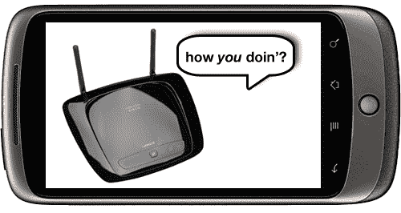

# Nexus One 被黑支持 T-Mobile WiFi 通话 

> 原文：<https://web.archive.org/web/https://techcrunch.com/2010/11/08/nexus-one-hacked-to-support-t-mobile-wifi-calling/>

# Nexus One 被黑支持 T-Mobile WiFi 通话

有志者事竟成——尤其是当这个“意愿”在一大群 Android 黑客社区中被分享的时候。

如果你在 T-Mobile 上有一部 Nexus One，但似乎无法保持信号，那只会对你有利:由于 XDA 开发论坛的努力，N1 现在(完全非官方)支持 T-Mo 的 WiFi 通话功能。

XDA 成员 [Rsotbiemrptson 在这里给出了完整的介绍](https://web.archive.org/web/20221203191932/http://forum.xda-developers.com/showpost.php?p=9058544&postcount=59)，但是基本的想法是……嗯，不是那么基本。Root 你的手机，安装修改过的固件，刷新你的内核，安装几个被黑的应用程序……你明白了。这非常不适合胆小的人——但如果这意味着你的电话掉线更少，这种努力可能是值得的。

[Via [安卓警察](https://web.archive.org/web/20221203191932/http://feedproxy.google.com/~r/AndroidPolice/~3/UskK8ZvF2yI/)