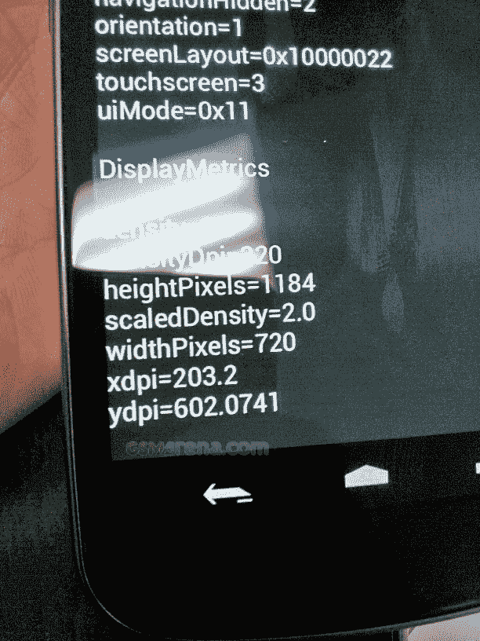

# 这可能是 Nexus Prime 吗？

> 原文：<https://web.archive.org/web/https://techcrunch.com/2011/10/04/nexus-prime-leaked-photo/>

# 这可能是 Nexus Prime 吗？

哦，看哪！这是什么？可以说是今年最热门的安卓手机 Nexus Prime 的一瞥？以这样一种方式泄漏并没有透露太多，同时展示了设备最大的规格之一(惊人的高分辨率屏幕)并取笑手机的整体设计？在下一代 iPhone 发布的前一天早上？多么疯狂的巧合！(注:斜体用于缺乏任何上级指示的讽刺。)

尽管如此，显然计划好的“泄漏”放在一边:*流口水*。

在 [GSMArena](https://web.archive.org/web/20230204201025/http://www.gsmarena.com/exclusive_samsung_nexus_prime_first_screenshot_leaks-news-3224.php) 的家伙捕捉到了这个镜头，当设备处于调试读出模式时，似乎显示了质数的边缘。

**图中需要注意的事项:**

*   传言称 Nexus Prime 的显示屏为“720p”。这张照片表明分辨率实际上是 1184×720(而真正的 720p 通常是 1280×720)——但这可能是因为它没有正确计算下面的软件按钮和顶部状态栏使用的像素。
*   它还表明，Nexus Prime 的显示屏将达到 320 dpi(每英寸点数)，略低于 iPhone 4 的 326 dpi 视网膜显示屏。
*   此前有传言称，Prime 将拥有一个近乎滑稽的 4.6 英寸大显示屏。假设分辨率实际上是 1280×720，并且屏幕上的 DPI 计数器是正确的，那么计算出来。在 1280×720 下运行的 4.6 英寸显示器的 DPI 将略高于 319
*   屏幕上的软件按钮！

真实的？假的？考虑到几乎太好的时机和图像的方便框架，我敢打赌银行、农场和猪会选择前者。不管怎样，我们都会在 10 月 11 日找到最好的冰淇淋三明治。