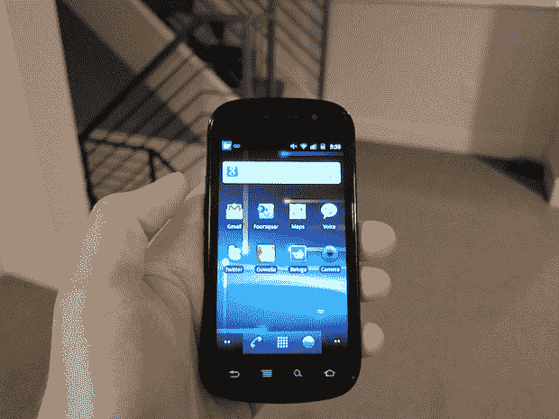
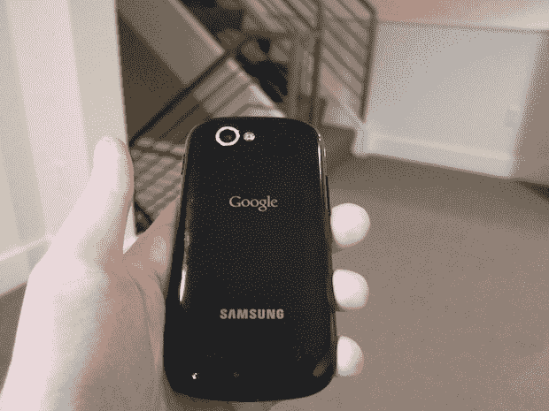
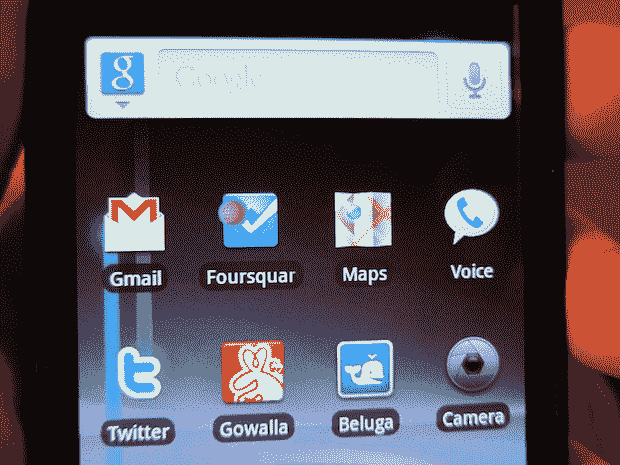
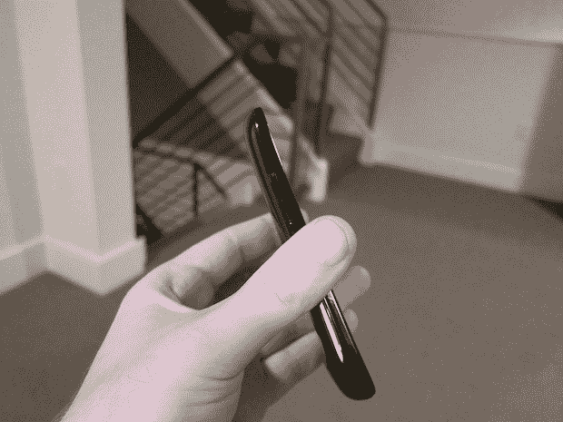

# 一个 iPhone 爱好者对 Nexus TechCrunch 的看法

> 原文：<https://web.archive.org/web/http://techcrunch.com/2010/12/31/nexus-s-iphone-review/>

《钢铁侠 2》中有一个场景，贾斯汀·哈默(山姆·洛克威尔)展示了他一直在研究的机械士兵——他未来的“钢铁侠杀手”。不幸的是，虽然它们看起来有些令人印象深刻，但他的机器出现了故障，演示出现了可怕的偏差。他的仿制品是垃圾。这个场景让我想起了第一款安卓手机 G1 与 iPhone 相比的样子。对谷歌来说幸运的是，从那以后事情有了实质性的改善——而且没有俄罗斯米基·洛克的帮助。嗯，大概是吧。

我们已经对最新最棒的安卓设备 Nexus S 做了一次大规模的[综合评测。但正如我喜欢做的那样(见:这篇文章的底部)，我将从一个 iPhone 死忠的角度来看待它。毕竟，这被广泛认为是迄今为止最好的 Android 设备。那么这足以让任何一个 iPhone 用户跳槽吗？而且由于这是目前唯一运行 Android 2.3“姜饼”的设备，那么该操作系统的整体状态如何？](https://web.archive.org/web/20230203000805/https://techcrunch.com/2010/12/06/google-nexus-s-review/)

首先，Nexus S 是一款很棒的智能手机。我已经用了两个多星期了，我想我可以有把握地说，在一个没有 iPhone 的世界里，这是我会使用的设备。虽然我更喜欢 Windows Phone 的一些基本特性，但 Android 更成熟。更重要的是，这个生态系统更加完善。此外，设备上的谷歌应用程序足以吸引任何人。

此前，我一直坚信 Nexus One 是最好的安卓手机。在我看来，这是事实，尽管最近市场上出现了十几款其他 Android 手机。Nexus One 是最好的，因为它是纯安卓系统。不像机器人或 EVO，它没有装载来自航空母舰的垃圾。他们无法用他们糟糕的皮肤来操控 Android 的核心体验。Nexus S 是第二款“纯 Android”手机。但是更快。因此，它夺走了 Nexus One 的桂冠。

**硬件**

话虽如此，我仍然更喜欢 Nexus One (HTC 内置)的构建质量，而不是 Nexus S(三星内置)。像我用过的 Windows Phone 型号(三星 Focus)，Nexus S 对我来说有点太塑料了。这和我喜欢最初的 iPhone 设计胜过喜欢 iPhone 3G 和 3GS 是一个道理。塑料背对我来说很便宜。它们很难去除。感觉每次都是把手机拆了。

我很高兴 Nexus S 没有配备许多 Android 手机(包括 Nexus One)过去喜欢配备的那个愚蠢的球。与 Nexus One 相比，Nexus S 的主要特点——屏幕——明显更好。(尽管在我看来，AMOLED 显示屏在阳光下还是太难阅读。)

我不知道为什么 Nexus S 的背面会有一个小突起。我假设这是出于人体工程学的原因，但在我看来，这似乎毫无意义，看起来很傻。

Nexus S 上的摄像头很棒。iPhone 4 上的摄像头不是很棒，但我会说这是我见过的第二好的智能手机摄像头。此外，Nexus S 还有一个前置摄像头，这是 Nexus One 所没有的。

这是我用过的最快的 Android 设备，但不清楚这是因为硬件规格(1 GHz 蜂鸟处理器)还是因为 Android 2.3。滚动看起来很流畅，除了几个应用程序外，我没有注意到任何重大的滞后，现在我会假设更多的是他们自己的错。

Nexus S 的触摸屏似乎也是我迄今为止在安卓手机上用过的最好的。与 iPhone 相比，这一直是该平台未能解决的小问题之一。但在这里，它们非常接近。(同样，很难知道这是硬件的问题还是 Android 2.3 的问题——很可能是两者的结合。)

可悲的是，也许 Nexus S 最酷的硬件功能，近场通信(NFC)，还没有太大的用处。但当它发生时，对于支付等事情来说，这可能是巨大的。我有预感苹果将来也会部署这项功能。

我在 Nexus S 上打的几个电话非常可靠。与 iPhone 不同，我没有遇到任何掉线的情况，即使是在室内。当然，Nexus S 是在 T-Mobile 上，而 iPhone 是在那个不应该被命名的运营商上。所以两者很难比较。

Nexus S 的电池续航能力相当不错，但也不算很棒。虽然它远没有 EVO 那么糟糕，但 Nexus S 在闲置时似乎仍然消耗过多的电量。[其他人也注意到了](https://web.archive.org/web/20230203000805/http://twitter.com/#!/sarahintampa/status/19927664051621888)这一点。据我所知，这是某些应用程序在后台运行的结果。Android 2.3 带来了改进的应用程序管理，但如果它仍然没有以保留电池寿命的方式杀死进程，这不是一个好迹象。

**软件**

还有我们来说说 Android 2.3 姜饼软件。虽然我们在去年夏天听说 Android 团队“[专注于](https://web.archive.org/web/20230203000805/https://techcrunch.com/2010/06/16/android-team-laser-focused-on-the-user-experience-for-next-release/)”改善 Android 3.0 的用户体验，但这项工作似乎已经被推迟到 Android 3.0。我为什么这么说？因为 Android 2.3 真的和 Android 2.2 看起来根本没那么大区别。

当然，这里和那里有一点点的润色，但总的来说，这是你们都知道和容忍的同一个机器人。

对我来说，Android 2.3 的关键是，它似乎比它的前辈运行得更流畅。这说明了一些问题，因为 Android 2.2 运行起来比 Android 2.1 流畅得多。Android 团队显然在这方面迅速做出了很好的改进。总体来说，系统还是没有 iPhone 4 流畅。但是已经很接近了。

在他们的评论中，Mike 和 Jason 谈到了 Android 2.3 的键盘改进。毫无疑问，键盘更好。但在我看来，它仍然远远落后于 iPhone 键盘。也在 Windows Phone 键盘后面。让我有点困惑的是，谷歌仍然没有抓住这个如此关键的功能(或者为什么他们没有收购像 Swype 这样的公司)。

而且不仅仅是打字。事实上，他们的软键盘经常在应用程序的关键部分弹出，并不能很好地指引你到下一个可能被覆盖的输入框。我在 Android 上一次又一次地看到这种情况发生。可悲的是，2.3 也没有什么不同。

当然，这些年来我在 Android 上遇到的许多问题看起来都像是小问题(事实上很多都是)，但它们都是令人讨厌的小问题，会阻止我从 iPhone 切换到 Android 手机。苹果非常擅长解决小问题。谷歌似乎仍在致力于整体的大改进，并没有在许多小细节上有所进展。希望到了 Android 3.0，我们可以期待一些。

谷歌制作的应用程序仍然是 Android 的杀手级应用程序。特别是 Gmail，它仍然比 iPhone 上的好，只是因为没有原生的 iPhone Gmail 应用程序(尽管丰富的移动网络版本非常好)。像导航和语音搜索这样的东西也给了你 iPhone 上没有的功能。[谷歌语音终于来到了 iPhone 上](https://web.archive.org/web/20230203000805/https://techcrunch.com/2010/11/16/google-voice-for-the-iphone/)，但它在 Android 上还是好得多，因为它无缝集成到了整个系统中。

还有最新版本的谷歌地图。这可能是我现在最喜欢 Android 的一个方面。最新版本包括 3D 建筑和旋转地图的能力，在 iPhone 版本的地图(也使用谷歌地图)上运行循环。

凭借 Nexus S + Android 2.3 的速度，游戏在 Android 上的运行似乎比以往更加流畅。我已经测试了几个流行的游戏，如愤怒的小鸟、SliceIt 和水果忍者，它们的外观和性能基本上都和 iOS 上的一样。我要说的是，像水果忍者这样的游戏没有明显的延迟。同样在那款游戏中，当我在屏幕上滑动手指并点击 Nexus S 上的软 home 键时，我被赶出了应用程序，这让我发疯。

我在 iPhone 上用得最多的两个应用程序:Twitter 和 Foursquare，与它们在 iOS 上的应用程序相比，仍有不足之处。尽管 Twitter 已经让它看起来更像 iOS 版本，但在可用性方面仍然远远落后于 iOS 版本。Foursquare 也是如此。它只是感觉比较慢，因此我发现自己犹豫是否要使用它。相反，我喜欢我的 iPhone。这对 Android 来说不是一个好兆头。

与此同时，Android 浏览器仍然存在奇怪的缩放问题。然而，当你在移动 Safari 中双击一个区域，而 iPhone 优雅地放大时，在 Android 的浏览器中，它似乎会断断续续地进入。此外，我不明白为什么谷歌仍然包括那些愚蠢的放大和缩小网页的软按钮。我知道这是单手使用，但你应该可以用拇指双击某个区域来缩放，就像你在 iPhone 上一样。

总而言之，尽管浏览器比 Windows Phone 捆绑的糟糕浏览器好一百万倍，但仍然落后于移动 Safari。

从软件的角度来看，我最喜欢的部分可能是“关闭”动画。你点击侧面的电源按钮，屏幕就会关闭，就像一台旧电视机一样。相当酷。

**无形资产**

当杰森听说我要试用一台 Nexus S 时，他(半开玩笑地)问我是否已经决定了我不会喜欢它的什么。事实是，我确实试图以开放的心态使用这些设备——但我也意识到这是一种固有的偏见。我使用 iPhone 已经三年多了。我太习惯在它上面做某些事情了，以至于很难尝试用“安卓方式”做一些事情。

但是我很清楚。我已经在安卓系统上工作了很长时间。当然，我更习惯于 iPhone，但我可以随时切换。但问题是，我不想。在我看来，iPhone 的体验总体来说还是更好的。就这么简单。

Nexus S 和 Gingerbread 延续了谷歌稳步改善 Android 的趋势，但它们仍落后于苹果的 iOS 4.2 和 iPhone 4。无论是硬件还是软件都是如此。理论上，这些设备排列得很好。在使用中，它们仍然没有。就像我上面说的，还有太多 iPhone 钉钉的小事，安卓好像根本就没想到。谷歌似乎仍然更专注于让更大的领域(如市场)加速发展。也许在 iPhone 5 上市之前，Android 3.0 会改变这一点，也许不会。

再说一遍，Nexus S 是一款很棒的设备。我强烈推荐给所有想要安卓手机的人。对我来说，它最引人注目的一点是，它比运营商提供的 EVO 和 Droid 2 等设备上蹩脚的 Android 体验好得多。

事实上，我很难相信有人会选择 Nexus S 以外的 Android 设备。拥有物理键盘是我唯一能看到的借口。也许是威瑞森的网络——也许是。否则，这绝对是一个得到的。不要相信 Verizon Droid 营销的鬼话。

Droid 不会。确实如此。

当然，除了 iPhone 4，它对任何东西都有效。也许俄罗斯的米基·洛克能帮上忙。

**更**: