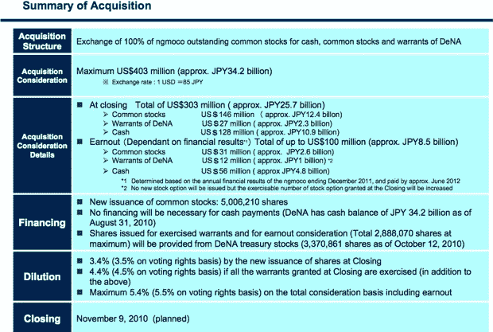

# 大家从 Ngmoco-DeNa 交易中获得了什么 TechCrunch

> 原文：<https://web.archive.org/web/https://techcrunch.com/2010/10/13/ngmoco-dena-deal/>

昨天，日本移动游戏公司 [DeNa 宣布以高达 4 亿美元的价格收购 iPhone 游戏初创公司 ng moco](https://web.archive.org/web/20221208175227/https://beta.techcrunch.com/2010/10/12/done-deal-dena-to-announce-ngmoco-acquisition-very-soon/)。(我们在这里首先报道了收购谈判[)。这个价格包括 3 亿美元的现金和股票，如果 ngmoco 达到某些业绩里程碑，还可以获得 1 亿美元。我们昨天还](https://web.archive.org/web/20221208175227/https://beta.techcrunch.com/2010/10/07/japans-dena-mulling-400-million-acquisition-of-ngmoco/)[报道了【ngmoco 的最大投资者凯鹏华盈(Kleiner Perkins)将为其持有的公司股份“减记超过 1 亿美元”，假设全额支付。事实证明，确切的数字可能接近 1.3 亿美元。](https://web.archive.org/web/20221208175227/https://beta.techcrunch.com/2010/10/12/kleiner-perkins-harvests-over-100-million-from-ngmoco-acquisition/)

由于 DeNa 在日本提交的财务文件，以及 Stuart Dredge 在 [Mobile Entertainment](https://web.archive.org/web/20221208175227/http://www.mobile-ent.biz/news/39046/The-numbers-behind-DeNAs-ngmoco-acquisition) 发现的财务文件，我们现在知道了每个主要股东在公司的股份以及他们将从这笔交易中获得多少。凯鹏华盈拥有该公司三分之一的股份，即 32.7%。IVP 拥有 25%的股份，现在价值 1 亿美元。两位联合创始人，首席执行官尼尔·杨和首席创意官鲍勃·斯蒂文森，每人拥有公司 9.5%的股份，价值 3800 万美元的潜在支出。

这是一个细目表，显示了每股价值的范围，使用了 3 亿美元和 4 亿美元的购买价格。(在真正赚到之前，你永远不能指望赚到钱):

*   KPCB 控股公司(32.72%)= 9800 万美元至 1.3 亿美元
*   机构风险合伙人(25.31%)= 7600 万美元至 1.01 亿美元
*   norwest Venture Partners(13.46%)= 4000 万至 5400 万美元
*   尼尔·杨(9.52%)= 2800 万美元至 3800 万美元
*   鲍勃史蒂文森(9.52%)2800 万美元至 3800 万美元
*   谷歌风投(3.65%)= 1100 万美元至 1460 万美元
*   枫叶投资公司(1.81%)= 540 万美元至 720 万美元

该文件(日文)还列出了 ng moco 2008 年和 2009 年的销售额和亏损。2008 年，销售额为 48.4 万美元，净亏损 246 万美元。2009 年，销售额仅为 316 万美元，亏损飙升至 1089 万美元。虽然这些文件没有涉及 2010 年的收入，但我们的消息来源表明，该公司的收入为 3000 万美元，这将是去年的 10 倍。

该公司的收入直到[推出](https://web.archive.org/web/20221208175227/https://beta.techcrunch.com/2009/11/04/at-the-top-of-his-game-and-the-app-charts-ngmoco-bets-its-future-on-in-app-purchases/)免费游戏策略，将 iPhone 的应用内购买作为主要收入来源后才真正开始增长。2009 年的收入仅相当于这一战略两个月的收入，而且只有两款游戏。今年到目前为止，它又推出了 15 款免费游戏，这些游戏没有计入 2009 年的收入。

DeNa 还发布了一组英文幻灯片(嵌入在下面),展示了其收购背后的战略。基本上，它将使用 ngmoco 作为进入美国市场的一种方式，大部分收购价值更可能与其未来收入的潜力相关，而不是当前收入的倍数。

**更新**:这些数字中似乎遗漏了一件事，那就是员工持有的股份，这使得所有的计算都被打乱了。一位对这笔交易有直接了解的人士告诉我，除了创始人之外，其他员工的持股比例都是两位数，这些数字根本没有反映出来。将相关表格通过谷歌翻译从日本也表明，员工股份没有被计算在内。表格的标题是“主要股东和持股比例”，但在底部写着:

> 人员之间无一资本无一

所以这里似乎缺少了一条关键信息。

[scribd id = 39286667 key = key-17 DPPX 17 cgs 0t 9 karbb 5 mode = list]