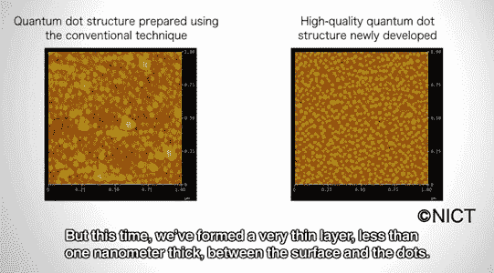
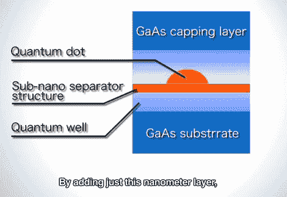

# 日本 NICT 创造量子点，将光纤带宽提高 7-10 倍，拍摄分子的高分辨率照片(视频)

> 原文：<https://web.archive.org/web/https://techcrunch.com/2012/01/25/nict-quantum-dots/>

# 日本的 NICT 创造量子点，将光纤带宽提高 7-10 倍，拍摄分子的高分辨率照片(视频)

日本国家信息和通信技术研究所(NICT)光子网络研究所的一组研究人员开发了一种新的光源技术，这种技术可能为未来一些非常壮观的应用铺平道路。

该技术的核心部分是“高质量”[量子点](https://web.archive.org/web/20221005150048/http://en.wikipedia.org/wiki/Quantum_dot)，微小的纳米粒子，拥有比传统方法更高的稳定性和光学频率。

通过使用所谓的“三明治亚纳米分离器结构”，NICT 说，他们的量子点可以用于大约 70 Thz 宽的光学频带，这比目前提供的 10Thz 常规频带宽大约 7 倍。

NICT 还表示，由于这种新的波段可以穿透人类皮肤，他们的技术也可以用于生物成像，例如拍摄细胞中新分子的高分辨率照片。

NICT 解释了他们的光源技术:

> 通常，当你制造量子点时，你会在半导体表面生长纳米大小的晶体量子点颗粒。但是这一次，我们在表面和点之间形成了一个非常薄的层，不到一纳米厚。通过添加这一纳米层，我们已经能够形成高质量的量子点，没有聚集结构，密度非常高。

这个视频由东京的 [Diginfo TV](https://web.archive.org/web/20221005150048/http://www.diginfo.tv/v/11-0274-f-en.php) 拍摄，提供了更多的见解(英文):
【YouTube = http://www . YouTube . com/watch？v = klgxx 3 zp3j 0&w = 560&h = 315】