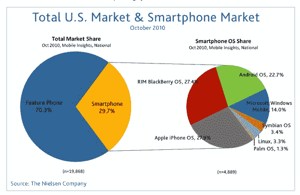
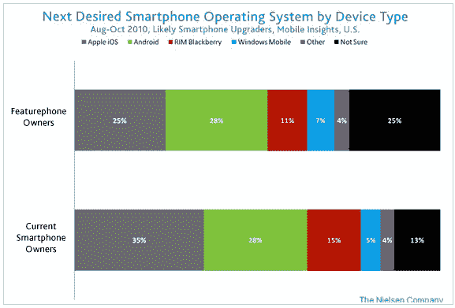
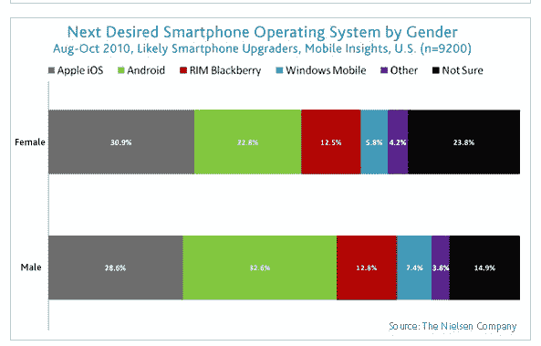
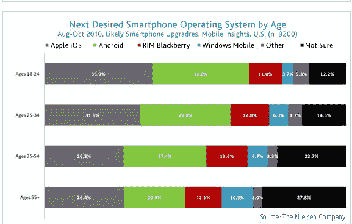

# 尼尔森:苹果 iOS 和安卓并列“最受欢迎的操作系统”

> 原文：<https://web.archive.org/web/https://techcrunch.com/2010/12/01/nielsen-apple-ios-and-android-tied-for-most-desired-operating-system/>

# 尼尔森:苹果 iOS 和安卓并列“最受欢迎的操作系统”

今天发布的尼尔森[数据显示，谷歌的安卓操作系统继续流行，可能会以苹果的 iOS 和 RIM 的黑莓为代价。该公司报告称，在 10 月份的一项调查中，当计划在明年升级到智能手机的移动用户被问及下一部手机时，苹果的 iOS 和 Android 并列为“最受欢迎的”操作系统。](https://web.archive.org/web/20230202234408/http://blog.nielsen.com/nielsenwire/online_mobile/us-smartphone-battle-heats-up/)

苹果的 iPhone 和 Android 设备是可能的智能手机升级者“最想要的”，苹果在 55 岁以上、18 岁至 24 岁和 25 岁至 34 岁的人群中略有领先。计划购买智能手机的女性更有可能希望 iPhone 成为她们的下一部手机，更多男性更喜欢安卓手机。

在已经拥有一部智能手机并计划购买新设备的用户中，这些受访者倾向于购买苹果 iPhone(35%)，而 28%的智能手机和 featurephone 计划智能手机升级者表示，他们希望将装有 Android 操作系统的设备作为他们的下一部手机。

智能手机的使用继续普及，29.7%的美国移动用户现在拥有运行完整操作系统的智能手机。苹果 iPhone 和 RIM Blackberry 是最受欢迎的智能手机，在美国智能手机市场上各占 27%的份额。22%的智能手机用户拥有 Android 操作系统的设备。

计划购买智能手机的用户不太可能对他们将选择的操作系统做出决定:25%的用户“不确定”他们下一个想要的操作系统可能是什么，相比之下，只有 13%的智能手机用户“不确定”。对于希望影响消费者的智能手机操作系统公司来说，这个“犹豫不决”的群体可能是一个相当有影响力的市场。

55 岁以上的人明显比年轻的移动用户更不确定，27.8%的人说他们不确定他们接下来想要什么样的设备，相比之下，18 至 24 岁的人只有 12.2%。

10 月，尼尔森[报告](https://web.archive.org/web/20230202234408/https://techcrunch.com/2010/10/05/nielsen-32-percent-of-new-smartphone-owners-choose-android-phones/)称，Android 已经超过 iPhone 和黑莓，成为过去六个月购买智能手机的人最喜欢的操作系统。

