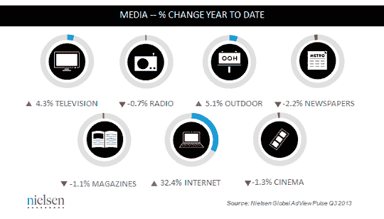

# 尼尔森:互联网展示广告在 2013 年增长了 32%，但仍然只占支出的 4.5%，而电视广告占 57.6%

> 原文：<https://web.archive.org/web/https://techcrunch.com/2014/01/27/nielsen-internet-advertising-grew-32-in-2013-but-its-still-only-4-5-of-spend-vs-tv-at-57-6/>

# 尼尔森:互联网展示广告在 2013 年增长了 32%，但仍仅占支出的 4.5%，而电视广告占 57.6%

今早，尼尔森发布了新旧媒体平台广告市场状况的最新数据。一个很大的收获是，互联网广告仍然是增长最快的媒体，但它仍然是一个小玩家。2013 年，网络、移动互联网和应用程序的全球展示广告总共增长了 32.4%，是迄今为止所有媒体中增长最快的，但这仍占广告总支出的 4.5%。相比之下，电视仅增长了 4.3%，但在广告支出方面仍然是庞然大物，占据了近 58%的市场份额。

尼尔森在其预测中不包括货币数字，只包括每个平台在广告支出方面获得的百分比，以及这些百分比是如何下降或增长的。为了了解我们在这里看到的规模， [Zenith Optimedia 估计](https://web.archive.org/web/20230129073309/http://adage.com/article/global-news/10-things-global-ad-market/245572/)2013 年广告支出首次超过 5000 亿美元。顺便提一下，它在互联网上的支出份额也比尼尔森高:大约 21%，相比之下，电视的支出份额大约为 40%。这很可能是因为当考虑互联网广告市场时，它也包括搜索广告和展示广告。

电视作为广告媒体的持久魅力是基于广告的商业模式的领先互联网公司继续寻求将更多视频相关广告纳入其整体组合的一个重要原因。

这一消息传出的同一周，谷歌(互联网广告的领导者)和脸书(正在采取措施成为一个广告网络)都将报告其季度收益。当谷歌拥有世界上最大的在线视频网站 YouTube 时，脸书也在向视频广告进军。当然，Twitter 已经把它的明星挂在电视上，以实现观众和广告的增长。

尼尔森指出，互联网发挥特别强大作用的一个领域是多屏广告，这涉及到跨网络、移动等媒体购买。我怀疑，我们可以期待看到大型互联网公司在这一领域的更多推动。

尼尔森广告解决方案全球负责人 Randall Beard 写道:“互联网是广告客户增长最快的媒体类型，这并不奇怪，但电视仍然是遥遥领先的媒体。”。“但真正令人兴奋的发展是两者如何合作。我们不断看到广告商转向整合活动，在多个屏幕上与消费者联系，战略性地强化他们的信息，以最大化影响。”

在市场的其他地方，广告仍然面临挑战——广播、报纸、杂志和电影都在下降，户外是唯一一个在 2013 年有所增长的类别，增长率为 5.1%。

更新以明确尼尔森的数据与展示广告相关，不包括搜索广告收入。(感谢萨米·曼苏尔指出这一点。)

