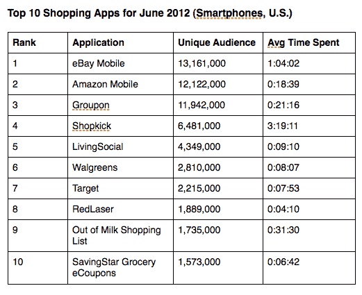

# 尼尔森对美国移动购物的评价:易贝的应用程序吸引了最多的用户，Shopkick 让他们停留更久 

> 原文：<https://web.archive.org/web/https://techcrunch.com/2012/08/06/nielsen-on-u-s-mobile-shopping-ebays-app-attracts-the-most-users-shopkick-keeps-them-around-for-much-longer/>

# 尼尔森对美国移动购物的评价:易贝的应用吸引了最多的用户，Shopkick 让他们停留更长时间

随着移动支付在零售商中变得越来越普遍，智能手机消费者已经对在他们的设备上进行移动购物表现出了相当强烈的兴趣。根据 2012 年 6 月对美国 5，000 名 Android 和 iPhone 用户的调查，尼尔森发现其中 47%的人在手机上使用过本地购物应用。分析师表示，总共约有 4500 万美国消费者平均每月使用购物应用 17 次。

在“销售”最好的应用程序方面，移动领域最强的玩家是那些在线领域最强的玩家，易贝、亚马逊和 Groupon 是三大移动购物网站，分别拥有 1320 万、1210 万和 1200 万独立用户。但是，当谈到花在这些应用上的时间时，保持用户参与时间最长的是不太受欢迎的[shock](https://web.archive.org/web/20221209020127/http://www.shopkick.com/)。

[Shopkick](https://web.archive.org/web/20221209020127/http://www.crunchbase.com/company/shopkick) ，通过在店内为用户提供交易来连接实体和移动体验，在本月吸引了 650 万 uniques，排名第四，但其应用程序被证明是一个非常强大的使用磁铁。这个月平均使用时间超过三个小时，是最受欢迎的独立用户应用易贝移动的三倍(按使用时间排名第二)。

不幸的是，尼尔森没有详细说明哪些应用带来了最多的收入。

然而，这可能是一个误导性的比较，因为前十名不仅包括拍卖网站易贝和在线市场亚马逊，还包括团购网站 Groupon(第二)和 Living Social(排名第五，430 万个独特的网站)；实体店的移动 app(目标:排名第七，220 万唯一)；像 Shopkick 的促销活动；以及像 Out of Milk 这样的组织 app(排名第九；170 万唯一)。其中一些应用程序不允许用户进行应用内购买，尽管这似乎是所有应用程序的融合方向:即使这不是一个应用程序本身将提供的功能，它也会集成，以便人们无论在手机上做什么都可以无缝地做到这一点。

看起来这将随着时间的推移而继续增长:“零售商发现消费者愿意使用智能手机应用程序来改善他们的购物体验，这一数据显示购物应用程序的使用正在增长，”尼尔森电信洞察总监唐·凯洛格在一份声明中指出。

