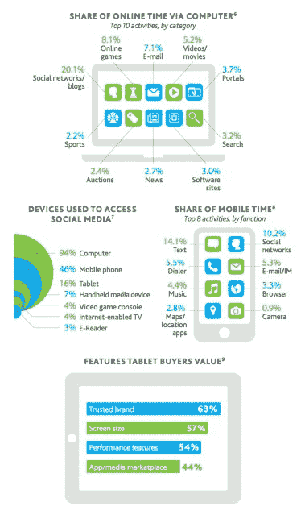
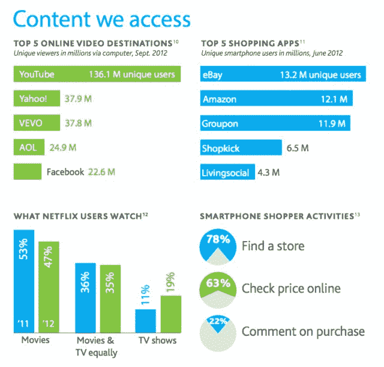

# 尼尔森:电视仍是媒体消费的王者:只有 16%的电视家庭拥有平板电脑 

> 原文：<https://web.archive.org/web/https://techcrunch.com/2013/01/07/nielsen-tv-still-king-in-media-consumption-only-16-percent-of-tv-homes-have-tablets/>

现在再来一份 2012 年回顾报告还为时不晚，今天的最新报道来自尼尔森，它调查了美国人在过去一年里是如何消费内容的。该报告发现，在 2.89 亿美国电视用户中，1.19 亿人拥有四台或更多电视机，这使得电视仍然是观看和录制节目等方面的最佳设备。

除了现场观看，拥有电视的观众还可以通过他们如何访问他们的节目以及他们使用电视做什么来进一步划分。

举个例子，

*   33%有卫星订阅，52%有有线电视；仅广播/空中下载从 2003 年的 16%下降到 9%
*   47%的人有 DVR
*   75%的人拥有高清电视
*   56%的人玩游戏机游戏
*   4%的人有能上网的电视

然而，当谈到美国人如何消费媒体时，电视仍然遥遥领先。传统的看电视时间超过六天(几天！或 144 小时 54 分钟)的时间。从电脑到智能手机，其他一切都只是这个整体蛋糕中的一小部分:

*   电脑上网:28 小时 29 分钟。
*   在线视频:5 小时 51 分钟
*   手机视频:5 小时 20 分钟
*   游戏机:6 小时 26 分钟
*   DVD/蓝光:5 小时 13 分钟
*   时移电视:11 小时 33 分钟

有点可笑的是，55%的美国用户仍然拥有录像机，但这(谢天谢地)比 2003 年的 93%有所下降。

2012 年，在美国活跃的 2.78 亿互联网用户中，有 2.12 亿人使用电脑。尼尔森说，2012 年，94%的社交媒体用户用电脑访问社交媒体。就花在电脑上的时间而言，20.1%用于社交网络和博客——是其他类别中最多的。其他类别花费的时间如下:

*   网络游戏 8.1%
*   7.1%的电子邮件
*   5.2%的视频和电影
*   3.7%的门户网站
*   3.2%搜索
*   3.0%的软件网站
*   2.7%的新闻
*   2.4%拍卖
*   2.2%运动

看看这些搜索和社交的数字，很难不明白为什么谷歌必须用 Google+开发一个社交平台来挑战脸书。即使回到 2009 年，脸书也在消耗用户的时间，每月超过 6 小时的网络使用时间占了谷歌的 2 小时 24 分钟。

但谷歌领先脸书的一个领域是在线视频，有 1.361 亿人在该网站上观看视频，而脸书只有 2260 万人。还显示:雅虎 3790 万，VEVO 3780 万，美国在线(披露:TechCrunch 母公司)2490 万从事视频。

此外，正如之前报道的那样，尼尔森发现，就美国移动应用而言，智能手机胜过功能手机。56%的移动用户拥有智能手机(截至 2012 年第三季度)，其中苹果占 35%，安卓和苹果合计占智能手机设备的 52%。黑莓仍持有 7%的份额，剩下的 6%由“其他”填写。智能手机市场也仍在增长:在今天早些时候发布的另一份报告中，德勤(T2)估计 2013 年将是智能手机行业在全球范围内出货量达到 10 亿部的第一年，智能手机的总装机量将达到近 20 亿部。然而另一份报告—[这份来自埃森哲](https://web.archive.org/web/20221221143502/https://techcrunch.com/2013/01/07/as-demand-for-tablets-smartphones-and-connected-screens-soars-pure-play-devices-under-threat-says-accenture/)—警告说，随着过去几年报道的拥有率下降，功能手机的日子屈指可数。

尼尔森也发现，功能手机在美国的拥有率从 2009 年的 82%下降到 2012 年的 44%。埃森哲报告称，在全球范围内，功能手机的拥有率分别为 84%和 64%，这表明功能手机在美国以外的市场，特别是发展中国家，仍然有很大的安装基数。

尼尔森说，智能手机用户用他们的设备购物。具体来说，这似乎是指现实世界中的购物。78%的人通过电话寻找商店，63%的人查询价格，22%的人对购买的商品发表评论。购物者最喜欢的应用是易贝(1320 万独立用户)、亚马逊(1210 万)、Groupon(1190 万)、Shopkick(650 万)和 living social(430 万)。

与此同时，16%的电视家庭拥有平板电脑，17%的联网设备用户也拥有电子阅读器。品牌认知度对平板电脑拥有者很重要，65%的人购买是因为这是一个“值得信赖”的品牌。(此处插入关于做羊的评论。)57%的人考虑屏幕尺寸，54%的人考虑性能特性，44%的人关心应用程序和媒体市场。

