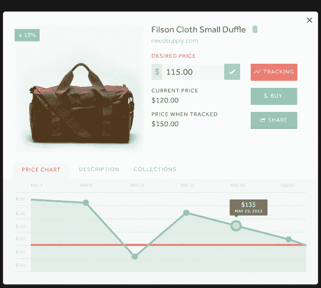

# Nifti 展示了一项由谷歌风投、奥托资本和其他 TechCrunch 投资 80 万美元支持的价格跟踪和提醒服务

> 原文：<https://web.archive.org/web/https://techcrunch.com/2013/07/18/nifti-reveals-a-price-tracking-alerts-service-backed-by-800k-from-google-ventures-otto-capital-others/>

帮助你跟踪你想买的东西何时打折的新购物服务 Nifti 今天正式开业，它得到了来自[谷歌风投](https://web.archive.org/web/20221206204443/http://www.crunchbase.com/financial-organization/google-ventures)、[奥托资本](https://web.archive.org/web/20221206204443/http://www.crunchbase.com/financial-organization/otto-capital)和其他公司的 80 万美元种子资金支持。本质上，Nifti 的服务本质上是一个价格追踪器，包括一个网站和一个浏览器书签，允许你快速将网上的产品添加到关注项目列表中。

如果该商品的价格下跌，你会收到电子邮件提醒。此外，Nifti 的服务还可以生成历史价格图表，帮助您确定产品的当前价格与之前的低点和高点相比如何。

总部设在波斯顿的 Nifti 由首席执行官内森·夏普、首席运营官·格雷格·金博尔和技术联合创始人兼 Nifti 投资者阿贝·古哈尔创立。本轮的其他天使包括[安迪·帕尔默](https://web.archive.org/web/20221206204443/http://www.crunchbase.com/person/andy-palmer-2)和[埃瑞克·安德森](https://web.archive.org/web/20221206204443/http://www.crunchbase.com/person/errik-b-anderson)。

夏普解释说，他对电子商务和购物领域的兴趣可以追溯到 2007 年，当时他在进入达特茅斯大学塔克商学院之前在谷歌的 AdWords 部门实习。他说，当时他对 AdWords 能够捕捉用户在网上的实时购物意图的方式非常着迷。但是今天，许多公司正朝着不同的方向发展。

“比起明确的购买意图，人们更关注含蓄的购买意图，”夏普说。“有这么多的监控在进行，公司可以在互联网上跟踪你，根据你点击的内容，你查看的内容，以及你在脸书或推特上的对话，他们会做出有根据的猜测，知道哪些广告与你相关。”

夏普解释说，往好里说，这些只是有根据的猜测，往坏里说，一些用户觉得他们的隐私被侵犯了。因此，他决定创建一个购买意图显而易见的系统——在 Nifti 上，它是关于捕捉人们正在购买的确切商品的数据。

当然，这是一个拥挤的空间。现在有很多服务可以让购物者跟踪价格变化。有些，比如 Decide.com，是专门针对高消费零售品类的，比如消费电子产品或家用电器。与此同时，还有数十家其他公司，如[的竞争对手 Clipix](https://web.archive.org/web/20221206204443/https://beta.techcrunch.com/2012/06/27/clipix-wants-to-be-a-pinterest-for-the-real-world/) 、[的移动应用 Slice](https://web.archive.org/web/20221206204443/http://priceadjustment.slice.com/) 、PriceGrabber、谷歌提醒、第三方亚马逊和大型零售商观察机构如[camel camel](https://web.archive.org/web/20221206204443/http://camelcamelcamel.com/)、各种优惠券搜索工具、通用愿望清单网站如 [Wishpot](https://web.archive.org/web/20221206204443/http://www.wishpot.com/help/how-to-price-alerts.aspx) 等等。

Nifti 认为有助于它脱颖而出的东西之一是它的历史价格图表，它可以为几乎任何网站生成。在推出时，Nifti 支持超过 400 家在线零售商，但声称它可以不费吹灰之力轻松增加更多。

“如果我们真的是不同网站和产品上人们购物偏好的储存库，你有很多不同的方式来获取这些数据，”夏普说。“这或多或少是我们对自己的看法。我们不一定是一个价格警报系统，甚至不是一个媒人。我们是一家数据公司，试图在人们购买之前了解他们想要什么。”

这一愿景也体现了 Nifti 的长期创收计划，而不仅仅是目前的代销商收入。虽然夏普没有详细说明细节，但总体想法将包括基于(希望)Nifti 最终拥有的大型数据集的个人推荐。然而，这些将不会是在网站上其他地方可以找到的现场广告或一般促销的形式，而是为使用该服务的个人量身定制的。用户还将负责商家如何看到和查看他们的数据，以及他们如何取得联系。

在今天的官方发布和融资消息后，Nifti 将立即专注于扩大覆盖范围并将其服务带到移动设备上，首先是几个月后推出的 iPhone 应用程序。同时，感兴趣的用户可以[在这里](https://web.archive.org/web/20221206204443/http://www.nifti.com/)注册使用服务。