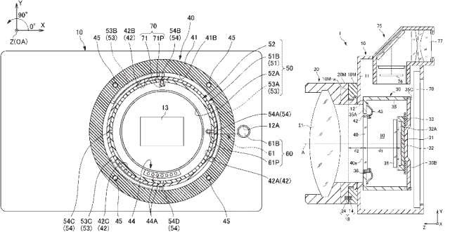

# 尼康炒作神秘周三发布 

> 原文：<https://web.archive.org/web/http://techcrunch.com/2011/09/19/nikon-hypes-up-mystery-wednesday-launch/>

# 尼康炒作神秘周三推出

一个新的[尼康](https://web.archive.org/web/20230205003131/https://techcrunch.com/tag/nikon/)网站刚刚上线，它的名字很奇怪，是 iamcomings.com 的[。我猜](https://web.archive.org/web/20230205003131/http://iamcomings.com/)[这些家伙](https://web.archive.org/web/20230205003131/http://iamcoming.com/)不想卖。它由大量的黄色、大约 43 小时的倒计时和不祥的信息“我来了”组成。

什么来了？嗯，我们猜测这是尼康的[无反光镜相机，V1 和 J1](https://web.archive.org/web/20230205003131/https://techcrunch.com/2011/09/09/rumored-specs-for-nikons-mirrorless-cameras/) 。我们不久前看到了一些泄露的规格，几个月来一直看到专利和谣言。

这些相机应该非常紧凑，拥有 1010 万像素的传感器和 2.7 倍的裁剪系数，以及新的“CX”镜头系统。高端的 V1 会有一个 EVF，便宜的 J1 会有一个内置闪光灯。两者都将在背面有一个 3 英寸的 LCD，可能还有一种有趣的电动变焦。

如果他们在主要竞争对手佳能之前推出高质量的产品，一个全新的尼康系统可能是一个重大胜利，但如果这些设备无法将买家从快速改进的微型四分之三标准和其他类似标准中吸引过来，它也可能是一个巨大的无用之物。也就是说，推出一款工作产品本身就是一项成就，如果佳能决定加入他们的第二次迭代，无论这款相机是否成功，这都是值得的。

我们将密切关注新闻，也许我们甚至会发现自己有能力处理周三到来的新相机。