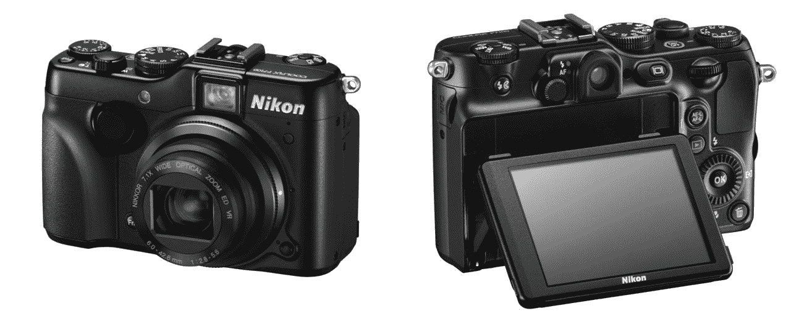
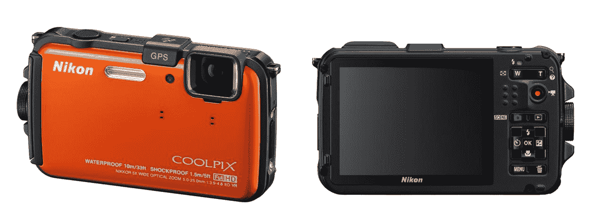
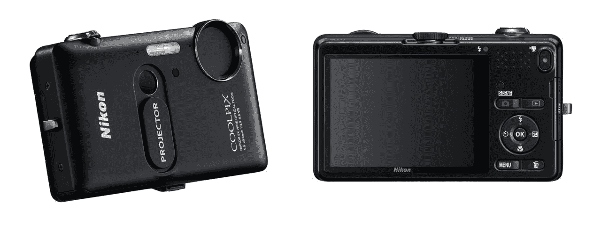
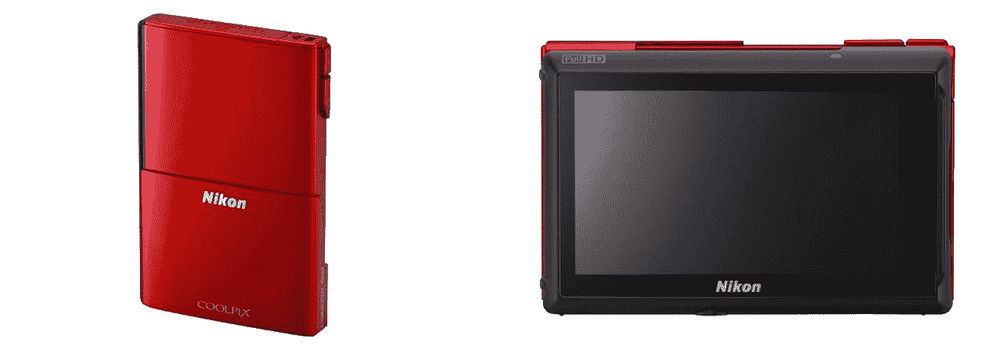
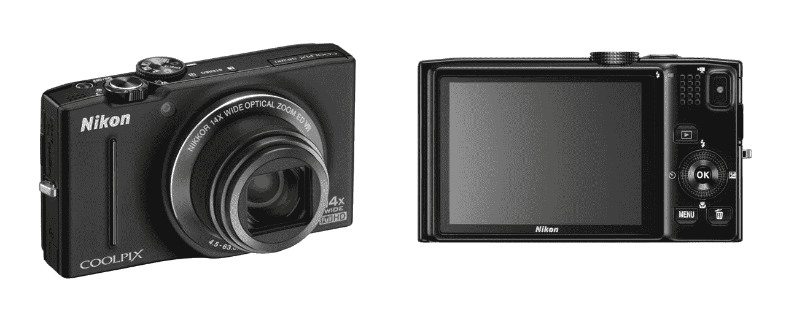
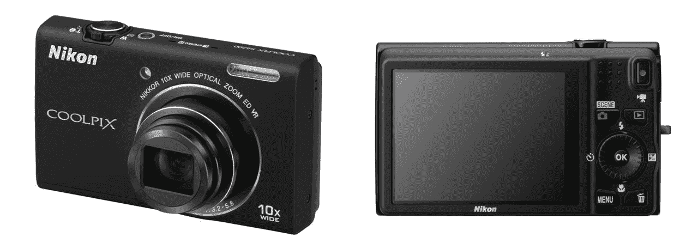

# 尼康更新其 Coolpix 系列，推出新的高端坚固型相机并拍摄 

> 原文：<https://web.archive.org/web/http://techcrunch.com/2011/08/23/nikon-updates-its-coolpix-line-with-new-high-end-and-rugged-point-and-shoots/>

今天是个相机似的一天。佳能[今天早上发布了其新的 Powershot 相机](https://web.archive.org/web/20230205041737/https://techcrunch.com/2011/08/23/canon-unveils-new-line-of-powershot-digital-cameras/)，索尼刚刚更新了其[阿尔法和 NEX 线](https://web.archive.org/web/20230205041737/https://techcrunch.com/2011/08/23/sony-updates-alpha-and-nex-line-with-nex-5n-nex-7-a65-a77/)，现在我们这里有一批尼康刚刚出来。他们是不是这样计划的，让我们这些只想在温暖的周二晚上放松一下的博主们日子不好过？

好吧，让我们继续吧。我会让你很快的。其中一些实际上相当不错。

首先，我们有 P7100，它是 [P7000](https://web.archive.org/web/20230205041737/https://techcrunch.com/2010/12/14/review-nikon-coolpix-p7000/) 的继任者。这是尼康最高端的紧凑型相机，作为快速备份在摄影师中很受欢迎。

它基本上是一样的(1010 万像素，7 倍变焦，640×480 LCD，720p 视频)，但增加了一些新功能。你有一个更新的图像处理器，新的屏幕界面，以及在录制视频时缩放的能力。身体前面增加了一个表盘，如果我没记错的话，这个东西的总表盘数是 6 个。LCD 现在也倾斜了，但是不旋转。

这是一个进步，但不是很大的进步——而且这个传感器需要提升。如果佳能的下一个 G 系列提高赌注，尼康将被甩在后面——就像他们去年用 P7000 把佳能甩在后面一样。九月份要花 500 美元。

接下来是 AW100。这是一款坚固耐用的傻瓜相机，能够在水下 33 英尺深的地方工作，能够承受 5 英尺的落差，并能抵抗低至“寒冷”14 华氏度的温度。背照式传感器在高达 3200 ISO 的条件下产生 1600 万像素，并将录制 1080p 视频。你前面有一个 5 倍变焦镜头，后面有一个 3 英寸 480×320 的液晶显示屏。我最喜欢的部分:它可以以 60、120 或 240fps 的速度录制电影。这是一些固体慢动作，虽然我认为它降低了分辨率。

坏消息呢？这位母亲将在 9 月份花掉你 380 美元。这比我用过的任何粗糙的指向和拍摄都要多，尽管公平地说，它听起来确实比我用过的任何粗糙的指向和拍摄都要好*。*

 *接下来是种类繁多的 S 系列相机。我将放弃细节([此处可用](https://web.archive.org/web/20230205041737/http://cdn.press.nikonusa.com/static/post-2011-08-24-with-sleek-design-and-incredible-functionality-the-new-coolpix-s-series-sets-the-trend-for-high-quality-images-and-hd-movies.html))，给你我给他们起的绰号:

**S1200pj**

“有一个你永远不会用的投影仪的那个”——430 美元(！)

**S100**

"那个有有机发光二极管触摸屏的瘦瘦的，显然你是垂直拿着它的？"– $300

**S8200**

【T2

“富家子弟的相机，屏幕漂亮，14 倍变焦”——330 美元

**S6200**

“足够好”——230 美元

* * *

外卖是什么？这些都有点贵，真的，但如果你有多余的现金，AW100 对我来说是最划算的随身相机。再加上它做了超级慢动作，比听起来还要好玩。如果你同意的话，我会等待佳能对 P7100(即 G13)的回应。

[尼康的 Coolpix 网站将很快提供更多信息。](https://web.archive.org/web/20230205041737/http://ashton.nikonusa.com/COOLPIX/Default.aspx)

**更新** : [NikonRumors 注意到](https://web.archive.org/web/20230205041737/http://nikonrumors.com/2011/08/24/new-coolpix-cameras-available-for-pre-order.aspx/)他们可以预订。*